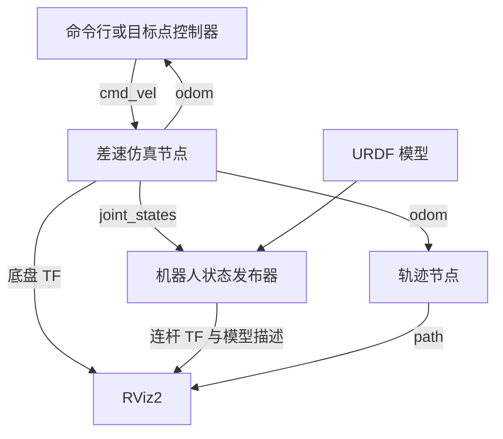
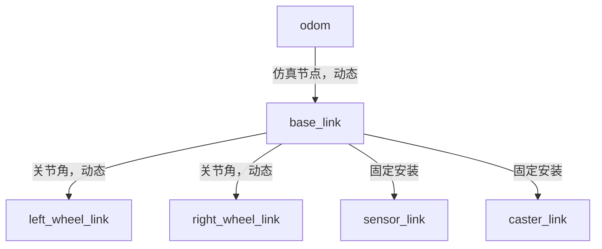

# ROS 2 第三周完整自学手册：差速机器人、里程计、TF2 与 RViz2

> 学习前提：完成两个 C++ 项目，并掌握前两周的 ROS 2 命令行、C++ 节点、发布订阅、参数、服务、Action、launch 与 rosbag2。  
> 环境：Ubuntu 24.04、Bash、ROS 2 Jazzy；继续使用你的 Ubuntu 虚拟机与 VSCode。  
> 安排：7 天，约 24～29 小时。第 3、5 天内容较多，可以拆成两个半天。  
> 本周成果：一辆接受速度指令、发布里程计与 TF、在 RViz2 中显示，并能闭环驶向目标点的差速仿真小车。  
> 内容核对日期：2026-09-22。

本手册沿用前两周的完整讲义形式：包含知识解释、公式推导、完整文件、构建命令、预期结果、例题、练习答案和排错方法。**完成第三周不需要另找教程或下载未提供的配套代码。** 安装软件依赖仍需要联网；末尾链接仅供核对与扩展。

你之前已经做过差速运动学、编码器、里程计和 PID。本周重点是理解这些算法怎样成为 ROS 系统的一部分。本手册给出一套独立、完整的参考实现，不假定你的旧项目恰好使用相同类名或目录。学完后可以保留 ROS 接口，把里面的数学模型替换成你的原项目实现。

参考实现使用**理想轮速模型**：受限后的目标轮速立即成为模型中的实际轮速。它没有电机惯性、打滑或编码器量化，也没有重新实现你的轮速 PID。第 6、7 天会明确说明位置闭环、轮速闭环和里程计估计分别应放在哪里，避免把不同层的控制混在一起。

验证说明：纯 C++ 的运动学、指令时限和目标点控制测试已在编写环境执行；配置、文件依赖和命令做了静态检查，ROS 接口对照 Jazzy 官方资料核对。编写环境没有 ROS 2 与桌面图形会话，因此没有在这里实际编译 ROS 节点或打开 RViz。正文中的 ROS 运行现象是供你验收的预期结果。

## 目录

- [学习方式、日程和系统结构](#start)
- [第 1 天：坐标约定与差速数学核心](#day1)
- [第 2 天：Twist 指令、限幅与超时停车](#day2)
- [第 3 天：里程计、四元数与动态 TF](#day3)
- [第 4 天：TF2 查询、静态安装关系与点变换](#day4)
- [第 5 天：URDF、轮子状态、RViz2 与一键启动](#day5)
- [第 6 天：驶向目标点的闭环控制](#day6)
- [第 7 天：录制回放、综合验收与旧项目衔接](#day7)
- [自测题与答案](#exam)
- [常见问题排查](#troubleshooting)
- [最终文件索引、命令速查与第四周方向](#finish)
- [核对来源](#sources)

<a id="start"></a>

## 学习方式、日程和系统结构

### 本周每天要交付什么

| 日期 | 核心问题 | 当天成果 | 建议用时 |
|---|---|---|---|
| 第 1 天 | 左右轮怎样决定整车运动？位置怎样积分？ | 可独立测试的差速数学核心 | 180～210 分钟 |
| 第 2 天 | ROS 速度命令怎样进入程序？断流后怎么办？ | 指令接收、限幅与超时实验 | 180 分钟 |
| 第 3 天 | Odometry 的位姿和速度分别在哪个坐标系？ | 接收 cmd_vel、发布 odom/TF/轮状态的节点 | 240～270 分钟 |
| 第 4 天 | 怎样把传感器中的点变到 odom？ | 静态 TF、TF2 查询与点坐标变换 | 180～210 分钟 |
| 第 5 天 | RViz 如何知道机器人长什么样、轮子怎样转？ | URDF 模型、轨迹显示、launch/YAML | 240～300 分钟 |
| 第 6 天 | 怎样根据当前位置持续修正速度？ | 驶向目标点的闭环控制器 | 240～270 分钟 |
| 第 7 天 | 怎样证明它正确，并记录、回放、复现？ | 实验记录、回放与验收报告 | 180～240 分钟 |

建议每天先花 15 分钟复述昨天的数据流，再阅读解释、保存文件、构建运行，最后完成练习。不要只以“画面动了”作为通过标准；应能同时解释输入、算法、输出和坐标关系。

### 工作空间与终端约定

本周新建 `~/ros2_week3_ws`，包名为 `diff_drive_lab`。它只使用 ROS 标准接口，不依赖第二周自定义接口包，因此可以独立构建。前两周的工程保留，不覆盖。

| 终端 | 用途 |
|---|---|
| BUILD | 编辑后的构建、依赖安装 |
| A | 仿真节点或完整 launch |
| B | 持续速度发布、后期目标点控制器 |
| C | echo、参数、服务、TF 查询 |
| D | 按需增加，用于 TF 工具、录包或回放 |

构建终端加载 `setup_build.bash`；所有运行终端加载 `setup_run.bash`，第 1 天会给出内容。每次换天先用 `Ctrl+C` 结束上一天的进程。

- `bash` 块是终端命令；`cpp/xml/cmake/yaml/python` 块保存成指定文件。
- “完整替换”意味着覆盖该文件的全部内容，不能把新旧文件拼起来。
- `~` 是你在 Ubuntu 中的用户主目录，不是 Windows 用户目录。
- `Ctrl+C` 是按键；持续运行的命令需要在不同终端执行。
- 修改 C++ 后要重新构建、停止旧进程并重启；新建资源后运行端也要重新加载环境。

### 系统数据流



| 接口 | 类型 | 生产者 → 使用者 |
|---|---|---|
| `/cmd_vel` | `geometry_msgs/msg/Twist` | 命令行或目标控制器 → 仿真节点 |
| `/odom` | `nav_msgs/msg/Odometry` | 仿真节点 → 目标控制器、轨迹节点 |
| `/joint_states` | `sensor_msgs/msg/JointState` | 仿真节点 → robot_state_publisher |
| `/tf` | `tf2_msgs/msg/TFMessage` | 仿真节点和 robot_state_publisher → TF2/RViz |
| `/tf_static` | 同上 | 静态关系发布者 → TF2/RViz |
| `/robot_description` | `std_msgs/msg/String` | robot_state_publisher → RViz |
| `/path` | `nav_msgs/msg/Path` | 轨迹节点 → RViz |
| `/sensor_point_odom` | `geometry_msgs/msg/PointStamped` | 坐标变换示例节点 → 观察工具 |
| `/reset_odometry` | `std_srvs/srv/Trigger` | 手动请求重置本次仿真实验 |
| `/clear_path` | `std_srvs/srv/Trigger` | 清空显示用轨迹历史 |

本周同一时刻只运行一个 `/cmd_vel` 发布源。ROS 不会自动替两个控制器决定谁优先；一边运行键盘/命令行，一边运行自动控制器，会使速度指令交替覆盖。

本周的 `/cmd_vel` 类型由我们自己的节点定义为 Twist。以后接入 Jazzy 的 `ros2_control` 差速控制器时，要按那个控制器的接口使用 `TwistStamped`，不能只因为话题名相似就认为消息类型相同。[S10]

<a id="day1"></a>

## 第 1 天：坐标约定与差速数学核心

### 1.1 先把单位、方向与变量说清楚

ROS 机器人通常采用右手坐标系：机体 x 向前、y 向左、z 向上。绕 z 的正角速度使机器人从上方看逆时针转，也就是向左转。常用单位是米、秒、弧度。[S1]

| 符号 / 代码 | 含义 | 单位 |
|---|---|---|
| `r` / `wheel_radius_m` | 轮半径 | m |
| `L` / `wheel_separation_m` | 左右轮中心的横向间距 | m |
| `v` | 整车沿机体 x 方向的线速度 | m/s |
| `w` 或 `ω` | 整车绕 z 的角速度 | rad/s |
| `ωL, ωR` | 左右轮绕各自轮轴的角速度 | rad/s |
| `x, y, θ` | 整车在 odom 中的位置与航向角 | m、m、rad |
| `dt` | 本次积分经过的时间 | s |

整车的 `ω` 和左右轮的 `ωL/ωR` 都可以用 rad/s 表示，但描述的是不同转轴。不能把 `angular.z=1.0` 直接赋给两只轮子的角速度。

本周固定示例几何：`r=0.05 m`，`L=0.30 m`。左右轮正转都定义为推动小车前进；机器人左右侧以它自己的朝向判断，不以你看屏幕的位置判断。

### 1.2 从约束推导正逆运动学

假设轮子纯滚动、底盘没有横向滑动，则轮缘线速度为：

$$v_L=r\omega_L,\qquad v_R=r\omega_R.$$

车体中心向前速度是两侧速度的平均；绕中心旋转会使两侧产生相反的切向速度，因此：

$$v_L=v-\frac{L}{2}\omega,\qquad v_R=v+\frac{L}{2}\omega.$$

两式相加、相减得到**正运动学**：

$$v=\frac{r}{2}(\omega_L+\omega_R),\qquad
\omega=\frac{r}{L}(\omega_R-\omega_L).$$

给定整车目标速度，求轮速叫**逆运动学**：

$$\omega_L=\frac{v-L\omega/2}{r},\qquad
\omega_R=\frac{v+L\omega/2}{r}.$$

| 情况 | 左右轮 | 整车行为 |
|---|---|---|
| `ωL=ωR>0` | 同向同速 | 向前直行 |
| `ωL=ωR<0` | 同向同速反转 | 倒车 |
| `ωL=-ωR` 且 `ωR>0` | 左后右前 | 原地左转 |
| `0<ωL<ωR` | 两轮前进，右侧更快 | 向左走圆弧 |

**例题 1：**`v=0.20 m/s, ω=0.50 rad/s`，求轮速。

`Lω/2=0.30×0.50/2=0.075 m/s`。因此左轮为 `(0.20−0.075)/0.05=2.5 rad/s`，右轮为 `(0.20+0.075)/0.05=5.5 rad/s`。圆弧半径 `R=v/ω=0.40 m`，右轮更快，应该向左转。

### 1.3 从机体速度到 odom 位姿

机器人车头方向为 θ 时，机体的向前速度需要转到 odom 中：

$$\dot{x}=v\cos\theta,\qquad \dot{y}=v\sin\theta,\qquad \dot{\theta}=\omega.$$

最简单的欧拉积分使用旧角度更新位置：`x += v*cos(theta)*dt`。它容易理解，但持续转弯时有离散误差。本周使用一个在每步轮速恒定假设下的圆弧积分公式。

记 `d=v·dt`、`a=ω·dt`、`h=a/2`，定义：

$$\operatorname{sinc}(h)=\begin{cases}\sin h/h,&h\ne0\\1,&h=0.\end{cases}$$

则：

$$\Delta x=d\operatorname{sinc}(h)\cos(\theta+h),\qquad
\Delta y=d\operatorname{sinc}(h)\sin(\theta+h),\qquad
\theta_{new}=\theta+a.$$

直行时 `a=0`，sinc 自动退化成 1。接近零时直接用 `sin(h)/h` 不方便，因此代码使用展开式 `1−h²/6+h⁴/120`。这是为处理直行附近的数值问题，不是另一个机器人运动模型。

这个积分对于“一小步内保持恒定的 v、ω”是圆弧的精确表达；真实速度若在这一步变化，仍然存在采样和建模误差，不能称为现实世界中的绝对精确位置。

`wrap_angle` 用 `atan2(sin θ, cos θ)` 把角度折回约 `[-π,π]`。接近边界时 +π 和 −π 表示同一朝向，不要把数值跳变误判为机器人突然转了一整圈。

### 1.4 轮速限幅为什么要按比例缩放

如果逆解得到 `(10,20) rad/s`，硬件或模型上限是 12，分别截断会得到 `(10,12)`，左右比值从 1:2 改成 5:6，转弯形状随之改变。

本周取 `scale=12/max(|10|,|20|)=0.6`，得到 `(6,12)`。两轮同乘一个正系数，v 和 ω 同比例缩小；当 ω 非零时，`v/ω` 保持不变。因此尽量保留车体限幅之后的转弯曲率。

注意：在此之前对 v、ω 分别限幅，本身就可能改变原命令曲率。不要把“轮速比例缩放保持曲率”扩大成“整条控制链永远保持原命令曲率”。

### 1.5 准备环境与工作空间

Ubuntu 终端中执行：

```bash
source /opt/ros/jazzy/setup.bash
echo "$ROS_DISTRO"
sudo apt update
sudo apt install -y ros-dev-tools build-essential cmake \
  ros-jazzy-rviz2 ros-jazzy-robot-state-publisher \
  ros-jazzy-tf2-ros ros-jazzy-tf2-tools ros-jazzy-tf2-geometry-msgs graphviz
mkdir -p ~/ros2_week3_ws/src ~/ros2_week3_ws/notes ~/ros2_week3_ws/bags
cd ~/ros2_week3_ws/src
ros2 pkg create --build-type ament_cmake --license Apache-2.0 diff_drive_lab
mkdir -p ~/ros2_week3_ws/src/diff_drive_lab/include/diff_drive_lab
mkdir -p ~/ros2_week3_ws/src/diff_drive_lab/test
```

应输出 `jazzy`。已有包就不重复执行 `pkg create`。VSCode 打开整个 `~/ros2_week3_ws` 文件夹；继续用终端的 colcon 构建，不用单文件“Run Code”按钮代替 ROS 包构建。

保存到 **`~/ros2_week3_ws/setup_build.bash`**：

```bash
source /opt/ros/jazzy/setup.bash
export ROS_DOMAIN_ID=42
unset ROS_LOCALHOST_ONLY ROS_STATIC_PEERS
export ROS_AUTOMATIC_DISCOVERY_RANGE=LOCALHOST
```

保存到 **`~/ros2_week3_ws/setup_run.bash`**：

```bash
source "$HOME/ros2_week3_ws/setup_build.bash"
if [ ! -f "$HOME/ros2_week3_ws/install/local_setup.bash" ]; then
  echo "Build ~/ros2_week3_ws before loading its runtime environment"
  return 1
fi
source "$HOME/ros2_week3_ws/install/local_setup.bash"
```

构建终端只加载本周 build 脚本，不先加载本周 overlay。运行终端在构建后 source run 脚本。不要把第二周和第三周工作空间的自动加载行不断叠加进 `.bashrc`；本周只需要基础 Jazzy 和当前工作空间。

### 1.6 完整数学核心

保存到 **`~/ros2_week3_ws/src/diff_drive_lab/include/diff_drive_lab/diff_drive.hpp`**：

```cpp
#pragma once

#include <algorithm>
#include <cmath>
#include <stdexcept>

namespace diff_drive_lab
{
struct BodyVelocity { double v{0.0}; double w{0.0}; };
struct WheelSpeeds { double left{0.0}; double right{0.0}; };
struct Pose2D { double x{0.0}; double y{0.0}; double yaw{0.0}; };

inline double wrap_angle(double angle)
{
  return std::atan2(std::sin(angle), std::cos(angle));
}

inline WheelSpeeds limit_wheels(WheelSpeeds wheels, double limit)
{
  if (!std::isfinite(wheels.left) || !std::isfinite(wheels.right) ||
    !std::isfinite(limit) || limit <= 0.0)
  {
    throw std::invalid_argument("Finite wheel speeds and a positive limit are required");
  }
  const double largest = std::max(std::abs(wheels.left), std::abs(wheels.right));
  if (largest > limit) {
    const double scale = limit / largest;
    wheels.left *= scale;
    wheels.right *= scale;
  }
  return wheels;
}

class DiffDrive
{
public:
  DiffDrive(double wheel_radius, double wheel_separation)
  : radius_(wheel_radius), separation_(wheel_separation)
  {
    if (!std::isfinite(radius_) || !std::isfinite(separation_) ||
      radius_ <= 0.0 || separation_ <= 0.0)
    {
      throw std::invalid_argument("Geometry must be finite and positive");
    }
  }

  WheelSpeeds inverse(BodyVelocity body) const
  {
    if (!std::isfinite(body.v) || !std::isfinite(body.w)) {
      throw std::invalid_argument("Body velocity must be finite");
    }
    return {(body.v - separation_ * body.w / 2.0) / radius_,
      (body.v + separation_ * body.w / 2.0) / radius_};
  }

  BodyVelocity forward(WheelSpeeds wheels) const
  {
    if (!std::isfinite(wheels.left) || !std::isfinite(wheels.right)) {
      throw std::invalid_argument("Wheel speeds must be finite");
    }
    return {radius_ * (wheels.left + wheels.right) / 2.0,
      radius_ * (wheels.right - wheels.left) / separation_};
  }

  void step(WheelSpeeds actual_wheels, double dt)
  {
    if (!std::isfinite(dt) || dt <= 0.0) {
      throw std::invalid_argument("dt must be finite and positive");
    }
    const auto body = forward(actual_wheels);
    const double distance = body.v * dt;
    const double turn = body.w * dt;
    const double half = turn / 2.0;
    const double half2 = half * half;
    const double sinc = std::abs(half) < 1e-6 ?
      1.0 - half2 / 6.0 + half2 * half2 / 120.0 : std::sin(half) / half;
    pose_.x += distance * sinc * std::cos(pose_.yaw + half);
    pose_.y += distance * sinc * std::sin(pose_.yaw + half);
    pose_.yaw = wrap_angle(pose_.yaw + turn);
    left_angle_ += actual_wheels.left * dt;
    right_angle_ += actual_wheels.right * dt;
  }

  void reset()
  {
    pose_ = {};
    left_angle_ = 0.0;
    right_angle_ = 0.0;
  }

  const Pose2D & pose() const { return pose_; }
  double left_angle() const { return left_angle_; }
  double right_angle() const { return right_angle_; }

private:
  double radius_;
  double separation_;
  Pose2D pose_{};
  double left_angle_{0.0};
  double right_angle_{0.0};
};
}  // namespace diff_drive_lab
```

`BodyVelocity`、`WheelSpeeds`、`Pose2D` 是三种不同含义的数据，避免在代码里用三个没有语义的 `double` 到处传递。`DiffDrive::step` 的输入名为 `actual_wheels`，表达“位姿积分应使用执行后的轮速”。本周它来自理想执行模型；以后接真实反馈时这个位置非常重要。

`left_angle`、`right_angle` 累加的是轮子的转角，供后面的 JointState 使用；它们不是底盘 yaw。源码只面向本周有界几何、轮速与步长，不是任意极端浮点数输入的通用数值库。

### 1.7 完整数值测试

保存到 **`~/ros2_week3_ws/src/diff_drive_lab/test/test_kinematics.cpp`**：

```cpp
#include <cmath>
#include <iostream>
#include <stdexcept>

#include "diff_drive_lab/diff_drive.hpp"

void check(double value, double expected, double tolerance = 1e-9)
{
  if (!std::isfinite(value) || std::abs(value - expected) > tolerance) {
    throw std::runtime_error("Numerical check failed");
  }
}

int main()
{
  using namespace diff_drive_lab;
  const double pi = std::acos(-1.0);
  DiffDrive robot(0.05, 0.30);
  auto straight = robot.inverse({0.20, 0.0});
  check(straight.left, 4.0);
  check(straight.right, 4.0);
  auto turn = robot.inverse({0.0, 1.0});
  check(turn.left, -3.0);
  check(turn.right, 3.0);
  auto arc = robot.inverse({0.20, 0.50});
  check(arc.left, 2.5);
  check(arc.right, 5.5);
  auto recovered = robot.forward(arc);
  check(recovered.v, 0.20);
  check(recovered.w, 0.50);

  for (int i = 0; i < 100; ++i) { robot.step(straight, 0.01); }
  check(robot.pose().x, 0.20);
  check(robot.pose().y, 0.0);
  robot.reset();
  robot.step(robot.inverse({0.0, pi / 2.0}), 1.0);
  check(robot.pose().x, 0.0);
  check(robot.pose().y, 0.0);
  check(robot.pose().yaw, pi / 2.0);
  robot.step(straight, 1.0);
  check(robot.pose().x, 0.0);
  check(robot.pose().y, 0.20);

  robot.reset();
  for (int i = 0; i < 200; ++i) { robot.step(arc, 0.01); }
  check(robot.pose().x, 0.4 * std::sin(1.0));
  check(robot.pose().y, 0.4 * (1.0 - std::cos(1.0)));
  check(robot.pose().yaw, 1.0);
  const auto limited = limit_wheels({10.0, 20.0}, 12.0);
  check(limited.left, 6.0);
  check(limited.right, 12.0);
  bool rejected = false;
  try { robot.step(straight, 0.0); }
  catch (const std::invalid_argument &) { rejected = true; }
  if (!rejected) { throw std::runtime_error("Zero dt was accepted"); }
  std::cout << "PASS: inverse/forward, straight, turn, arc, saturation, dt\n";
}
```

完整替换 **`~/ros2_week3_ws/src/diff_drive_lab/CMakeLists.txt`**：

```cmake
cmake_minimum_required(VERSION 3.8)
project(diff_drive_lab)

set(CMAKE_CXX_STANDARD 17)
set(CMAKE_CXX_STANDARD_REQUIRED ON)
set(CMAKE_CXX_EXTENSIONS OFF)
find_package(ament_cmake REQUIRED)


function(configure_program target)
  target_include_directories(${target} PRIVATE ${CMAKE_CURRENT_SOURCE_DIR}/include)
  if(CMAKE_CXX_COMPILER_ID MATCHES "GNU|Clang")
    target_compile_options(${target} PRIVATE -Wall -Wextra -Wpedantic)
  endif()
  install(TARGETS ${target} DESTINATION lib/${PROJECT_NAME})
endfunction()

function(add_math_test target)
  add_executable(${target} test/${target}.cpp)
  configure_program(${target})
endfunction()

add_math_test(test_kinematics)


ament_package()
```

完整替换 **`~/ros2_week3_ws/src/diff_drive_lab/package.xml`**：

```xml
<?xml version="1.0"?>
<package format="3">
  <name>diff_drive_lab</name>
  <version>0.0.1</version>
  <description>Week 3 ROS 2 differential-drive learning project</description>
  <maintainer email="student@example.com">Student</maintainer>
  <license>Apache-2.0</license>
  <buildtool_depend>ament_cmake</buildtool_depend>

  <export>
    <build_type>ament_cmake</build_type>
  </export>
</package>
```

这个测试是普通 C++ 可执行文件，只是放在 ROS 包里安装。它不创建 ROS 节点，不需要 `rclcpp::init`，说明算法核心已经与 ROS 通信分开。

### 1.8 构建与运行

若第二周已经初始化 rosdep，不重复 init。只在尚未初始化的机器运行下面条件块：

```bash
if [ ! -f /etc/ros/rosdep/sources.list.d/20-default.list ]; then
  sudo rosdep init
fi
rosdep update
```

BUILD：

```bash
source ~/ros2_week3_ws/setup_build.bash
cd ~/ros2_week3_ws
rosdep install --from-paths src --ignore-src -r -y --rosdistro jazzy
colcon build --symlink-install --packages-up-to diff_drive_lab \
  --cmake-args -DCMAKE_BUILD_TYPE=RelWithDebInfo -DCMAKE_EXPORT_COMPILE_COMMANDS=ON
```

C：

```bash
source ~/ros2_week3_ws/setup_run.bash
ros2 run diff_drive_lab test_kinematics
```

预期：

```text
PASS: inverse/forward, straight, turn, arc, saturation, dt
```

圆弧测试使用 `v=0.2, ω=0.5` 运行 2 秒，所以 θ=1 rad；应有 `x=0.4 sin(1)≈0.336588 m`，`y=0.4(1−cos(1))≈0.183879 m`。这些是确定数值，不受 ROS 调度影响。

### 1.9 练习与答案

**练习 A：`v=0.3, ω=0`，左右轮各多少？** 答案：均为 `0.3/0.05=6 rad/s`。

**练习 B：`v=0, ω=1`，左右轮各多少？** 答案：左 −3、右 +3 rad/s；整车原地左转。

**练习 C：当前 θ=π/2，向前走 0.2 m，哪个坐标增加？** 答案：odom 的 y 增加约 0.2，x 基本不变；机体向前不一定等于世界 x 增大。

**练习 D：正轮速超过上限时能否只缩慢一只轮子？** 答案：可以形成另一种运动，但会改变期望曲率。本周按共同系数缩放两轮。

**今日验收：**能手算直行、原地旋转和圆弧三组轮速；数值测试通过；在 `notes/day1.md` 写清“整车角速度与轮子角速度”的区别。

<a id="day2"></a>

## 第 2 天：Twist 指令、限幅与超时停车

### 2.1 Twist 的含义与本节点约定

`geometry_msgs/msg/Twist` 含两组三维向量：`linear` 和 `angular`。本周底盘只使用 `linear.x` 与 `angular.z`，其余四项必须是有限的零值；检测到非法非平面指令会清空当前命令。

| 字段 | 本周意义 | 示例 |
|---|---|---|
| `linear.x` | 沿机体 x 的目标线速度 | 0.2 表示 0.2 m/s |
| `linear.y`、`linear.z` | 不支持侧移/升降 | 应为 0 |
| `angular.z` | 绕机体 z 的目标角速度 | 0.5 表示 0.5 rad/s |
| `angular.x`、`angular.y` | 不支持翻滚/俯仰控制 | 应为 0 |

Twist 本身没有 Header，不包含时间戳和坐标系字符串。将命令解释为机体速度，是我们的接口约定。`TwistStamped` 则有 Header，但加上 Header 后仍需发送者和接收者就坐标系、时间语义达成一致。

发布 20 Hz 表示每秒发送约 20 份命令，不表示速度 20 m/s。命令值与发送频率是两个独立量。

### 2.2 为什么需要周期和指令超时

订阅回调只更新最新命令；固定周期回调读取它、执行控制或仿真。这样计算频率不被命令的到达次数直接决定。

本例使用“最后一次收到有效命令的本地单调时间”。超过 0.5 秒没有有效更新，`sample` 返回零速度。未收到过命令时也返回零。时间恰好等于 0.5 秒仍可使用旧命令，严格大于才超时。

这个时限按**接收处理时间**计算，不是按发送端采样时间。它能检测消息断流，却不能仅靠无 Header 的 Twist 判断一条延迟消息是否早已过时。

注意：软件时限需要程序得到调度才能执行；程序卡住期间，回调本身不能凭空运行。后面的仿真节点还会检查异常长的更新间隔。这是模型运行约束，不能等同于真实设备的独立急停回路。

### 2.3 完整指令缓存类

保存到 **`~/ros2_week3_ws/src/diff_drive_lab/include/diff_drive_lab/command_buffer.hpp`**：

```cpp
#pragma once

#include <algorithm>
#include <chrono>
#include <cmath>
#include <stdexcept>

#include "diff_drive_lab/diff_drive.hpp"

namespace diff_drive_lab
{
inline double steady_seconds()
{
  return std::chrono::duration<double>(
    std::chrono::steady_clock::now().time_since_epoch()).count();
}

class CommandBuffer
{
public:
  CommandBuffer(double max_v, double max_w, double timeout)
  : max_v_(max_v), max_w_(max_w), timeout_(timeout)
  {
    if (!std::isfinite(max_v_) || !std::isfinite(max_w_) ||
      !std::isfinite(timeout_) || max_v_ <= 0.0 || max_w_ <= 0.0 || timeout_ <= 0.0)
    {
      throw std::invalid_argument("Limits and timeout must be finite and positive");
    }
  }

  bool accept(double v, double w, double received_at)
  {
    if (!std::isfinite(v) || !std::isfinite(w) || !std::isfinite(received_at)) {
      clear();
      return false;
    }
    command_ = {std::clamp(v, -max_v_, max_v_), std::clamp(w, -max_w_, max_w_)};
    received_at_ = received_at;
    valid_ = true;
    return true;
  }

  BodyVelocity sample(double now) const
  {
    if (!valid_ || !std::isfinite(now) || now < received_at_ ||
      now - received_at_ > timeout_)
    {
      return {};
    }
    return command_;
  }

  void clear() { valid_ = false; command_ = {}; }

private:
  double max_v_;
  double max_w_;
  double timeout_;
  bool valid_{false};
  double received_at_{0.0};
  BodyVelocity command_{};
};
}  // namespace diff_drive_lab
```

`steady_clock` 用于测量经过的时间。它不受系统日期调整影响；`steady_seconds()` 把它表示成秒，便于做差。这个数不能直接填进 ROS Header，因为它没有 ROS 时间戳的含义。

`std::clamp` 在有限范围内截断速度；非有限值先拒绝，再做限幅，避免让 NaN 通过比较后继续污染状态。`sample` 不产生新的 ROS 消息，它只返回普通 C++ 数据。

### 2.4 完整命令观察节点

保存到 **`~/ros2_week3_ws/src/diff_drive_lab/src/cmd_probe.cpp`**：

```cpp
#include <algorithm>
#include <array>
#include <chrono>
#include <cmath>
#include <memory>

#include "rclcpp/rclcpp.hpp"
#include "geometry_msgs/msg/twist.hpp"
#include "diff_drive_lab/command_buffer.hpp"

class CmdProbe : public rclcpp::Node
{
public:
  CmdProbe() : Node("cmd_probe")
  {
    subscription_ = create_subscription<geometry_msgs::msg::Twist>(
      "cmd_vel", rclcpp::QoS(1).reliable(),
      [this](geometry_msgs::msg::Twist::ConstSharedPtr message) {
        const std::array<double, 4> unused{
          message->linear.y, message->linear.z, message->angular.x, message->angular.y};
        const bool planar = std::all_of(unused.begin(), unused.end(), [](double value) {
          return std::isfinite(value) && std::abs(value) <= 1e-9;
        });
        if (!planar || !commands_.accept(
            message->linear.x, message->angular.z, diff_drive_lab::steady_seconds()))
        {
          commands_.clear();
          RCLCPP_WARN(get_logger(), "Invalid planar command: stop");
        }
      });
    timer_ = create_wall_timer(std::chrono::milliseconds(100), [this]() {
      const auto command = commands_.sample(diff_drive_lab::steady_seconds());
      RCLCPP_INFO(get_logger(), "applied v=%.3f m/s w=%.3f rad/s", command.v, command.w);
    });
  }

private:
  diff_drive_lab::CommandBuffer commands_{0.5, 2.0, 0.5};
  rclcpp::Subscription<geometry_msgs::msg::Twist>::SharedPtr subscription_;
  rclcpp::TimerBase::SharedPtr timer_;
};

int main(int argc, char * argv[])
{
  rclcpp::init(argc, argv);
  rclcpp::spin(std::make_shared<CmdProbe>());
  rclcpp::shutdown();
  return 0;
}
```

`QoS(1)` 表达命令通道只保留较新的数据，减少积压旧命令的机会。深度 1 本身不是时限，也不能取消网络中已经传输的数据，因此还要做应用层时限检查。

定时器 100 ms，意味着观察日志约 10 Hz。回调串行执行，不需要把第二周多线程数据管线的所有线程重新搬进来。

### 2.5 完整边界测试与构建文件

保存到 **`~/ros2_week3_ws/src/diff_drive_lab/test/test_command_buffer.cpp`**：

```cpp
#include <cmath>
#include <iostream>
#include <limits>
#include <stdexcept>

#include "diff_drive_lab/command_buffer.hpp"

void check(double actual, double expected)
{
  if (!std::isfinite(actual) || std::abs(actual - expected) > 1e-9) {
    throw std::runtime_error("Command check failed");
  }
}

int main()
{
  diff_drive_lab::CommandBuffer buffer(0.5, 2.0, 0.5);
  check(buffer.sample(0.0).v, 0.0);
  buffer.accept(5.0, -5.0, 10.0);
  check(buffer.sample(10.25).v, 0.5);
  check(buffer.sample(10.25).w, -2.0);
  check(buffer.sample(10.50).v, 0.5);
  check(buffer.sample(10.51).v, 0.0);
  buffer.accept(0.2, 0.0, 11.0);
  const bool ok = buffer.accept(std::numeric_limits<double>::quiet_NaN(), 0.0, 11.1);
  if (ok) { throw std::runtime_error("NaN was accepted"); }
  check(buffer.sample(11.2).v, 0.0);
  buffer.accept(0.3, 0.0, 12.0);
  check(buffer.sample(11.9).v, 0.0);
  buffer.clear();
  check(buffer.sample(12.1).v, 0.0);
  std::cout << "PASS: empty, limits, timeout boundary, NaN, time reversal, clear\n";
}
```

完整替换 **`~/ros2_week3_ws/src/diff_drive_lab/CMakeLists.txt`**：

```cmake
cmake_minimum_required(VERSION 3.8)
project(diff_drive_lab)

set(CMAKE_CXX_STANDARD 17)
set(CMAKE_CXX_STANDARD_REQUIRED ON)
set(CMAKE_CXX_EXTENSIONS OFF)
find_package(ament_cmake REQUIRED)
find_package(rclcpp REQUIRED)
find_package(geometry_msgs REQUIRED)

function(configure_program target)
  target_include_directories(${target} PRIVATE ${CMAKE_CURRENT_SOURCE_DIR}/include)
  if(CMAKE_CXX_COMPILER_ID MATCHES "GNU|Clang")
    target_compile_options(${target} PRIVATE -Wall -Wextra -Wpedantic)
  endif()
  install(TARGETS ${target} DESTINATION lib/${PROJECT_NAME})
endfunction()

function(add_math_test target)
  add_executable(${target} test/${target}.cpp)
  configure_program(${target})
endfunction()

function(add_ros_node target)
  add_executable(${target} src/${target}.cpp)
  configure_program(${target})
  ament_target_dependencies(${target} rclcpp geometry_msgs)
endfunction()

add_math_test(test_kinematics)
add_math_test(test_command_buffer)
add_ros_node(cmd_probe)

ament_package()
```

完整替换 **`~/ros2_week3_ws/src/diff_drive_lab/package.xml`**：

```xml
<?xml version="1.0"?>
<package format="3">
  <name>diff_drive_lab</name>
  <version>0.0.1</version>
  <description>Week 3 ROS 2 differential-drive learning project</description>
  <maintainer email="student@example.com">Student</maintainer>
  <license>Apache-2.0</license>
  <buildtool_depend>ament_cmake</buildtool_depend>
  <depend>rclcpp</depend>
  <depend>geometry_msgs</depend>
  <export>
    <build_type>ament_cmake</build_type>
  </export>
</package>
```

BUILD：

```bash
source ~/ros2_week3_ws/setup_build.bash
cd ~/ros2_week3_ws
rosdep install --from-paths src --ignore-src -r -y --rosdistro jazzy
colcon build --symlink-install --packages-up-to diff_drive_lab \
  --cmake-args -DCMAKE_BUILD_TYPE=RelWithDebInfo -DCMAKE_EXPORT_COMPILE_COMMANDS=ON
```

C：

```bash
source ~/ros2_week3_ws/setup_run.bash
ros2 run diff_drive_lab test_command_buffer
```

预期输出 `PASS: empty, limits, timeout boundary, NaN, time reversal, clear`。

### 2.6 实验一：持续指令与断流

A：

```bash
source ~/ros2_week3_ws/setup_run.bash
ros2 run diff_drive_lab cmd_probe
```

开始没有指令，日志应一直显示 v=0、w=0。B：

```bash
source ~/ros2_week3_ws/setup_run.bash
ros2 topic pub --rate 20 /cmd_vel geometry_msgs/msg/Twist \
  '{linear: {x: 0.2}, angular: {z: 0.5}}'
```

A 应显示 `applied v=0.200 m/s w=0.500 rad/s`。C 可运行：

```bash
source ~/ros2_week3_ws/setup_run.bash
ros2 topic info /cmd_vel --verbose
```

在 B 按 Ctrl+C，A 应在最后一次命令处理后的约 0.5 秒，再加下一次观察回调的等待时间后，显示零。健康调度下大致不超过 0.6 秒，但不承诺虚拟机被挂起时仍满足这个墙钟上限。

### 2.7 实验二：单次命令不是永久速度

B：

```bash
ros2 topic pub --once /cmd_vel geometry_msgs/msg/Twist \
  '{linear: {x: 0.2}, angular: {z: 0.0}}'
```

预期：短暂显示 v=0.2，随后回到零。`--once` 只发一次，它不是持续刷新速度命令。后面要保持直行或圆周运动，应使用 `--rate 20`。

### 2.8 实验三：限幅与非法输入

限幅：

```bash
ros2 topic pub --once /cmd_vel geometry_msgs/msg/Twist \
  '{linear: {x: 5.0}, angular: {z: -5.0}}'
```

应暂时显示 v=0.5、w=−2.0，随后超时回零。超出允许范围的有限值被限幅。

非法平面指令：

```bash
ros2 topic pub --once /cmd_vel geometry_msgs/msg/Twist \
  '{linear: {x: 0.2, y: 0.1}, angular: {z: 0.0}}'
```

应显示拒绝日志并保持零。本例选择“拒绝不支持的分量”，而不是悄悄忽略它们。NaN 路径已经在独立测试中验证，无需依赖命令行对特殊浮点字面量的解析。

### 2.9 练习与答案

**练习 A：命令每秒发送一次，时限是 0.5 秒，会怎样？** 答案：可能周期性运动、停车，因为相邻消息间隔 1 秒大于时限。提高正常刷新频率，或根据需求合理设置时限。

**练习 B：定时器 50 Hz、命令 20 Hz，是否每个 timer 都能拿到新消息？** 答案：不是；多个 timer 步会复用最新的有效命令。这是明确的零阶保持近似。

**练习 C：缓存时间戳能直接作为 odom.header.stamp 吗？** 答案：不能。一个用于本地经过时间，另一个用于 ROS 数据的时间语义。

**今日验收：**通过缓存测试；观察无指令、持续指令、断流、限幅和非法输入五种行为；在 `notes/day2.md` 写清“发送频率、仿真频率、速度值”的区别。

<a id="day3"></a>

## 第 3 天：里程计、四元数与动态 TF

### 3.1 先理解三个坐标系

| 坐标系 | 含义 | 本周是否使用 |
|---|---|---|
| `base_link` | 固定在机器人上的机体坐标系 | 是 |
| `odom` | 本次运行的局部参考坐标系，通常用于连续运动估计 | 是 |
| `map` | 经定位或建图得到的全局参考坐标系 | 暂不创建 |

正常机器人中，odom 位姿应连续，但可能长期漂移；map 可以通过定位更新纠正全局误差，修正可能带来跳变。常见关系是 `map → odom → base_link`。本周还没有地图或全局定位，不需要凭空补一条假的 map 变换。[S2]

本手册将 `base_link` 原点放在两轮轴线中点的地面投影，x 前、y 左、z 上。平面运动中它与车体保持固定关系，位姿 z=0。后面的轮子中心位于 z=0.05，车身显示在更高处。原点选在哪里是模型约定，必须与 URDF 和算法一致。

### 3.2 Odometry 最容易写错的地方

`nav_msgs/msg/Odometry` 同时包含位姿和速度，但这两部分不在同一个表达坐标系里。[S3]

| 字段 | 本周填写 | 解释 |
|---|---|---|
| `header.stamp` | 本次状态发布的 ROS 时间 | 同一批 odom、TF、joint_states 共用 |
| `header.frame_id` | `odom` | 位姿相对于哪个参考系 |
| `child_frame_id` | `base_link` | 被描述的机体系，也是本消息速度的表达坐标系 |
| `pose.pose.position` | x、y、z=0 | base_link 原点在 odom 中的位置 |
| `pose.pose.orientation` | yaw 对应的单位四元数 | base_link 相对于 odom 的朝向 |
| `twist.twist.linear.x` | 执行后的 v | 机体向前速度，不是 odom 的 dx/dt |
| `twist.twist.angular.z` | 执行后的 ω | 机体绕 z 的角速度 |

**例题：**车头朝 odom 的 +y，正向行驶 0.2 m/s。此时 `Odometry.twist.linear.x` 仍然是 0.2，`linear.y` 是 0；而 odom 位置满足 `dx/dt≈0, dy/dt≈0.2`。两者不同是因为表达坐标系不同。

本周发布的是理想仿真模型自身的状态。真实编码器里程计必须根据测得的轮运动估计位姿，不能直接把想让机器人达到的速度积分后，当作真实反馈。

### 3.3 四元数的最小知识

ROS 中姿态通常存为 `(x,y,z,w)` 四元数；不要把欧拉角直接塞进这四个分量。只有绕 z 的平面转动时：

$$q_x=0,\quad q_y=0,\quad q_z=\sin(\theta/2),\quad q_w=\cos(\theta/2).$$

| yaw | 四元数 `(x,y,z,w)` |
|---|---|
| 0 | `(0,0,0,1)` |
| π/2 | `(0,0,0.7071068,0.7071068)` |
| π | `(0,0,1,0)`，数值可能存在浮点微小误差 |

单位四元数满足 `x²+y²+z²+w²=1`。默认全部为零不是合法姿态。`q` 与 `−q` 表示同一个旋转，因此不能只比较某个分量的符号判断朝向是否跳变。

代码通过 `tf2::Quaternion::setRPY(roll,pitch,yaw)` 构造，再归一化。RPY 的单位为弧度。

### 3.4 Odometry 与 TF 是两条不同的信息通道

Odometry 是业务消息，携带位姿、速度和协方差；TF 是坐标系之间随时间变化的关系。只发布 `/odom`，TF2 不会自动创建 `odom → base_link`。[S4]

本周由同一个仿真节点同时发布二者，保证：

- 父坐标系同为 `odom`，子坐标系同为 `base_link`。
- x、y、z 与四元数相同。
- 使用同一份时间戳。

一条 TF 边应有明确的唯一发布者。以后定位融合节点接管 `odom → base_link` 时，原发布者需要关闭这条边；本节点提供 `publish_tf` 启动参数供这种组合使用。本周默认保持 true。

### 3.5 协方差现在需要掌握到什么程度

Pose 和 Twist 各有 36 个数，按 6×6 矩阵逐行排列。顺序为 x、y、z、绕 x、绕 y、绕 z；对角下标为 0、7、14、21、28、35。

方差表示不确定性，不是误差值；位置方差单位是 m²，角度方差单位是 rad²。非对角元素表达变量之间的相关性。

本例填入一组**仅用于展示消息结构的固定值**，没有做噪声标定或随时间传播。没有观测的维度用较大值表达较低信任。以后给状态估计器使用时，需要根据真实传感器与模型重新设计，不能直接沿用这组教学数字；也不能把默认全零理解为“位置完全准确”。

### 3.6 时间设计与异常间隔

| 用途 | 本周使用的时间 |
|---|---|
| 两次仿真更新之间的 dt | `steady_clock` 的实际经过时间 |
| 指令时限 | 同一个单调时钟的接收间隔 |
| odom/TF/joint_states 的 Header | 节点的 `now()`，本周直播实验使用系统 ROS 时间 |
| 第 7 天历史可视化 | bag 发布 `/clock`，RViz 使用仿真时间 |

设置 timer 为 50 Hz，只给出了期望周期 0.02 s；实际 dt 应测量，不能每步强行写死 0.02 后宣称它等于真实经过时间。

如果更新间隔超过 `max_step_s=0.1`，本节点跳过该段积分、清空命令并发布零速度。这样挂起虚拟机后不会按一个巨大 dt 把小车瞬间推到很远。该策略意味着暂停时间被丢弃，不是在暂停期间仍持续模拟真实运动。

这份实时仿真器按单调时间推进，因此明确要求 `use_sim_time=false`。第 7 天回放时只启动 RViz，不把这份节点切成仿真时钟模式。以后接 Gazebo 时再让状态推进和时间体系统一由仿真器负责。

### 3.7 完整仿真节点

保存到 **`~/ros2_week3_ws/src/diff_drive_lab/src/diff_drive_node.cpp`**：

```cpp
#include <algorithm>
#include <array>
#include <chrono>
#include <cmath>
#include <exception>
#include <memory>
#include <stdexcept>
#include <string>
#include <vector>

#include "rclcpp/rclcpp.hpp"
#include "rcl_interfaces/msg/parameter_descriptor.hpp"
#include "rcl_interfaces/msg/set_parameters_result.hpp"
#include "geometry_msgs/msg/twist.hpp"
#include "geometry_msgs/msg/transform_stamped.hpp"
#include "nav_msgs/msg/odometry.hpp"
#include "sensor_msgs/msg/joint_state.hpp"
#include "std_srvs/srv/trigger.hpp"
#include "tf2/LinearMath/Quaternion.hpp"
#include "tf2_ros/transform_broadcaster.hpp"
#include "diff_drive_lab/command_buffer.hpp"
#include "diff_drive_lab/diff_drive.hpp"

class DiffDriveNode : public rclcpp::Node
{
public:
  DiffDriveNode() : Node("diff_drive_node")
  {
    const double radius = setting("wheel_radius_m", 0.05, 0.01, 0.5);
    const double separation = setting("wheel_separation_m", 0.30, 0.05, 2.0);
    const double rate = setting("update_rate_hz", 50.0, 20.0, 200.0);
    const double max_v = setting("max_linear_mps", 0.5, 0.01, 2.0);
    const double max_w = setting("max_angular_rps", 2.0, 0.01, 6.0);
    max_wheel_ = setting("max_wheel_rps", 12.0, 0.1, 50.0);
    const double timeout = setting("command_timeout_s", 0.5, 0.1, 2.0);
    max_step_ = setting("max_step_s", 0.1, 2.0 / rate, 0.5);
    rcl_interfaces::msg::ParameterDescriptor fixed;
    fixed.read_only = true;
    odom_frame_ = declare_parameter<std::string>("odom_frame", "odom", fixed);
    base_frame_ = declare_parameter<std::string>("base_frame", "base_link", fixed);
    publish_tf_ = declare_parameter<bool>("publish_tf", true, fixed);
    if (odom_frame_.empty() || base_frame_.empty() || odom_frame_ == base_frame_ ||
      odom_frame_.front() == '/' || base_frame_.front() == '/')
    {
      throw std::invalid_argument("Frame IDs must be nonempty, distinct and have no leading slash");
    }
    if (get_parameter("use_sim_time").as_bool()) {
      throw std::invalid_argument("This wall-time simulator requires use_sim_time=false");
    }
    clock_guard_ = add_on_set_parameters_callback(
      [](const std::vector<rclcpp::Parameter> & parameters) {
        rcl_interfaces::msg::SetParametersResult result;
        result.successful = true;
        for (const auto & parameter : parameters) {
          if (parameter.get_name() == "use_sim_time" &&
            (parameter.get_type() != rclcpp::ParameterType::PARAMETER_BOOL ||
            parameter.as_bool()))
          {
            result.successful = false;
            result.reason = "Live simulator uses wall time; keep use_sim_time=false";
          }
        }
        return result;
      });
    model_ = std::make_unique<diff_drive_lab::DiffDrive>(radius, separation);
    commands_ = std::make_unique<diff_drive_lab::CommandBuffer>(max_v, max_w, timeout);
    odom_publisher_ = create_publisher<nav_msgs::msg::Odometry>("odom", 10);
    joint_publisher_ = create_publisher<sensor_msgs::msg::JointState>("joint_states", 10);
    broadcaster_ = std::make_unique<tf2_ros::TransformBroadcaster>(*this);
    command_subscription_ = create_subscription<geometry_msgs::msg::Twist>(
      "cmd_vel", rclcpp::QoS(1).reliable(),
      [this](geometry_msgs::msg::Twist::ConstSharedPtr message) {
        const std::array<double, 4> unused{
          message->linear.y, message->linear.z, message->angular.x, message->angular.y};
        const bool planar = std::all_of(unused.begin(), unused.end(), [](double value) {
          return std::isfinite(value) && std::abs(value) <= 1e-9;
        });
        if (!planar || !commands_->accept(
            message->linear.x, message->angular.z, diff_drive_lab::steady_seconds()))
        {
          commands_->clear();
          RCLCPP_WARN(get_logger(), "Rejected invalid planar command; stopping");
        }
      });
    reset_service_ = create_service<std_srvs::srv::Trigger>(
      "reset_odometry",
      [this](const std::shared_ptr<std_srvs::srv::Trigger::Request> request,
      std::shared_ptr<std_srvs::srv::Trigger::Response> response) {
        (void)request;
        model_->reset();
        commands_->clear();
        last_tick_ = diff_drive_lab::steady_seconds();
        response->success = true;
        response->message = "Pose and wheel angles reset; command buffer cleared";
      });
    last_tick_ = diff_drive_lab::steady_seconds();
    const auto period = std::chrono::duration_cast<std::chrono::nanoseconds>(
      std::chrono::duration<double>(1.0 / rate));
    timer_ = create_wall_timer(period, [this]() { tick(); });
  }

private:
  double setting(const std::string & name, double default_value, double low, double high)
  {
    rcl_interfaces::msg::ParameterDescriptor description;
    description.read_only = true;
    const double value = declare_parameter<double>(name, default_value, description);
    if (!std::isfinite(value) || value < low || value > high) {
      throw std::invalid_argument(name + " is outside its allowed range");
    }
    return value;
  }

  void tick()
  {
    const double current = diff_drive_lab::steady_seconds();
    const double dt = current - last_tick_;
    last_tick_ = current;
    diff_drive_lab::WheelSpeeds actual_wheels{};
    if (!std::isfinite(dt) || dt <= 0.0 || dt > max_step_) {
      commands_->clear();
      RCLCPP_WARN(get_logger(), "Bad update gap %.4f s: skip integration and stop", dt);
    } else {
      const auto requested = commands_->sample(current);
      actual_wheels = diff_drive_lab::limit_wheels(model_->inverse(requested), max_wheel_);
      model_->step(actual_wheels, dt);
    }
    publish_state(actual_wheels);
  }

  void publish_state(diff_drive_lab::WheelSpeeds actual_wheels)
  {
    const auto stamp = now().to_msg();
    const auto pose = model_->pose();
    const auto body = model_->forward(actual_wheels);
    tf2::Quaternion orientation;
    orientation.setRPY(0.0, 0.0, pose.yaw);
    orientation.normalize();

    nav_msgs::msg::Odometry odometry;
    odometry.header.stamp = stamp;
    odometry.header.frame_id = odom_frame_;
    odometry.child_frame_id = base_frame_;
    odometry.pose.pose.position.x = pose.x;
    odometry.pose.pose.position.y = pose.y;
    odometry.pose.pose.orientation.x = orientation.x();
    odometry.pose.pose.orientation.y = orientation.y();
    odometry.pose.pose.orientation.z = orientation.z();
    odometry.pose.pose.orientation.w = orientation.w();
    odometry.twist.twist.linear.x = body.v;
    odometry.twist.twist.angular.z = body.w;
    const std::array<double, 6> pose_variances{0.01, 0.01, 1e6, 1e6, 1e6, 0.04};
    const std::array<double, 6> twist_variances{0.01, 1e6, 1e6, 1e6, 1e6, 0.04};
    for (std::size_t i = 0; i < 6; ++i) {
      odometry.pose.covariance[i * 6 + i] = pose_variances[i];
      odometry.twist.covariance[i * 6 + i] = twist_variances[i];
    }
    odom_publisher_->publish(odometry);

    if (publish_tf_) {
      geometry_msgs::msg::TransformStamped transform;
      transform.header = odometry.header;
      transform.child_frame_id = base_frame_;
      transform.transform.translation.x = pose.x;
      transform.transform.translation.y = pose.y;
      transform.transform.rotation = odometry.pose.pose.orientation;
      broadcaster_->sendTransform(transform);
    }

    sensor_msgs::msg::JointState joints;
    joints.header.stamp = stamp;
    joints.name = {"left_wheel_joint", "right_wheel_joint"};
    joints.position = {model_->left_angle(), model_->right_angle()};
    joints.velocity = {actual_wheels.left, actual_wheels.right};
    joint_publisher_->publish(joints);
  }

  std::unique_ptr<diff_drive_lab::DiffDrive> model_;
  std::unique_ptr<diff_drive_lab::CommandBuffer> commands_;
  double max_wheel_{12.0};
  double max_step_{0.1};
  double last_tick_{0.0};
  bool publish_tf_{true};
  std::string odom_frame_;
  std::string base_frame_;
  rclcpp::Publisher<nav_msgs::msg::Odometry>::SharedPtr odom_publisher_;
  rclcpp::Publisher<sensor_msgs::msg::JointState>::SharedPtr joint_publisher_;
  rclcpp::Subscription<geometry_msgs::msg::Twist>::SharedPtr command_subscription_;
  rclcpp::Service<std_srvs::srv::Trigger>::SharedPtr reset_service_;
  std::unique_ptr<tf2_ros::TransformBroadcaster> broadcaster_;
  rclcpp::TimerBase::SharedPtr timer_;
  rclcpp::node_interfaces::OnSetParametersCallbackHandle::SharedPtr clock_guard_;
};

int main(int argc, char * argv[])
{
  rclcpp::init(argc, argv);
  try {
    rclcpp::spin(std::make_shared<DiffDriveNode>());
  } catch (const std::exception & error) {
    RCLCPP_ERROR(rclcpp::get_logger("diff_drive_node"), "%s", error.what());
    rclcpp::shutdown();
    return 1;
  }
  rclcpp::shutdown();
  return 0;
}
```

建议按照“构造 → 命令回调 → tick → publish_state”顺序阅读。

| 方法 / 区域 | 职责 |
|---|---|
| `setting` | 声明只读启动参数，检查有限值与范围 |
| 命令订阅回调 | 检查平面指令，保存最新有效命令和接收时间 |
| `tick` | 测量 dt、检查时限、逆解轮速、限幅、推进模型 |
| `publish_state` | 从同一个模型状态构造 odom、TF、JointState |
| `reset_odometry` 服务 | 为实验清零位姿、轮角与命令缓存 |

这里明确把限幅后的轮速称为 `actual_wheels`，因为理想模型假定它立刻执行。若要接电机动态与 PID，应在“目标轮速 → actual_wheels”之间插入那一层，而不是让 odom 仍用未执行的目标值。

JointState 的 `position` 是累计轮角，`velocity` 是轮角速度；名字与数值按数组下标一一对应，`effort` 留空表示没有提供力矩数据。第 5 天会把这些名字接到 URDF 关节。

### 3.8 构建配置

完整替换 **`~/ros2_week3_ws/src/diff_drive_lab/CMakeLists.txt`**：

```cmake
cmake_minimum_required(VERSION 3.8)
project(diff_drive_lab)

set(CMAKE_CXX_STANDARD 17)
set(CMAKE_CXX_STANDARD_REQUIRED ON)
set(CMAKE_CXX_EXTENSIONS OFF)
find_package(ament_cmake REQUIRED)
find_package(rclcpp REQUIRED)
find_package(geometry_msgs REQUIRED)
find_package(rcl_interfaces REQUIRED)
find_package(nav_msgs REQUIRED)
find_package(sensor_msgs REQUIRED)
find_package(std_srvs REQUIRED)
find_package(tf2 REQUIRED)
find_package(tf2_ros REQUIRED)

function(configure_program target)
  target_include_directories(${target} PRIVATE ${CMAKE_CURRENT_SOURCE_DIR}/include)
  if(CMAKE_CXX_COMPILER_ID MATCHES "GNU|Clang")
    target_compile_options(${target} PRIVATE -Wall -Wextra -Wpedantic)
  endif()
  install(TARGETS ${target} DESTINATION lib/${PROJECT_NAME})
endfunction()

function(add_math_test target)
  add_executable(${target} test/${target}.cpp)
  configure_program(${target})
endfunction()

function(add_ros_node target)
  add_executable(${target} src/${target}.cpp)
  configure_program(${target})
  ament_target_dependencies(${target} rclcpp geometry_msgs rcl_interfaces nav_msgs sensor_msgs std_srvs tf2 tf2_ros)
endfunction()

add_math_test(test_kinematics)
add_math_test(test_command_buffer)
add_ros_node(cmd_probe)
add_ros_node(diff_drive_node)

ament_package()
```

完整替换 **`~/ros2_week3_ws/src/diff_drive_lab/package.xml`**：

```xml
<?xml version="1.0"?>
<package format="3">
  <name>diff_drive_lab</name>
  <version>0.0.1</version>
  <description>Week 3 ROS 2 differential-drive learning project</description>
  <maintainer email="student@example.com">Student</maintainer>
  <license>Apache-2.0</license>
  <buildtool_depend>ament_cmake</buildtool_depend>
  <depend>rclcpp</depend>
  <depend>geometry_msgs</depend>
  <depend>rcl_interfaces</depend>
  <depend>nav_msgs</depend>
  <depend>sensor_msgs</depend>
  <depend>std_srvs</depend>
  <depend>tf2</depend>
  <depend>tf2_ros</depend>
  <export>
    <build_type>ament_cmake</build_type>
  </export>
</package>
```

BUILD：

```bash
source ~/ros2_week3_ws/setup_build.bash
cd ~/ros2_week3_ws
rosdep install --from-paths src --ignore-src -r -y --rosdistro jazzy
colcon build --symlink-install --packages-up-to diff_drive_lab \
  --cmake-args -DCMAKE_BUILD_TYPE=RelWithDebInfo -DCMAKE_EXPORT_COMPILE_COMMANDS=ON
```

### 3.9 实验一：静止与直行

先停止第 2 天的 cmd_probe。A：

```bash
source ~/ros2_week3_ws/setup_run.bash
ros2 run diff_drive_lab diff_drive_node
```

C：

```bash
source ~/ros2_week3_ws/setup_run.bash
ros2 topic echo /odom --once
ros2 topic echo /joint_states --once
ros2 run tf2_ros tf2_echo odom base_link
```

静止时位置为零，姿态接近 `(0,0,0,1)`，轮角和速度为零。TF 查询开始时可能因发现尚未完成而短暂提示等待；之后应持续输出有效变换。用 Ctrl+C 结束查询。

B：

```bash
source ~/ros2_week3_ws/setup_run.bash
ros2 topic pub --rate 20 /cmd_vel geometry_msgs/msg/Twist \
  '{linear: {x: 0.2}, angular: {z: 0.0}}'
```

C：

```bash
ros2 topic echo /odom --once
ros2 topic echo /joint_states --once
```

预期：x 逐渐增加，y 约为 0；两轮速度约 4 rad/s。B 停止后等约 1 秒再查询，twist 应变成零，位置停止继续增长。

不要用“发 40 条、频率 20 Hz”直接断言恰好前进 0.4 m：消息发现、最后一条后的保持时间和回调调度都会影响实际运动时长。精确数值由第 1 天的固定 dt 测试验证；ROS 实验验证连接与语义。

### 3.10 实验二：旋转和圆弧

保持 B 已停止，C 重置：

```bash
ros2 service call /reset_odometry std_srvs/srv/Trigger '{}'
```

B 发布原地左转：

```bash
ros2 topic pub --rate 20 /cmd_vel geometry_msgs/msg/Twist \
  '{linear: {x: 0.0}, angular: {z: 1.0}}'
```

预期：x、y 仍接近 0，yaw 增长，左右轮速度为 −3 和 +3。四元数的 z、w 随角度变化；不要把 `orientation.z` 当作 yaw 数值。

停止 B、等待停车、重置，然后 B 改为圆弧：

```bash
ros2 topic pub --rate 20 /cmd_vel geometry_msgs/msg/Twist \
  '{linear: {x: 0.2}, angular: {z: 0.5}}'
```

从原点起步会向左沿半径约 0.4 m 的圆弧运动；轮速为 2.5 与 5.5。视觉轨迹留到第 5 天查看。

### 3.11 实验三：确认 odom 发布执行后的速度

先停止之前的命令。B：

```bash
ros2 topic pub --rate 20 /cmd_vel geometry_msgs/msg/Twist \
  '{linear: {x: 0.5}, angular: {z: 2.0}}'
```

逆解轮速为 `(4,16)`，超过 12 rad/s 上限；共同缩放系数 0.75，执行轮速为 `(3,12)`。所以 `/odom` 中应为 **v=0.375 m/s、ω=1.5 rad/s**，而不是原始请求的 0.5 和 2.0。

完成后停止 B。这个实验直接检查“里程计速度与模型执行速度一致”，比只看小车能动更有价值。

### 3.12 参数与重置的边界

本节点自定义参数都只在启动时配置，数值类型是 double。比如把轮速上限改成 8：

```bash
ros2 run diff_drive_lab diff_drive_node --ros-args -p max_wheel_rps:=8.0
```

执行前必须先停止旧 A，不要同时运行两个同名仿真节点。`8.0` 明确是 double。轮半径、轮间距、更新频率等参数有有限范围校验；`max_step_s` 还必须至少为两倍名义周期。

`reset_odometry` 会让 odom 位姿产生人为跳变，仅供这套孤立实验重置场景。正常导航中不能不通知其他模块就任意重置 odom。服务只清空当前命令，不锁住未来命令；若发布源仍在发，下一条有效命令会让机器人再次运动。

### 3.13 练习与答案

**练习 A：只看到 `/odom`，TF 查询失败，是不是必然里程计算法错？** 答案：不一定。检查 `publish_tf`、frame 名和 TF 发布者，Odometry 不自动生成 TF。

**练习 B：方向为 π/2 时，四元数大致是什么？** 答案：`(0,0,0.7071,0.7071)`，等价的整体相反号也表示同一朝向。

**练习 C：暂停虚拟机 3 秒后恢复，代码为何不补积分 3 秒？** 答案：无法假定期间命令和执行状态持续有效，本例选择丢弃异常间隔并清空指令。

**今日验收：**直行、原地旋转、圆弧、断流停车和轮速饱和均符合预期；能指出 odom 位姿与速度各自的 frame；记录到 `notes/day3.md`。

<a id="day4"></a>

## 第 4 天：TF2 查询、静态安装关系与点变换

### 4.1 TF2 解决什么问题

传感器报告“前方 0.5 m 有一个点”，这个前方属于传感器坐标系。若要在 odom 中画出来，必须知道传感器相对底盘的安装位置，以及底盘当前位姿。

TF2 维护带时间的坐标关系，并按关系链组合变换。它不会自动知道传感器安装在哪里，也不会从话题名猜出坐标系。

本周到今天形成：`odom → base_link → sensor_link`。第一条随车运动而变化，第二条安装关系固定。

| 类型 | 发布方式 | 本周实例 |
|---|---|---|
| 动态变换 | 随状态更新广播到 `/tf` | odom 到 base_link |
| 静态变换 | 发布到 `/tf_static`，供后加入的监听端获取 | base_link 到 sensor_link |

TF 的名字通常不写开头的 `/`；话题 `/odom` 和坐标系 `odom` 是不同类别的名称。修改话题命名空间不会自动修改消息内部的 frame 字符串。

### 4.2 一个 TF 的方向怎样读

`header.frame_id="odom"`、`child_frame_id="base_link"` 描述的是 base_link 在 odom 中的位置和姿态。用矩阵记为 `T_odom_base`，可以把以 base 为坐标表示的点转换到 odom。

$$p_{odom}=R_{odom,base}p_{base}+t_{odom,base}.$$

不要只记“从 A 到 B”这种容易混淆的说法。记住**输入坐标是什么，输出坐标是什么**：

```cpp
lookupTransform("odom", "sensor_link", tf2::TimePointZero)
```

第一个参数是目标表达坐标系，第二个参数是源表达坐标系，结果用于把 `sensor_link` 中的点变到 `odom`。[S5]

`TimePointZero` 是“查询最新可用的共同时间”，不是强行查询时间戳 0，也不保证它恰好等于现在。对于真正的传感器消息，应使用采样时间并处理变换是否可用的问题。

### 4.3 手算一个平面变换

传感器固定在底盘前方 0.12 m、高 0.18 m，没有相对旋转；传感器中的测试点为 `(0.5,0,0)`。

先换到 base_link：`p_base=(0.62,0,0.18)`。再假设底盘在 odom 中为 `(x,y,θ)=(1,2,π/2)`：

$$x_o=x_b\cos\theta-y_b\sin\theta+1,$$
$$y_o=x_b\sin\theta+y_b\cos\theta+2.$$

得到 `(1,2.62,0.18)`。如果误把先平移和先旋转顺序交换，答案一般不同。

逆变换也不是简单把平移向量取负：旋转也必须求逆，平移应变成 `−Rᵀt`。TF2 可以替你按正确方向组合，不需要在每个节点手写一套矩阵乘法。

### 4.4 发布静态安装关系

先结束旧节点，重新启动 A 的 `diff_drive_node`，不发运动指令。D：

```bash
source ~/ros2_week3_ws/setup_run.bash
ros2 run tf2_ros static_transform_publisher \
  --x 0.12 --y 0.0 --z 0.18 \
  --roll 0.0 --pitch 0.0 --yaw 0.0 \
  --frame-id base_link --child-frame-id sensor_link
```

该进程保持运行，以便为之后的订阅者保留静态数据。静态变换应使用专门的静态广播方式，不需要自己每秒重复发送一个不变的 `/tf`。

C：

```bash
source ~/ros2_week3_ws/setup_run.bash
ros2 run tf2_ros tf2_echo base_link sensor_link
```

应看到平移约 `(0.12,0,0.18)`、单位旋转。Ctrl+C 后查询：

```bash
ros2 run tf2_ros tf2_echo odom sensor_link
```

小车处于原点时结果相同；小车运动后第二个结果变化，但第一条固定安装关系保持不变。

### 4.5 完整点坐标变换节点

保存到 **`~/ros2_week3_ws/src/diff_drive_lab/src/frame_probe.cpp`**：

```cpp
#include <chrono>
#include <memory>

#include "rclcpp/rclcpp.hpp"
#include "geometry_msgs/msg/point_stamped.hpp"
#include "tf2/exceptions.hpp"
#include "tf2/time.hpp"
#include "tf2_ros/buffer.hpp"
#include "tf2_ros/transform_listener.hpp"
#include "tf2_geometry_msgs/tf2_geometry_msgs.hpp"

class FrameProbe : public rclcpp::Node
{
public:
  FrameProbe() : Node("frame_probe")
  {
    buffer_ = std::make_unique<tf2_ros::Buffer>(get_clock());
    listener_ = std::make_shared<tf2_ros::TransformListener>(*buffer_);
    publisher_ = create_publisher<geometry_msgs::msg::PointStamped>("sensor_point_odom", 10);
    timer_ = create_wall_timer(std::chrono::milliseconds(500), [this]() {
      try {
        const auto transform = buffer_->lookupTransform("odom", "sensor_link", tf2::TimePointZero);
        geometry_msgs::msg::PointStamped in_sensor;
        in_sensor.header.frame_id = "sensor_link";
        in_sensor.header.stamp = transform.header.stamp;
        in_sensor.point.x = 0.5;
        geometry_msgs::msg::PointStamped in_odom;
        tf2::doTransform(in_sensor, in_odom, transform);
        publisher_->publish(in_odom);
        RCLCPP_INFO(get_logger(), "point in odom: x=%.3f y=%.3f z=%.3f",
          in_odom.point.x, in_odom.point.y, in_odom.point.z);
      } catch (const tf2::TransformException & error) {
        RCLCPP_WARN_THROTTLE(get_logger(), *get_clock(), 2000, "%s", error.what());
      }
    });
  }

private:
  std::unique_ptr<tf2_ros::Buffer> buffer_;
  std::shared_ptr<tf2_ros::TransformListener> listener_;
  rclcpp::Publisher<geometry_msgs::msg::PointStamped>::SharedPtr publisher_;
  rclcpp::TimerBase::SharedPtr timer_;
};

int main(int argc, char * argv[])
{
  rclcpp::init(argc, argv);
  rclcpp::spin(std::make_shared<FrameProbe>());
  rclcpp::shutdown();
  return 0;
}
```

各对象的职责：

- `TransformListener` 接收 TF 数据；这里采用的构造方式由库管理内部监听执行线程。
- `Buffer` 缓存并查询变换，不是另一个里程计算法。
- timer 每 500 ms 查询一次最新关系，构造测试点并调用 `tf2::doTransform`。
- 查询不可用时捕获 `TransformException`，过一会儿再试；不会让整个节点因为启动顺序短暂不同而退出。

本节点构造的是一个假想的测试点，时间戳取查询到的变换时间；没有真实激光或相机输入。对真实消息，不能为了消除报错就把采样时间随意改成最新时间，那会掩盖时间对齐错误。

日志节流 `RCLCPP_WARN_THROTTLE` 防止未建立 TF 时大量重复打印。查询没有设置长等待时间，timer 回调不会在这里阻塞数秒等变换。

### 4.6 更新构建文件

完整替换 **`~/ros2_week3_ws/src/diff_drive_lab/CMakeLists.txt`**：

```cmake
cmake_minimum_required(VERSION 3.8)
project(diff_drive_lab)

set(CMAKE_CXX_STANDARD 17)
set(CMAKE_CXX_STANDARD_REQUIRED ON)
set(CMAKE_CXX_EXTENSIONS OFF)
find_package(ament_cmake REQUIRED)
find_package(rclcpp REQUIRED)
find_package(geometry_msgs REQUIRED)
find_package(rcl_interfaces REQUIRED)
find_package(nav_msgs REQUIRED)
find_package(sensor_msgs REQUIRED)
find_package(std_srvs REQUIRED)
find_package(tf2 REQUIRED)
find_package(tf2_ros REQUIRED)
find_package(tf2_geometry_msgs REQUIRED)

function(configure_program target)
  target_include_directories(${target} PRIVATE ${CMAKE_CURRENT_SOURCE_DIR}/include)
  if(CMAKE_CXX_COMPILER_ID MATCHES "GNU|Clang")
    target_compile_options(${target} PRIVATE -Wall -Wextra -Wpedantic)
  endif()
  install(TARGETS ${target} DESTINATION lib/${PROJECT_NAME})
endfunction()

function(add_math_test target)
  add_executable(${target} test/${target}.cpp)
  configure_program(${target})
endfunction()

function(add_ros_node target)
  add_executable(${target} src/${target}.cpp)
  configure_program(${target})
  ament_target_dependencies(${target} rclcpp geometry_msgs rcl_interfaces nav_msgs sensor_msgs std_srvs tf2 tf2_ros tf2_geometry_msgs)
endfunction()

add_math_test(test_kinematics)
add_math_test(test_command_buffer)
add_ros_node(cmd_probe)
add_ros_node(diff_drive_node)
add_ros_node(frame_probe)

ament_package()
```

完整替换 **`~/ros2_week3_ws/src/diff_drive_lab/package.xml`**：

```xml
<?xml version="1.0"?>
<package format="3">
  <name>diff_drive_lab</name>
  <version>0.0.1</version>
  <description>Week 3 ROS 2 differential-drive learning project</description>
  <maintainer email="student@example.com">Student</maintainer>
  <license>Apache-2.0</license>
  <buildtool_depend>ament_cmake</buildtool_depend>
  <depend>rclcpp</depend>
  <depend>geometry_msgs</depend>
  <depend>rcl_interfaces</depend>
  <depend>nav_msgs</depend>
  <depend>sensor_msgs</depend>
  <depend>std_srvs</depend>
  <depend>tf2</depend>
  <depend>tf2_ros</depend>
  <depend>tf2_geometry_msgs</depend>
  <export>
    <build_type>ament_cmake</build_type>
  </export>
</package>
```

BUILD：

```bash
source ~/ros2_week3_ws/setup_build.bash
cd ~/ros2_week3_ws
rosdep install --from-paths src --ignore-src -r -y --rosdistro jazzy
colcon build --symlink-install --packages-up-to diff_drive_lab \
  --cmake-args -DCMAKE_BUILD_TYPE=RelWithDebInfo -DCMAKE_EXPORT_COMPILE_COMMANDS=ON
```

B：

```bash
source ~/ros2_week3_ws/setup_run.bash
ros2 run diff_drive_lab frame_probe
```

机器人在原点、正朝 x 时，应显示 `point in odom: x=0.620 y=0.000 z=0.180`。C：

```bash
ros2 topic echo /sensor_point_odom --once
```

其 `header.frame_id` 应为 odom。再开一个已加载环境的终端发布圆弧指令，观察这个点跟随底盘改变；该测试点不是固定世界障碍物，它始终定义在传感器前方 0.5 m。

### 4.7 查看 TF 树与时间问题

C：

```bash
mkdir -p ~/ros2_week3_ws/notes/tf
cd ~/ros2_week3_ws/notes/tf
ros2 run tf2_tools view_frames
```

工具收集一小段时间后，在当前目录生成 TF 图文件，文件名以实际输出为准。应看到 odom、base_link、sensor_link 连成一棵树，不能出现 sensor_link 同时有两个父坐标系。

| 报错或现象 | 含义 | 应先检查 |
|---|---|---|
| frame does not exist | 还没收到该 frame 的信息 | 拼写、广播节点、发现环境 |
| frames are not connected | 两个 frame 没有关系链 | 是否漏了某条静态或动态边 |
| extrapolation into future | 请求时间比可用数据更新 | 时间戳是否提前、是否统一时钟 |
| extrapolation into past | 请求早于当前缓存范围 | 数据延迟、缓存范围、回放顺序 |
| 偶发跳动、关系互相覆盖 | 同一条边可能被多个节点发布 | 找到该父子关系的唯一发布者 |

TF Buffer 缓存历史变换，但不会无限保存整个系统运行历史；最新值和任意过去时刻都能查到，是两回事。

### 4.8 练习与答案

**练习 A：底盘在 `(2,0,0)`，本例测试点在 odom 中哪里？** 答案：`(2.62,0,0.18)`。

**练习 B：底盘在原点但 yaw=π，测试点在哪里？** 答案：约 `(-0.62,0,0.18)`。

**练习 C：把整个节点放进 `/robot1`，TF 里的 base_link 会自动叫 robot1/base_link 吗？** 答案：不会。消息内 frame 字符串需要单独规划；多机器人还要协调 TF 的发布和命名。

**练习 D：停止静态发布者后，已有监听器可能仍然查询成功吗？** 答案：可能，因为缓存中还保留静态关系；这不能证明发布者仍在线，新启动的监听器未必收到它。

**今日验收：**静态安装关系数值正确，能手算并解释 `(0.62,0,0.18)`，TF 树连通，能指出 lookupTransform 两个 frame 参数的顺序。在进入第 5 天前结束本节静态发布进程，下一天由 URDF 接管同一条边。

<a id="day5"></a>

## 第 5 天：URDF、轮子状态、RViz2 与一键启动

### 5.1 URDF、JointState、TF 各自负责什么

URDF 是用 XML 描述机器人的模型格式：link 表示连杆，joint 表示连接关系及其运动方式。它可以描述几何外观和运动结构，单靠这份文件不会让机器人自动按照物理规律运动。[S6]

| 内容 | 提供的信息 | 本周来源 |
|---|---|---|
| URDF | 有哪些 link/joint、尺寸、安装位置、转轴 | `robot.urdf` |
| JointState | 指定关节当前角度和速度 | 仿真节点 |
| robot_state_publisher | 把 URDF 与关节角组合成连杆间 TF | 系统软件包 |
| odom → base_link | 整车在外部参考系里的运动 | 仿真节点 |
| RViz2 | 将模型、TF、轨迹显示出来 | 可视化程序 |

robot_state_publisher 不根据轮角替你计算底盘里程计；它负责机器人内部连杆关系。整车如何移动仍由第 3 天节点计算。

本周已经有仿真节点发布 JointState，所以不再启动另一个 joint_state_publisher 或它的 GUI，避免两路关节角互相覆盖。那个工具适合没有真实关节数据时手动摆模型，和 robot_state_publisher 不是同一个东西。

### 5.2 本周模型的 TF 树与发布责任



除 odom → base_link 外的四条边，都由 robot_state_publisher 根据 URDF 发布。固定关节走 `/tf_static`，可运动关节随 JointState 更新到 `/tf`。[S7]

因此 `/tf` 存在多个发布者本身是正常的：它们可以负责不同的边。问题是两个发布者同时负责同一个父子关系。

开始本节前，停止第 4 天手动运行的 static_transform_publisher、frame_probe 和仿真节点。接下来全部由 launch 启动，不能让手动 sensor_link 变换与 URDF 版本并存。

### 5.3 完整 URDF 模型

BUILD：

```bash
mkdir -p ~/ros2_week3_ws/src/diff_drive_lab/urdf
mkdir -p ~/ros2_week3_ws/src/diff_drive_lab/config
mkdir -p ~/ros2_week3_ws/src/diff_drive_lab/launch
mkdir -p ~/ros2_week3_ws/src/diff_drive_lab/rviz
```

保存到 **`~/ros2_week3_ws/src/diff_drive_lab/urdf/robot.urdf`**：

```xml
<?xml version="1.0"?>
<robot name="week3_diff_drive">
  <material name="blue"><color rgba="0.1 0.4 0.9 1.0"/></material>
  <material name="dark"><color rgba="0.15 0.15 0.15 1.0"/></material>
  <material name="orange"><color rgba="1.0 0.5 0.0 1.0"/></material>
  <material name="green"><color rgba="0.1 0.8 0.2 1.0"/></material>

  <link name="base_link">
    <visual>
      <origin xyz="0 0 0.10"/>
      <geometry><box size="0.24 0.20 0.10"/></geometry>
      <material name="blue"/>
    </visual>
    <visual>
      <origin xyz="0.09 0 0.156"/>
      <geometry><box size="0.04 0.05 0.01"/></geometry>
      <material name="orange"/>
    </visual>
  </link>

  <link name="left_wheel_link">
    <visual>
      <origin rpy="1.5707963267948966 0 0"/>
      <geometry><cylinder radius="0.05" length="0.03"/></geometry>
      <material name="dark"/>
    </visual>
    <visual>
      <geometry><box size="0.008 0.032 0.075"/></geometry>
      <material name="orange"/>
    </visual>
  </link>
  <joint name="left_wheel_joint" type="continuous">
    <parent link="base_link"/><child link="left_wheel_link"/>
    <origin xyz="0 0.15 0.05"/>
    <axis xyz="0 1 0"/>
    <limit effort="1.0" velocity="12.0"/>
  </joint>

  <link name="right_wheel_link">
    <visual>
      <origin rpy="1.5707963267948966 0 0"/>
      <geometry><cylinder radius="0.05" length="0.03"/></geometry>
      <material name="dark"/>
    </visual>
    <visual>
      <geometry><box size="0.008 0.032 0.075"/></geometry>
      <material name="orange"/>
    </visual>
  </link>
  <joint name="right_wheel_joint" type="continuous">
    <parent link="base_link"/><child link="right_wheel_link"/>
    <origin xyz="0 -0.15 0.05"/>
    <axis xyz="0 1 0"/>
    <limit effort="1.0" velocity="12.0"/>
  </joint>

  <link name="sensor_link">
    <visual>
      <geometry><box size="0.04 0.06 0.04"/></geometry>
      <material name="green"/>
    </visual>
  </link>
  <joint name="sensor_joint" type="fixed">
    <parent link="base_link"/><child link="sensor_link"/>
    <origin xyz="0.12 0 0.18"/>
  </joint>

  <link name="caster_link">
    <visual>
      <geometry><sphere radius="0.02"/></geometry>
      <material name="dark"/>
    </visual>
  </link>
  <joint name="caster_joint" type="fixed">
    <parent link="base_link"/><child link="caster_link"/>
    <origin xyz="-0.09 0 0.02"/>
  </joint>
</robot>
```

按以下顺序理解，不需要逐字背诵：

1. `base_link` 原点是地面投影，车身 visual 的 origin 向上移 0.10 m。
2. 左轮中心是 `(0,+0.15,0.05)`，右轮是 `(0,-0.15,0.05)`，因此轮间距为 0.30 m。
3. 两轮半径为 0.05 m，与运动学配置一致。
4. `continuous` 表示可以持续旋转，不限于某个角度范围；关节轴均为 `(0,1,0)`。
5. 圆柱 visual 默认沿局部 z 轴，`rpy` 把圆柱外观旋转到轮轴方向。visual 的朝向与 joint 的运动轴是两个不同设置。
6. 绿色块表示传感器安装位置；`sensor_joint` 保留第 4 天的 `(0.12,0,0.18)`。
7. `caster_link` 是后方支撑轮的简化外观，固定显示，不计算它的真实滚动。

橙色车身标记帮助识别车头，轮上的橙色细条帮助观察转动。模型只包含本周可视化所需内容，尚未配置用于物理仿真的质量惯量、碰撞与驱动插件。

URDF 中的 velocity/effort 限制声明不会自动替我们的 C++ 节点限速。实际限速由代码执行。本周 URDF 尺寸是固定值，若修改 YAML 的轮半径或轮间距，必须同步修改 URDF 对应几何，二者不会自动联动。

### 5.4 轮角怎样传到模型

第 3 天发布的 JointState 具有如下对应关系：

| 数组位置 | name | position | velocity |
|---|---|---|---|
| 0 | `left_wheel_joint` | 左轮累计转角，rad | 左轮角速度，rad/s |
| 1 | `right_wheel_joint` | 右轮累计转角，rad | 右轮角速度，rad/s |

`name` 必须与 URDF 的 **joint 名**匹配，不是与 wheel link 名匹配。数组长度应相符，未提供的数据数组可以为空。[S8]

正角度遵守关节轴的右手规则。本例两只轮子的正轴方向均为 +y，所以同号正轮速对应前进。不要因左右轮位置对称就擅自把一侧轴写反，否则模型轮子的视觉转向会不一致。

### 5.5 完整轨迹记录节点

保存到 **`~/ros2_week3_ws/src/diff_drive_lab/src/path_trace.cpp`**：

```cpp
#include <cmath>
#include <memory>

#include "rclcpp/rclcpp.hpp"
#include "geometry_msgs/msg/pose_stamped.hpp"
#include "nav_msgs/msg/odometry.hpp"
#include "nav_msgs/msg/path.hpp"
#include "std_srvs/srv/trigger.hpp"

class PathTrace : public rclcpp::Node
{
public:
  PathTrace() : Node("path_trace")
  {
    publisher_ = create_publisher<nav_msgs::msg::Path>("path", 10);
    subscription_ = create_subscription<nav_msgs::msg::Odometry>(
      "odom", rclcpp::QoS(10).reliable(),
      [this](nav_msgs::msg::Odometry::ConstSharedPtr message) {
        if (message->header.frame_id != "odom" || message->child_frame_id != "base_link" ||
          !std::isfinite(message->pose.pose.position.x) ||
          !std::isfinite(message->pose.pose.position.y))
        {
          return;
        }
        const rclcpp::Time stamp(message->header.stamp);
        if (!path_.poses.empty()) {
          const rclcpp::Time last(path_.poses.back().header.stamp);
          if (stamp < last) {
            path_.poses.clear();
          } else if ((stamp - last).seconds() < 0.1) {
            return;
          }
        }
        geometry_msgs::msg::PoseStamped pose;
        pose.header = message->header;
        pose.pose = message->pose.pose;
        path_.header = message->header;
        path_.poses.push_back(pose);
        if (path_.poses.size() > 1000) {
          path_.poses.erase(path_.poses.begin());
        }
        publisher_->publish(path_);
      });
    clear_service_ = create_service<std_srvs::srv::Trigger>(
      "clear_path",
      [this](const std::shared_ptr<std_srvs::srv::Trigger::Request> request,
      std::shared_ptr<std_srvs::srv::Trigger::Response> response) {
        (void)request;
        path_.poses.clear();
        path_.header.frame_id = "odom";
        path_.header.stamp = now().to_msg();
        publisher_->publish(path_);
        response->success = true;
        response->message = "Path history cleared";
      });
  }

private:
  nav_msgs::msg::Path path_;
  rclcpp::Publisher<nav_msgs::msg::Path>::SharedPtr publisher_;
  rclcpp::Subscription<nav_msgs::msg::Odometry>::SharedPtr subscription_;
  rclcpp::Service<std_srvs::srv::Trigger>::SharedPtr clear_service_;
};

int main(int argc, char * argv[])
{
  rclcpp::init(argc, argv);
  rclcpp::spin(std::make_shared<PathTrace>());
  rclcpp::shutdown();
  return 0;
}
```

这个节点把 Odometry 的 Pose 连续组织成 `nav_msgs/msg/Path`。每个 PoseStamped 都携带自己的时间与 frame，Path 的 Header 说明整条轨迹的参考系。

为控制内存和消息大小，它最多保存 1000 个点，相邻保存时间至少约 0.1 秒；因此是一段有限历史，不是完整无限轨迹。`erase(begin())` 在这里是 O(N) 操作，1000 点的教学规模可接受；更大系统可以用环形缓冲等方式组织。

发现时间倒退时清空历史，避免把新旧时间段拼到一起；手动重置位姿不必然改变时间，所以还提供 `/clear_path` 服务。该节点只接受默认 odom/base_link 名称，若你更改 frame 参数，需要同步调整它和其他下游节点。

### 5.6 完整运行配置

保存到 **`~/ros2_week3_ws/src/diff_drive_lab/config/robot.yaml`**：

```yaml
/diff_drive_node:
  ros__parameters:
    use_sim_time: false
    wheel_radius_m: 0.05
    wheel_separation_m: 0.30
    update_rate_hz: 50.0
    max_linear_mps: 0.5
    max_angular_rps: 2.0
    max_wheel_rps: 12.0
    command_timeout_s: 0.5
    max_step_s: 0.1
    odom_frame: odom
    base_frame: base_link
    publish_tf: true
```

所有数值参数在本节点都声明为 double，因此更新频率也写 `50.0`。参数文件顶层 `/diff_drive_node` 要匹配实际节点名，`ros__parameters` 中间有两个下划线。

保存到 **`~/ros2_week3_ws/src/diff_drive_lab/rviz/robot.rviz`**：

```yaml
Panels:
  - Class: rviz_common/Displays
    Name: Displays
  - Class: rviz_common/Views
    Name: Views
Visualization Manager:
  Displays:
    - Class: rviz_default_plugins/Grid
      Name: Grid
      Value: true
      Cell Size: 0.5
    - Class: rviz_default_plugins/RobotModel
      Name: RobotModel
      Value: true
      Alpha: 1.0
      Description Source: Topic
      Description Topic:
        Value: /robot_description
        Depth: 1
        Durability Policy: Transient Local
        History Policy: Keep Last
        Reliability Policy: Reliable
    - Class: rviz_default_plugins/TF
      Name: TF
      Value: true
      Show Axes: true
      Show Names: true
    - Class: rviz_default_plugins/Path
      Name: Path
      Value: true
      Color: 255; 180; 0
      Line Style: Lines
      Topic:
        Value: /path
        Depth: 10
        Durability Policy: Volatile
        History Policy: Keep Last
        Reliability Policy: Reliable
  Global Options:
    Fixed Frame: odom
    Background Color: 48; 48; 48
    Frame Rate: 30
  Tools:
    - Class: rviz_default_plugins/MoveCamera
  Value: true
  Views:
    Current:
      Class: rviz_default_plugins/Orbit
      Distance: 3.5
      Name: Current View
      Pitch: 0.65
      Yaw: 0.8
      Focal Point:
        X: 0.5
        Y: 0.5
        Z: 0.0
Window Geometry:
  Height: 800
  Width: 1200
```

这份文件预置 Grid、RobotModel、TF、Path，Fixed Frame 为 odom。RobotModel 从 `/robot_description` 读取 URDF 字符串；该描述话题使用 transient local，便于后启动的 RViz 获取最近描述。

保存到 **`~/ros2_week3_ws/src/diff_drive_lab/launch/sim.launch.py`**：

```python
from pathlib import Path

from ament_index_python.packages import get_package_share_directory
from launch import LaunchDescription
from launch.actions import DeclareLaunchArgument
from launch.conditions import IfCondition
from launch.substitutions import LaunchConfiguration
from launch_ros.actions import Node
from launch_ros.parameter_descriptions import ParameterValue


def generate_launch_description():
    share = Path(get_package_share_directory("diff_drive_lab"))
    description = (share / "urdf" / "robot.urdf").read_text(encoding="utf-8")
    return LaunchDescription([
        DeclareLaunchArgument("rviz", default_value="true"),
        Node(
            package="diff_drive_lab",
            executable="diff_drive_node",
            name="diff_drive_node",
            parameters=[str(share / "config" / "robot.yaml")],
            output="screen",
        ),
        Node(
            package="robot_state_publisher",
            executable="robot_state_publisher",
            parameters=[{
                "robot_description": ParameterValue(description, value_type=str),
                "publish_frequency": 50.0,
                "use_sim_time": False,
            }],
            output="screen",
        ),
        Node(package="diff_drive_lab", executable="path_trace", output="screen"),
        Node(package="diff_drive_lab", executable="frame_probe", output="screen"),
        Node(
            package="rviz2",
            executable="rviz2",
            arguments=["-d", str(share / "rviz" / "robot.rviz")],
            parameters=[{"use_sim_time": False}],
            condition=IfCondition(LaunchConfiguration("rviz")),
            output="screen",
        ),
    ])
```

`robot_description` 参数传入的是 URDF **文件内容**，不是文件路径。`ParameterValue(..., value_type=str)` 明确让这段 XML 作为字符串传给节点。

launch 默认打开 RViz。`rviz:=false` 可以只启动模型与计算节点，适合先排查程序或在没有图形窗口的环境中运行。

### 5.7 完整构建配置与安装

完整替换 **`~/ros2_week3_ws/src/diff_drive_lab/CMakeLists.txt`**：

```cmake
cmake_minimum_required(VERSION 3.8)
project(diff_drive_lab)

set(CMAKE_CXX_STANDARD 17)
set(CMAKE_CXX_STANDARD_REQUIRED ON)
set(CMAKE_CXX_EXTENSIONS OFF)
find_package(ament_cmake REQUIRED)
find_package(rclcpp REQUIRED)
find_package(geometry_msgs REQUIRED)
find_package(rcl_interfaces REQUIRED)
find_package(nav_msgs REQUIRED)
find_package(sensor_msgs REQUIRED)
find_package(std_srvs REQUIRED)
find_package(tf2 REQUIRED)
find_package(tf2_ros REQUIRED)
find_package(tf2_geometry_msgs REQUIRED)

function(configure_program target)
  target_include_directories(${target} PRIVATE ${CMAKE_CURRENT_SOURCE_DIR}/include)
  if(CMAKE_CXX_COMPILER_ID MATCHES "GNU|Clang")
    target_compile_options(${target} PRIVATE -Wall -Wextra -Wpedantic)
  endif()
  install(TARGETS ${target} DESTINATION lib/${PROJECT_NAME})
endfunction()

function(add_math_test target)
  add_executable(${target} test/${target}.cpp)
  configure_program(${target})
endfunction()

function(add_ros_node target)
  add_executable(${target} src/${target}.cpp)
  configure_program(${target})
  ament_target_dependencies(${target} rclcpp geometry_msgs rcl_interfaces nav_msgs sensor_msgs std_srvs tf2 tf2_ros tf2_geometry_msgs)
endfunction()

add_math_test(test_kinematics)
add_math_test(test_command_buffer)
add_ros_node(cmd_probe)
add_ros_node(diff_drive_node)
add_ros_node(frame_probe)
add_ros_node(path_trace)

install(DIRECTORY launch config urdf rviz DESTINATION share/${PROJECT_NAME})

ament_package()
```

完整替换 **`~/ros2_week3_ws/src/diff_drive_lab/package.xml`**：

```xml
<?xml version="1.0"?>
<package format="3">
  <name>diff_drive_lab</name>
  <version>0.0.1</version>
  <description>Week 3 ROS 2 differential-drive learning project</description>
  <maintainer email="student@example.com">Student</maintainer>
  <license>Apache-2.0</license>
  <buildtool_depend>ament_cmake</buildtool_depend>
  <depend>rclcpp</depend>
  <depend>geometry_msgs</depend>
  <depend>rcl_interfaces</depend>
  <depend>nav_msgs</depend>
  <depend>sensor_msgs</depend>
  <depend>std_srvs</depend>
  <depend>tf2</depend>
  <depend>tf2_ros</depend>
  <depend>tf2_geometry_msgs</depend>
  <exec_depend>ament_index_python</exec_depend>
  <exec_depend>launch</exec_depend>
  <exec_depend>launch_ros</exec_depend>
  <exec_depend>robot_state_publisher</exec_depend>
  <exec_depend>rviz2</exec_depend>
  <export>
    <build_type>ament_cmake</build_type>
  </export>
</package>
```

BUILD：

```bash
source ~/ros2_week3_ws/setup_build.bash
cd ~/ros2_week3_ws
rosdep install --from-paths src --ignore-src -r -y --rosdistro jazzy
colcon build --symlink-install --packages-up-to diff_drive_lab \
  --cmake-args -DCMAKE_BUILD_TYPE=RelWithDebInfo -DCMAKE_EXPORT_COMPILE_COMMANDS=ON
```

四个资源目录通过 install 规则进入包的 share 目录。仅仅把 launch 文件放在源码里，却没有安装，`ros2 launch 包名 文件名` 仍可能找不到它。

### 5.8 启动并查看 RViz

A：

```bash
source ~/ros2_week3_ws/setup_run.bash
ros2 launch diff_drive_lab sim.launch.py
```

应出现蓝色车身、两只轮子、绿色传感器块和坐标轴。先不要发运动命令，检查左侧 Displays 的状态。

| RViz 设置 | 本周应为 |
|---|---|
| Global Options → Fixed Frame | `odom` |
| RobotModel → Description Source | `Topic` |
| RobotModel → Description Topic | `/robot_description` |
| Path → Topic | `/path` |
| TF | 启用，可以看到相关坐标系 |

若要手动重建配置：打开 RViz，点击左侧 Add，按显示类型依次添加 Grid、RobotModel、TF、Path，再设置上表字段。鼠标滚轮缩放；视角不合适时在 Views 中调整距离和观察中心。保存配置到本包的 `rviz/robot.rviz` 后重新构建。

**Fixed Frame 选择 base_link 时，画面会跟着机器人参考系走，小车可能看起来一直留在原地。** 本周想看它在场景中的运动，应固定到 odom。

C：

```bash
source ~/ros2_week3_ws/setup_run.bash
ros2 node list
ros2 topic echo /joint_states --once
ros2 run tf2_ros tf2_echo odom left_wheel_link
```

图中可能存在 TF 监听器的内部节点，不要求节点数恰好等于 launch 中写的 Node 数量。

### 5.9 运动与轨迹实验

B：

```bash
source ~/ros2_week3_ws/setup_run.bash
ros2 topic pub --rate 20 /cmd_vel geometry_msgs/msg/Twist \
  '{linear: {x: 0.2}, angular: {z: 0.5}}'
```

预期：小车左转，轨迹逐渐形成圆弧，橙色轮辐随轮角转动。`v/ω=0.4 m`，走完整圈约需 `2π/0.5≈12.57 s` 的持续执行时间；启动发现与停止阶段会带来少量额外时间。

停止 B，等停车后，C：

```bash
ros2 service call /reset_odometry std_srvs/srv/Trigger '{}'
ros2 service call /clear_path std_srvs/srv/Trigger '{}'
```

小车回到实验原点，旧轨迹清空。处理器仍在接收静止 odom，所以轨迹里很快又可能出现原点位置，不要求点数长期保持零。

然后分别用第 3 天的直行、原地旋转指令观察。原地旋转时，底盘位置轨迹几乎是同一个点，只有朝向变化；Path 主要显示位置轨迹，不一定能清晰表达原地转了多少圈，需要同时看 TF 或四元数。

### 5.10 虚拟机中 RViz 打不开怎么办

先运行不带图形的系统：

```bash
ros2 launch diff_drive_lab sim.launch.py rviz:=false
```

若 odom 和 TF 都正常，再排查显示。VMware 中常见问题是图形驱动或 OpenGL 兼容，可另开终端尝试软件渲染：

```bash
source ~/ros2_week3_ws/setup_run.bash
LIBGL_ALWAYS_SOFTWARE=1 ros2 run rviz2 rviz2 \
  -d ~/ros2_week3_ws/src/diff_drive_lab/rviz/robot.rviz
```

这个环境变量只影响本次命令。若提示没有显示服务，确认在 Ubuntu 图形桌面的终端启动，而不是没有 GUI 转发的纯 SSH 会话。图形问题不会使已经通过的数学测试失效；继续用 odom、JointState 和 tf2_echo 分层定位。

### 5.11 练习与答案

**练习 A：车身在移动，轮子不转，先查什么？** 答案：`/joint_states` 是否变化、数组名字是否对应 URDF joint、robot_state_publisher 是否收到消息和发布轮子 TF。

**练习 B：模型不显示，但 TF 都正常，先查什么？** 答案：RobotModel 的描述来源、`/robot_description`、QoS、URDF 是否解析成功，再看 link 是否有 visual。

**练习 C：只把 YAML 的半径改为 0.1，RViz 轮子会自动变大吗？** 答案：不会。URDF 几何是独立描述，必须同步修改，或以后用 Xacro/统一参数化方案消除重复配置。

**今日验收：**一条命令启动完整系统；模型尺寸和轮轴关系正确；三种运动可见；能解释 odom TF 与轮子 TF 分别由谁发布；把截图和解释放进 `notes/day5.md`。

<a id="day6"></a>

## 第 6 天：驶向目标点的闭环控制

### 6.1 把你学过的反馈概念接到 ROS

前几天手动给 v、ω，机器人执行后我们观察它。今天让程序根据当前位姿不断修正命令，直到到达目标位置。

闭环关系是：目标点 → 位置/朝向误差 → 控制律 → cmd_vel → 仿真机器人 → odom → 再计算误差。

这里的位置控制器位于整车运动层。你原项目中左右轮 PID 位于轮速执行层，反馈通常是测得的轮速。两层可以共存，各自控制不同变量。

| 控制层 | 目标 | 反馈 | 输出 |
|---|---|---|---|
| 本周目标点控制 | 目标 x、y | odom 的 x、y、yaw | v、ω |
| 差速逆运动学 | v、ω | 不属于反馈控制器 | 左右轮目标角速度 |
| 原项目轮速 PID | 左右轮目标角速度 | 左右轮实际角速度 | 电机输入量 |

ROS 负责把这些信号组织起来，不会因为创建了节点就自动给系统增加 PID 或稳定性保证。

### 6.2 本周控制律

当前位姿 `(x,y,θ)`，目标 `(xg,yg)`：

$$e_x=x_g-x,\quad e_y=y_g-y,\quad \rho=\sqrt{e_x^2+e_y^2}.$$

目标方向 `θg=atan2(ey,ex)`，最短朝向误差：

$$\alpha=\operatorname{wrap}(\theta_g-\theta).$$

我们采用一个便于理解的分段比例控制：

- `ρ≤0.05 m`：判定到点，持续发零速度。
- `|α|>0.5 rad`：先原地转向，不前进。
- 其余情况：边前进边修正朝向。

角速度为：

$$\omega=\operatorname{clamp}(1.5\alpha,-1.0,1.0).$$

允许前进时：

$$v=\min(0.8\rho,0.25)\max(0,\cos\alpha).$$

乘上 cos 项，使车头与目标方向稍有偏差时适当降低前进速度。靠近目标时，距离比例项让速度逐步下降；到达容差后完全停车。

这个控制器只要求到达位置，不指定最终朝向，没有障碍物检测、路径规划或避障。它适合本周空旷的理想平面实验；后续课程再加入环境感知与导航功能。

### 6.3 两道手算例题

**例题 1：**机器人在原点、yaw=0，目标 `(1,1)`。

`ρ=√2≈1.414`，`α=π/4≈0.785`，大于 0.5，所以 v=0；`1.5α≈1.178` 被限到 ω=1.0 rad/s。第一步应先左转。

**例题 2：**机器人已经朝向目标，距离 0.1 m。

α=0，ω=0；`v=min(0.8×0.1,0.25)=0.08 m/s`。距离减到 0.05 m 以内则进入到点状态。

**为什么要 wrap？** 当前朝向 +179°、目标方向 −179°，直接相减得到 −358°；最短误差应约 +2°。控制程序用弧度计算，角度在这里只帮助你理解。

### 6.4 完整纯 C++ 控制律

保存到 **`~/ros2_week3_ws/src/diff_drive_lab/include/diff_drive_lab/goal_control.hpp`**：

```cpp
#pragma once

#include <algorithm>
#include <cmath>

#include "diff_drive_lab/diff_drive.hpp"

namespace diff_drive_lab
{
struct GoalSettings
{
  double x{1.0};
  double y{1.0};
  double distance_gain{0.8};
  double heading_gain{1.5};
  double max_v{0.25};
  double max_w{1.0};
  double tolerance{0.05};
};

struct GoalOutput
{
  BodyVelocity command{};
  double distance{0.0};
  bool reached{false};
};

inline GoalOutput goal_control(const Pose2D & pose, const GoalSettings & goal)
{
  const double dx = goal.x - pose.x;
  const double dy = goal.y - pose.y;
  GoalOutput output;
  output.distance = std::hypot(dx, dy);
  output.reached = output.distance <= goal.tolerance;
  if (output.reached) {
    return output;
  }
  const double heading_error = wrap_angle(std::atan2(dy, dx) - pose.yaw);
  output.command.w = std::clamp(goal.heading_gain * heading_error, -goal.max_w, goal.max_w);
  if (std::abs(heading_error) <= 0.5) {
    output.command.v = std::min(goal.distance_gain * output.distance, goal.max_v) *
      std::max(0.0, std::cos(heading_error));
  }
  return output;
}
}  // namespace diff_drive_lab
```

该函数输入已经校验过的位姿和设置，输出命令、当前距离以及是否到点。本周由 ROS 包装层校验参数和消息，再调用它；不要把任何来源的未校验 NaN 直接交给控制计算。

### 6.5 完整目标点节点

保存到 **`~/ros2_week3_ws/src/diff_drive_lab/src/go_to_goal.cpp`**：

```cpp
#include <chrono>
#include <cmath>
#include <exception>
#include <memory>
#include <stdexcept>
#include <string>

#include "rclcpp/rclcpp.hpp"
#include "rcl_interfaces/msg/parameter_descriptor.hpp"
#include "geometry_msgs/msg/twist.hpp"
#include "nav_msgs/msg/odometry.hpp"
#include "diff_drive_lab/command_buffer.hpp"
#include "diff_drive_lab/goal_control.hpp"

class GoToGoal : public rclcpp::Node
{
public:
  GoToGoal() : Node("go_to_goal")
  {
    goal_.x = setting("goal_x", 1.0, -5.0, 5.0);
    goal_.y = setting("goal_y", 1.0, -5.0, 5.0);
    goal_.distance_gain = setting("distance_gain", 0.8, 0.1, 3.0);
    goal_.heading_gain = setting("heading_gain", 1.5, 0.1, 6.0);
    goal_.max_v = setting("max_linear_mps", 0.25, 0.05, 0.5);
    goal_.max_w = setting("max_angular_rps", 1.0, 0.1, 2.0);
    goal_.tolerance = setting("tolerance_m", 0.05, 0.01, 0.2);
    publisher_ = create_publisher<geometry_msgs::msg::Twist>("cmd_vel", rclcpp::QoS(1).reliable());
    subscription_ = create_subscription<nav_msgs::msg::Odometry>(
      "odom", rclcpp::QoS(10).reliable(),
      [this](nav_msgs::msg::Odometry::ConstSharedPtr message) {
        const auto & p = message->pose.pose.position;
        const auto & q = message->pose.pose.orientation;
        const double norm2 = q.x * q.x + q.y * q.y + q.z * q.z + q.w * q.w;
        if (message->header.frame_id != "odom" || message->child_frame_id != "base_link" ||
          !std::isfinite(p.x) || !std::isfinite(p.y) || !std::isfinite(norm2) ||
          std::abs(norm2 - 1.0) > 0.01)
        {
          return;
        }
        pose_.x = p.x;
        pose_.y = p.y;
        pose_.yaw = std::atan2(2.0 * (q.w * q.z + q.x * q.y),
          1.0 - 2.0 * (q.y * q.y + q.z * q.z));
        last_odom_ = diff_drive_lab::steady_seconds();
        have_odom_ = true;
      });
    started_ = diff_drive_lab::steady_seconds();
    timer_ = create_wall_timer(std::chrono::milliseconds(50), [this]() { tick(); });
  }

private:
  double setting(const std::string & name, double fallback, double low, double high)
  {
    rcl_interfaces::msg::ParameterDescriptor descriptor;
    descriptor.read_only = true;
    const double value = declare_parameter<double>(name, fallback, descriptor);
    if (!std::isfinite(value) || value < low || value > high) {
      throw std::invalid_argument(name + " is outside its allowed range");
    }
    return value;
  }

  void tick()
  {
    geometry_msgs::msg::Twist command;
    const double current = diff_drive_lab::steady_seconds();
    if (!finished_) {
      if (current - started_ > 60.0 ||
        (!have_odom_ && current - started_ > 5.0) ||
        (have_odom_ && current - last_odom_ > 0.5))
      {
        finished_ = true;
        RCLCPP_ERROR(get_logger(), "Task stopped: timeout or odometry unavailable; restart to retry");
      } else if (have_odom_) {
        const auto output = diff_drive_lab::goal_control(pose_, goal_);
        if (output.reached) {
          finished_ = true;
          RCLCPP_INFO(get_logger(), "GOAL REACHED: distance=%.4f m", output.distance);
        } else {
          command.linear.x = output.command.v;
          command.angular.z = output.command.w;
          RCLCPP_INFO_THROTTLE(get_logger(), *get_clock(), 1000,
            "distance=%.3f m command v=%.3f w=%.3f",
            output.distance, output.command.v, output.command.w);
        }
      }
    }
    publisher_->publish(command);
  }

  diff_drive_lab::GoalSettings goal_;
  diff_drive_lab::Pose2D pose_;
  bool have_odom_{false};
  bool finished_{false};
  double started_{0.0};
  double last_odom_{0.0};
  rclcpp::Publisher<geometry_msgs::msg::Twist>::SharedPtr publisher_;
  rclcpp::Subscription<nav_msgs::msg::Odometry>::SharedPtr subscription_;
  rclcpp::TimerBase::SharedPtr timer_;
};

int main(int argc, char * argv[])
{
  rclcpp::init(argc, argv);
  try {
    rclcpp::spin(std::make_shared<GoToGoal>());
  } catch (const std::exception & error) {
    RCLCPP_ERROR(rclcpp::get_logger("go_to_goal"), "%s", error.what());
    rclcpp::shutdown();
    return 1;
  }
  rclcpp::shutdown();
  return 0;
}
```

消息回调只更新最近位姿；50 ms 定时器运行控制。姿态先检查四元数是否有限且接近单位长度，再转换 yaw。节点明确要求 odom/base_link，不会把一个任意 frame 中的位置当作相同坐标直接使用。

| 情况 | 行为 |
|---|---|
| 尚未收到 odom | 发零速度并等待 |
| 启动 5 秒仍无可用 odom | 锁定失败状态，持续零速度 |
| 曾收到 odom，但 0.5 秒没有新有效消息 | 停止任务，持续零速度 |
| 任务超过 60 秒 | 停止任务 |
| 距离达到容差 | 输出 GOAL REACHED，持续零速度 |

“收到新消息”的时限在这里也按本地处理时间计算。本周输入来自同一台机器的实时仿真，不用它证明跨网络延迟数据一定足够新。

完成或失败后，节点仍在运行并发零速度。**开始手动驾驶或新目标前，先 Ctrl+C 结束旧控制器。** 否则它会持续用零命令覆盖另一发布者。想重试，需要停止旧进程再启动，不会自动因 odom 恢复而恢复旧任务。

### 6.6 完整闭环数值测试

保存到 **`~/ros2_week3_ws/src/diff_drive_lab/test/test_goal_control.cpp`**：

```cpp
#include <cmath>
#include <iostream>
#include <stdexcept>

#include "diff_drive_lab/diff_drive.hpp"
#include "diff_drive_lab/goal_control.hpp"

int main()
{
  using namespace diff_drive_lab;
  DiffDrive robot(0.05, 0.30);
  GoalSettings goal;
  auto initial = goal_control(robot.pose(), goal);
  if (initial.command.v != 0.0 || initial.command.w <= 0.0) {
    throw std::runtime_error("Robot should first turn toward (1,1)");
  }
  bool reached = false;
  for (int i = 0; i < 3000; ++i) {
    const auto output = goal_control(robot.pose(), goal);
    if (output.reached) { reached = true; break; }
    robot.step(limit_wheels(robot.inverse(output.command), 12.0), 0.02);
  }
  const double error = std::hypot(goal.x - robot.pose().x, goal.y - robot.pose().y);
  if (!reached || error > goal.tolerance) {
    throw std::runtime_error("Closed-loop goal test failed");
  }
  std::cout << "PASS: goal reached; distance=" << error << " m\n";
  return 0;
}
```

它把控制律与理想模型直接连接，使用固定 0.02 s 步长，最多模拟 60 秒。测试既检查第一步应先左转，也检查最终位置误差进入容差，不依赖 ROS 图形界面。

完整替换 **`~/ros2_week3_ws/src/diff_drive_lab/CMakeLists.txt`**：

```cmake
cmake_minimum_required(VERSION 3.8)
project(diff_drive_lab)

set(CMAKE_CXX_STANDARD 17)
set(CMAKE_CXX_STANDARD_REQUIRED ON)
set(CMAKE_CXX_EXTENSIONS OFF)
find_package(ament_cmake REQUIRED)
find_package(rclcpp REQUIRED)
find_package(geometry_msgs REQUIRED)
find_package(rcl_interfaces REQUIRED)
find_package(nav_msgs REQUIRED)
find_package(sensor_msgs REQUIRED)
find_package(std_srvs REQUIRED)
find_package(tf2 REQUIRED)
find_package(tf2_ros REQUIRED)
find_package(tf2_geometry_msgs REQUIRED)

function(configure_program target)
  target_include_directories(${target} PRIVATE ${CMAKE_CURRENT_SOURCE_DIR}/include)
  if(CMAKE_CXX_COMPILER_ID MATCHES "GNU|Clang")
    target_compile_options(${target} PRIVATE -Wall -Wextra -Wpedantic)
  endif()
  install(TARGETS ${target} DESTINATION lib/${PROJECT_NAME})
endfunction()

function(add_math_test target)
  add_executable(${target} test/${target}.cpp)
  configure_program(${target})
endfunction()

function(add_ros_node target)
  add_executable(${target} src/${target}.cpp)
  configure_program(${target})
  ament_target_dependencies(${target} rclcpp geometry_msgs rcl_interfaces nav_msgs sensor_msgs std_srvs tf2 tf2_ros tf2_geometry_msgs)
endfunction()

add_math_test(test_kinematics)
add_math_test(test_command_buffer)
add_math_test(test_goal_control)
add_ros_node(cmd_probe)
add_ros_node(diff_drive_node)
add_ros_node(frame_probe)
add_ros_node(path_trace)
add_ros_node(go_to_goal)

install(DIRECTORY launch config urdf rviz DESTINATION share/${PROJECT_NAME})

ament_package()
```

完整替换 **`~/ros2_week3_ws/src/diff_drive_lab/package.xml`**：

```xml
<?xml version="1.0"?>
<package format="3">
  <name>diff_drive_lab</name>
  <version>0.0.1</version>
  <description>Week 3 ROS 2 differential-drive learning project</description>
  <maintainer email="student@example.com">Student</maintainer>
  <license>Apache-2.0</license>
  <buildtool_depend>ament_cmake</buildtool_depend>
  <depend>rclcpp</depend>
  <depend>geometry_msgs</depend>
  <depend>rcl_interfaces</depend>
  <depend>nav_msgs</depend>
  <depend>sensor_msgs</depend>
  <depend>std_srvs</depend>
  <depend>tf2</depend>
  <depend>tf2_ros</depend>
  <depend>tf2_geometry_msgs</depend>
  <exec_depend>ament_index_python</exec_depend>
  <exec_depend>launch</exec_depend>
  <exec_depend>launch_ros</exec_depend>
  <exec_depend>robot_state_publisher</exec_depend>
  <exec_depend>rviz2</exec_depend>
  <export>
    <build_type>ament_cmake</build_type>
  </export>
</package>
```

第 5 天其他配置和 launch 保留。launch 不自动启动目标控制器，便于手动选择运行哪个目标。

BUILD：

```bash
source ~/ros2_week3_ws/setup_build.bash
cd ~/ros2_week3_ws
rosdep install --from-paths src --ignore-src -r -y --rosdistro jazzy
colcon build --symlink-install --packages-up-to diff_drive_lab \
  --cmake-args -DCMAKE_BUILD_TYPE=RelWithDebInfo -DCMAKE_EXPORT_COMPILE_COMMANDS=ON
```

C：

```bash
source ~/ros2_week3_ws/setup_run.bash
ros2 run diff_drive_lab test_goal_control
```

预期以 `PASS: goal reached; distance=` 开头，距离不大于 0.05 m。末尾小数不用背诵。

### 6.7 实验一：驶向 (1,1)

结束所有旧速度发布者、旧控制器和旧 launch。A 重新启动：

```bash
source ~/ros2_week3_ws/setup_run.bash
ros2 launch diff_drive_lab sim.launch.py
```

C 确认当前只有预期的速度源；此时尚未启动控制器，通常 Publisher count 为 0：

```bash
source ~/ros2_week3_ws/setup_run.bash
ros2 topic info /cmd_vel --verbose
```

B：

```bash
source ~/ros2_week3_ws/setup_run.bash
ros2 run diff_drive_lab go_to_goal --ros-args -p goal_x:=1.0 -p goal_y:=1.0
```

预期：先向左转，随后前进并调整朝向，接近目标时减速，最后显示 `GOAL REACHED`。C：

```bash
ros2 topic echo /odom --once
ros2 topic echo /cmd_vel --once
```

用当前 x、y 计算 `sqrt((1−x)²+(1−y)²)`，应进入约 0.05 m 容差，停止后速度为零。理想数值测试与 ROS 运行存在不同采样和消息时序，末位坐标不要求完全一样。

### 6.8 实验二：在身后设置目标

先 Ctrl+C 结束 B 的旧控制器，C：

```bash
ros2 service call /reset_odometry std_srvs/srv/Trigger '{}'
ros2 service call /clear_path std_srvs/srv/Trigger '{}'
```

B：

```bash
ros2 run diff_drive_lab go_to_goal --ros-args -p goal_x:=-1.0 -p goal_y:=0.0
```

预期：先大幅转向，再向目标前进。该控制律不采用倒车策略。恰好位于正后方时，顺时针或逆时针转半圈都可到达相同朝向，边界符号受角度表达影响，不用把这一种等价选择当错误。

### 6.9 实验三：比较控制增益

每次比较前都结束旧控制器并重置位姿、轨迹。保持目标 `(1,1)`：

```bash
ros2 run diff_drive_lab go_to_goal --ros-args \
  -p goal_x:=1.0 -p goal_y:=1.0 \
  -p distance_gain:=0.4 -p heading_gain:=1.5
```

再与默认 `distance_gain=0.8` 比较。

| 修改 | 通常应观察什么 | 不应草率推断什么 |
|---|---|---|
| 降低距离增益 | 接近目标时更慢，可能增加到达时间 | 不能说全程速度必然减半，远处可能都受速度上限约束 |
| 提高朝向增益 | 对误差反应更强，更容易达到角速度上限 | 不能说增益越大越稳定 |
| 减小目标容差 | 要求更接近目标，停止更晚 | 不能说真实定位精度因此自动提高 |

如果参数组合使 60 秒内不能到点，程序会以超时停止。允许范围校验只是排除明显非法数值，不是对所有组合都给出收敛时间保证。

### 6.10 实验四：丢失反馈后停止任务

在控制器执行途中，Ctrl+C 停止 A 的整个 launch，保留 B 控制器。

预期：B 在 odom 断流后约 0.5 秒加一个控制周期停止任务，持续发零速度并提示需要重启。此时仿真本身也已经停止，所以这项实验验证控制器的反馈时限状态，不能用它测量真实车辆的制动距离。

B 保持失败状态时重新启动 A，不会自动恢复旧目标。然后结束 B，按正常步骤重新发起任务，确认能重新运行。

### 6.11 练习与答案

**练习 A：目标与当前位置相同，程序会怎样？** 答案：距离进入容差，直接发布零速度并记录到点，不需要计算一个有意义的目标朝向。

**练习 B：到点后 yaw 不等于 0，是错误吗？** 答案：不是，本任务没有要求最终朝向。若需要位姿目标，要新增末端朝向调整阶段及其判据。

**练习 C：为什么已有轮速 PID 还可能需要这个控制器？** 答案：轮速 PID 让轮速跟踪目标；这个控制器根据目标位置决定轮速目标应如何随时间变化，控制层次不同。

**练习 D：画面到点，但没有 odom 反馈，能算位置闭环吗？** 答案：不能。闭环需要当前状态实际参与误差计算；按固定时长发速度是另一种控制方式。

**今日验收：**数值闭环测试通过；两个目标都能运行；记录一次增益比较；理解到点、反馈失效和任务超时三个终止条件。保存到 `notes/day6.md`。

<a id="day7"></a>

## 第 7 天：录制回放、综合验收与旧项目衔接

### 7.1 今天要证明的三件事

1. 数学算法在已知输入下给出正确数值。
2. ROS 接口、坐标系、时限和控制逻辑符合约定。
3. 一次运行可以保存下来，在停止实时系统后重现可视化。

不再增加新的通信机制。先停止昨天所有控制器、命令行发布者和 launch，确认 `/cmd_vel` 没有遗留发布源。

### 7.2 重跑三个确定性测试

运行终端：

```bash
source ~/ros2_week3_ws/setup_run.bash
ros2 run diff_drive_lab test_kinematics
ros2 run diff_drive_lab test_command_buffer
ros2 run diff_drive_lab test_goal_control
```

三个测试都应输出 PASS。它们分别验证运动公式与积分、命令边界条件、控制律与理想模型组合后的到点能力。

这些是本手册 CMake 函数安装的普通测试程序，**没有注册到 CTest/ament 自动测试体系**。因此不要只运行一次 `colcon test`，就以为这三个程序已经执行；本周按上面命令明确运行即可。

若想验证核心没有暗中依赖 ROS，可用普通 g++ 单独构建：

```bash
cd ~/ros2_week3_ws
g++ -std=c++17 -Wall -Wextra -Wpedantic -Werror \
  -I src/diff_drive_lab/include \
  src/diff_drive_lab/test/test_kinematics.cpp -o /tmp/week3_kinematics_test
/tmp/week3_kinematics_test
```

这不替代 ROS 节点的构建验证，而是帮助你把数学错误与通信错误分开。

### 7.3 录制什么才足够回放模型

只录 `/odom`，不能保证能恢复整套 RViz 模型。本周需要保存以下数据：[S11]

| 话题 | 为什么录制 |
|---|---|
| `/cmd_vel` | 当时发送了什么命令，方便分析输入 |
| `/odom` | 位置、姿态和执行速度 |
| `/tf` | 底盘运动与轮子转动关系 |
| `/tf_static` | 传感器、支撑轮等固定安装关系 |
| `/joint_states` | 原始关节状态，便于检查与后续处理 |
| `/robot_description` | RViz 重建模型所需的 URDF 文本 |
| `/path` | 本次生成的轨迹历史 |

静态变换和模型描述使用 transient local。我们显式给录制/回放设置相应 QoS，并且先开录制再启动系统，减少漏掉启动数据的机会。

保存到 **`~/ros2_week3_ws/src/diff_drive_lab/config/bag_qos.yaml`**：

```yaml
/tf_static:
  reliability: reliable
  durability: transient_local
  history: keep_last
  depth: 1
/robot_description:
  reliability: reliable
  durability: transient_local
  history: keep_last
  depth: 1
```

本 URDF 的固定变换由一个 robot_state_publisher 一起发布。此处 depth=1 保留它最近一条静态变换集合；多来源静态发布的复杂系统需要另外核对录制与回放保留的完整集合。

### 7.4 完整录制流程

先确认没有旧 launch、目标控制器、手动静态发布者或 bag 播放器。若刚新增配置文件，可以在 BUILD 执行一次第 6 天构建命令，把它也安装进 share 目录。

D 先开始录制：

```bash
source ~/ros2_week3_ws/setup_run.bash
cd ~/ros2_week3_ws
ros2 bag record -o bags/goal_run_01 \
  --qos-profile-overrides-path src/diff_drive_lab/config/bag_qos.yaml \
  --topics /cmd_vel /odom /tf /tf_static /joint_states /robot_description /path
```

刚开始没发现话题属于正常等待。输出目录必须不存在；重复实验用 goal_run_02 等新编号。

A：

```bash
source ~/ros2_week3_ws/setup_run.bash
ros2 launch diff_drive_lab sim.launch.py
```

等模型和 TF 状态正常后，B：

```bash
source ~/ros2_week3_ws/setup_run.bash
ros2 run diff_drive_lab go_to_goal --ros-args -p goal_x:=1.0 -p goal_y:=1.0
```

看到 GOAL REACHED 后，再保留一小段静止数据，然后依次：

1. Ctrl+C 结束 B 的目标控制器。
2. Ctrl+C 结束 D 的录制，等待写入正常结束。
3. Ctrl+C 结束 A 的 launch，关闭它启动的 RViz 与其他节点。

C：

```bash
source ~/ros2_week3_ws/setup_run.bash
ros2 bag info ~/ros2_week3_ws/bags/goal_run_01
```

检查上述七个话题是否在记录中，特别是 `/tf_static` 与 `/robot_description` 是否有消息。数据大小和各话题数量受运行时间影响，不给固定答案。若缺少模型或静态数据，先修复录制条件再进行可视化回放。

### 7.5 只启动 RViz，回放历史状态

这里不运行 diff_drive_node、go_to_goal、path_trace 或 robot_state_publisher。bag 已经包含了历史 TF、模型描述和轨迹，再启动实时发布者会使新旧信息混合。

C 单独打开回放查看器：

```bash
source ~/ros2_week3_ws/setup_run.bash
ros2 run rviz2 rviz2 \
  -d ~/ros2_week3_ws/src/diff_drive_lab/rviz/robot.rviz \
  --ros-args -r __node:=replay_rviz -p use_sim_time:=true
```

此时尚未播放，RViz 可能提示没有 odom/TF，这是正常的。

D：

```bash
source ~/ros2_week3_ws/setup_run.bash
ros2 bag play ~/ros2_week3_ws/bags/goal_run_01 \
  --clock 50 \
  --qos-profile-overrides-path ~/ros2_week3_ws/src/diff_drive_lab/config/bag_qos.yaml
```

bag 按记录重新发布消息，并用 `/clock` 发布回放时间；RViz 的 `use_sim_time=true` 使它使用同一条时间线。应重新看到小车的运动、轮子转动与轨迹。

另一个已加载环境的终端可检查：

```bash
ros2 param get /replay_rviz use_sim_time
ros2 topic echo /clock --once
```

第一个应为 True，第二个应有时间数据。不要同时启动其他 `/clock` 发布者。

如果想半速观察，停止播放器后，在播放命令中加 `--rate 0.5`；一段记录会用更长的墙钟时间显示。首次验证先不启用无限循环，避免把循环时的时钟倒退和缓存行为与数据是否完整混在一起。

### 7.6 三种“复现”不要混为一谈

| 做法 | 实际复现的是什么 | 能说明什么 |
|---|---|---|
| 本节回放 TF/odom/path | 当时记录下来的状态流 | 可以重现历史观察结果 |
| 只回放 cmd_vel 给新启动的模型 | 用历史命令重新计算一次模型运动 | 可比较模型响应，但调度和初态可能不同 |
| 固定 dt 的纯 C++ 测试 | 明确输入与步长下的算法输出 | 适合验证确定数值与回归 |

回放历史命令不会重新执行当时的反馈决策；控制器当时为什么给出那条命令，仍需要结合 odom 与程序逻辑分析。这个记录也没有保存 Git 提交、参数文件的所有修改或程序二进制，所以源码与配置应一起保留。

### 7.7 怎样对接你的原差速项目

本周 ROS 接口可以保留，内部计算逐层替换。先完成本手册的参考系统，再按下面映射接入旧项目，避免同时调试数学、消息和可视化。

| 原项目能力 | 对应位置 | 迁移时检查什么 |
|---|---|---|
| 正逆运动学 | `DiffDrive::inverse/forward` | 单位、左右轮顺序、正方向一致 |
| 电机响应模型 | 目标轮速与实际轮速之间 | 实际速度不应被直接写成目标速度 |
| 左右轮 PID | 电机输入计算 | 每轮独立状态、dt、输出限幅、积分处理 |
| 编码器模拟 | 从实际轮角生成计数 | 每圈计数定义、量化、累计计数与增量区别 |
| 编码器里程计 | `/odom` 的状态来源 | 使用测得轮运动，不能偷用目标速度 |
| 模型真实位姿 | 可单独作为真值话题输出 | 与估计位姿分开，便于计算误差 |
| CSV 日志 | 可保留为数值分析补充 | 同时保存参数、时间语义和状态来源 |
| 主循环 | ROS 定时器中的一次有限更新 | 不把旧的 while 主循环塞进订阅回调 |

完整执行关系应是：上层 v/ω → 左右轮目标 → PID 与电机模型 → 实际轮速/轮角 → 编码器观测 → 里程计估计。理想参考版本把中间执行环节简化了，迁移时应重新显式区分它们。

如果一圈有 N 个有效计数，累计计数从 `ticks_old` 变成 `ticks_new`，则：

$$\Delta\phi=2\pi\frac{ticks_{new}-ticks_{old}}{N},\qquad
\Delta s=r\Delta\phi.$$

例如 N=1000、计数增加 100、r=0.05 m，则 `Δφ=0.2π≈0.628319 rad`，轮行进距离约 `0.031416 m`。如果左右轮增量相同，车体近似直行这么远。

先确认 N 是最终有效计数数，还是某种编码器脉冲/倍频前的标称值；定义不同会造成固定倍数错误。真实轮径误差、打滑、噪声和量化会使里程计漂移，这才是后续定位融合需要处理的问题。

迁移旧项目属于本周参考系统完成后的应用方向，不要求你在没有完整旧工程接口说明的情况下盲目替换函数。用本节映射核对职责，保留旧工程已通过的数值测试，再逐层替换即可。

### 7.8 100 分综合验收

| 项目 | 分值 | 通过条件 |
|---|---|---|
| 数学核心 | 15 | 正逆解、直行/转弯积分、饱和测试通过，能解释公式 |
| 指令约束 | 10 | 无指令静止、断流归零、非法输入清空、限幅符合预期 |
| Odometry | 15 | frame 正确，速度是执行后的机体速度，姿态是单位四元数 |
| TF2 | 15 | 树连通、同一边发布责任明确、测试点结果正确 |
| URDF 与 JointState | 10 | 轮子名字、轴向、半径和间距一致，模型可见且轮子转动 |
| launch 与配置 | 10 | 一条命令启动，参数与安装资源生效 |
| 目标闭环 | 15 | 默认目标进入容差，反馈断流会停止，能解释两层控制 |
| 记录与回放 | 10 | 七个话题记录完整，关闭实时系统后能回放可视化 |

建议达到 80 分再进入第四周；坐标系、时限停车、odom/TF 一致性和控制器反馈不能靠其他分数抵消。如果这些没做通，先修对应最小实验。

### 7.9 实验报告模板

保存到 **`~/ros2_week3_ws/notes/week3-report.md`**，填写自己的实际运行结果：

```markdown
# ROS 2 第三周实验报告

## 环境与版本
- Ubuntu / ROS：
- 工作空间：
- 源码版本或提交：
- 本次 wheel_radius / wheel_separation：
- update_rate / command_timeout / max_wheel：

## 系统理解
- cmd_vel 的类型与坐标约定：
- odom 位姿与速度各自的参考系：
- TF 每条边的发布者：
- 轮速 PID 与目标位置控制器的关系：

## 验收结果
| 实验 | 预期 | 实际 | 结论 |
|---|---|---|---|
| 三个 C++ 数值测试 | 均为 PASS | | |
| v=0.2,w=0 | 两轮 4 rad/s | | |
| v=0,w=1 | 左 -3、右 3 rad/s | | |
| v=0.5,w=2 | 执行 v=0.375,w=1.5 | | |
| 指令断流 | 时限后速度归零 | | |
| 原点处测试点 | (0.62,0,0.18) | | |
| 目标 (1,1) | 距离进入容差 | | |
| odom 断流 | 控制任务停止 | | |
| 历史回放 | 模型和轨迹可见 | | |

## 一个排错案例
- 现象：
- 我检查的第一个接口：
- 真正原因：
- 修改：
- 验证证据：

## 模型边界
- 当前仿真省略了哪些物理环节：
- 当前 covariance 是否经过标定：
- 到点控制尚未包含哪些导航能力：

## 下一步
- 最需要补的一项：
- 想迁移旧项目的哪一层：
```

报告应区分“预期”和“实际”。建议保留一张 TF 图、一张 RViz 轨迹图、一份参数文件和一次 bag，足以让之后的自己知道这次结果是在什么条件下得到的。

### 7.10 保留可恢复版本

如果本周工作空间尚未由已有 Git 仓库管理，可建立本地仓库。保存 **`~/ros2_week3_ws/.gitignore`**：

```gitignore
/build/
/install/
/log/
/bags/
__pycache__/
*.pyc
```

然后：

```bash
cd ~/ros2_week3_ws
git init
git add src notes setup_build.bash setup_run.bash .gitignore
git status --short
git commit -m "Complete ROS 2 week 3 differential-drive lab"
```

若已有仓库，沿用现有提交方式，不额外建立嵌套仓库。Git 作者信息使用你自己的配置；本步骤仅为本地提交，不需要发布远端。bag 保留在本地数据目录，不必直接加入普通源码仓库。

<a id="exam"></a>

## 自测题与答案

先不看答案，用自己的话回答，再找出需要重做的章节。

### 题目

1. 机体 x、y、z 的正方向分别是什么？从上方看正 yaw 朝哪边转？
2. 整车角速度与轮子角速度的单位相同，为什么不能直接等同？
3. 半径 0.05 m、轮间距 0.30 m，v=0.2、ω=0.5 时左右轮速是多少？
4. 车头朝 odom 的 +y 时，机体向前速度怎样影响 odom 的 x、y？
5. 为什么不能总用定时器名义周期当成实际 dt？
6. 用限幅后的轮速积分，和用原始命令积分，有什么区别？
7. Twist 自带 frame 和时间戳吗？
8. 持续指令 20 Hz 和机器人速度 0.2 m/s 有什么关系？
9. 命令超时检测为什么使用 steady_clock？这个时间能否直接填 Header？
10. Odometry 的 pose 和 twist 分别用哪个 frame 表达？
11. yaw=0 和 yaw=π/2 的四元数分别是什么？全零四元数表示零旋转吗？
12. 发布 Odometry 是否会自动创建 odom → base_link 的 TF？
13. `/tf` 有两个发布者就一定错误吗？
14. `lookupTransform("odom","sensor_link",TimePointZero)` 的输入与输出坐标是什么？
15. TimePointZero 表示查询时间戳零吗？
16. robot_state_publisher 是否会从轮角自动推算底盘 odom？
17. JointState 的 name 应匹配 joint 还是 link？
18. RViz Fixed Frame 设成 base_link 为什么可能看起来小车不动？
19. 目标点控制器与轮速 PID 的反馈量、输出量有什么不同？
20. 到点后朝向不是零是否错误？
21. 回放历史 TF 时为什么不再启动原来的仿真与状态发布器？
22. 真实里程计为什么不能直接积分目标速度？

### 参考答案

1. x 前、y 左、z 上；正 yaw 从上方看逆时针，也就是左转。
2. 转轴不同：整车绕竖直 z 转，轮子绕各自轮轴转；需要通过几何关系换算。
3. 左 2.5 rad/s，右 5.5 rad/s。
4. odom 的 y 增大，x 近似不变；机体速度的 x 分量仍可以是正值。
5. 系统调度、回调工作量和虚拟机运行情况会改变实际间隔；应测量并处理异常值。
6. 前者与实际模型执行状态一致；后者可能把未能执行的速度也计入位置，从而高估或错误估计运动。
7. 不带，必须通过接口约定解释；TwistStamped 才有 Header。
8. 一个是刷新率，一个是每秒移动距离，独立配置。刷新频率要和时限机制匹配。
9. 单调时钟适合测经过时间，不随系统日期回拨；它不能当成 ROS 时间戳直接使用。
10. pose 在 header.frame_id 中；twist 在 child_frame_id 中，本例分别为 odom 与 base_link。
11. `(0,0,0,1)` 和约 `(0,0,0.7071,0.7071)`；全零四元数无效。
12. 不会，需要显式广播对应关系。
13. 不一定。它们可以负责不同的边；同一边出现多个相互竞争的发布源才是本周需要排除的问题。
14. 输入为 sensor_link 中的坐标，输出为 odom 中的坐标；第一个参数是目标表达坐标系。
15. 不表示，它请求最新可用共同时间的变换。
16. 不会，它用模型和关节状态计算内部连杆关系；外部底盘运动需要里程计等节点提供。
17. 匹配 joint 名，数组按下标对应。
18. 观察参考系跟着底盘走；本周应固定到 odom 看世界中的运动。
19. 目标点控制根据位置/航向误差输出 v、ω；轮速 PID 根据轮速误差输出电机控制量。
20. 不错误，本控制器只指定位置容差，没有指定最终朝向。
21. 避免对同一 TF 边同时发布历史和实时状态，产生混合时间线或冲突。
22. 目标与实际可能因惯性、饱和、打滑、故障等不同；里程计应建立在观测或明确的状态估计模型上。

<a id="troubleshooting"></a>

## 常见问题排查

### 固定顺序：环境 → 构建 → 数据 → 坐标 → 显示

先查问题位于哪一层，再修改。不要因为 RViz 不显示，就同时改轮径、话题名、QoS、坐标系和 URDF。

```bash
echo "$ROS_DISTRO"
echo "$ROS_DOMAIN_ID"
echo "$ROS_AUTOMATIC_DISCOVERY_RANGE"
ros2 pkg prefix diff_drive_lab
ros2 node list
ros2 topic list -t
```

环境应为 Jazzy、42、LOCALHOST，包路径指向本周 install。然后针对出问题的数据，先 `topic echo` 确认有没有数值，再 `topic info --verbose` 确认端点和类型，最后检查 TF 与 RViz。

### 问题对照表

| 现象 | 常见原因 | 最小检查与处理 |
|---|---|---|
| 找不到 diff_drive_lab | 没构建或没加载本周环境 | 构建成功后 source setup_run.bash，查 pkg prefix |
| 找不到可执行程序 | CMake 目标/安装规则不完整，或使用了错误程序名 | `ros2 pkg executables diff_drive_lab` |
| CMake 找不到源文件 | 提前使用后一天构建文件，源码还没保存 | 对照当日完整文件，确认 src/test 路径 |
| TF2 头文件找不到 | 依赖漏装、find_package 或 XML 漏写 | 使用完整当日构建配置，执行 rosdep install |
| C++ 修改后行为没变 | 旧进程未停、未重新构建或加载了别的工作空间 | 停进程，构建，source，核对 pkg prefix |
| 参数 `50` 类型错误 | 本例该项声明为 double | 使用 `50.0` |
| 参数设置被 read-only 拒绝 | 本周自定义配置只在启动时设定 | 停节点，用启动参数或 YAML 重新运行 |
| use_sim_time=true 被拒绝 | 实时模型按单调墙钟积分 | 实时实验设 false；历史回放只给 RViz 设 true |
| cmd_vel 存在但车不动 | 消息类型、名称、QoS 不匹配，或只有一次指令已超时 | 查类型，使用 Twist，持续 20 Hz 发布 |
| 小车一动一停 | 刷新频率太低、两个发布源竞争、虚拟机长时间卡顿 | 查 Publisher count、topic hz 与 Bad update gap 日志 |
| odom 速度小于命令 | 车体或轮速限幅已经生效 | 按公式计算缩放后的轮速和 v/ω |
| 直行却 y 变化 | 小车初始朝向不是零 | 查看四元数/TF，必要时停止输入后重置 |
| orientation.z 不等于预期 yaw | 把四元数分量当成欧拉角 | 使用 yaw 换算或 tf2_echo 的 RPY 输出 |
| TF 提示 odom 不存在 | 底盘 TF 没发布、frame 拼写错、启动未完成 | 查 publish_tf，运行 tf2_echo odom base_link |
| sensor_link 关系跳动 | 手动静态发布者与 URDF 同时发布同一边 | 停止第 4 天静态发布进程 |
| 轮子 link 缺少 TF | JointState 名与 URDF joint 不一致，或没有关节消息 | echo joint_states，检查两个 joint 名 |
| 轮子视觉转向相反 | URDF joint axis 或轮角符号不一致 | 本例两轴均为 +y，两轮正转都表示前进 |
| RViz 模型不显示 | 描述话题缺失、URDF 解析失败、Fixed Frame 不存在 | RobotModel 状态、robot_description、TF 三项分别查 |
| odom 在变但模型像是不动 | Fixed Frame 设成 base_link | 改为 odom，并调整视角观察范围 |
| 新轨迹连出一条长直线 | 重置位姿但没有清空旧 Path | 停输入后 reset_odometry，再 clear_path |
| 自动到点与手动速度互相干扰 | 两个 cmd_vel 发布者同时运行 | 结束旧 go_to_goal 或手动 publisher |
| 控制器等待反馈后失败 | odom 未到达、frame 名不匹配或四元数非法 | 检查 odom 数值与 Header，不只看话题存在 |
| 回放模型缺少固定 link | 没录 tf_static，或静态 QoS/描述不完整 | bag info 检查静态数据，使用本节 QoS 文件 |
| 回放 TF 时间报错 | 实时与历史发布混合，或 RViz 没用仿真时间 | 停实时系统，bag --clock，RViz use_sim_time=true |
| RViz OpenGL 或显示服务错误 | 虚拟机显卡/GUI 环境问题 | 用无 RViz launch 确认计算正常，再尝试软件渲染 |

### 查看关键数据的完整命令

```bash
ros2 topic info /cmd_vel --verbose
ros2 topic echo /cmd_vel --once
ros2 topic echo /odom --once
ros2 topic echo /joint_states --once
ros2 run tf2_ros tf2_echo odom base_link
```

最后一条会持续运行，Ctrl+C 结束。若要检查静态数据，使用符合其持久性需求的订阅：

```bash
ros2 topic echo /tf_static --qos-durability transient_local --once
ros2 topic echo /robot_description --qos-durability transient_local --once
```

URDF 字符串输出比较长，只需要确认能收到完整描述和正确机器人名称，不必把它当成一条需要背诵的日志。

### 编译错误与编辑器红线分开处理

第一条真正的编译 error 通常比最后的 Failed 更有用。需要直接看构建过程时：

```bash
cd ~/ros2_week3_ws
colcon build --symlink-install --packages-up-to diff_drive_lab \
  --event-handlers console_direct+ \
  --cmake-args -DCMAKE_BUILD_TYPE=RelWithDebInfo -DCMAKE_EXPORT_COMPILE_COMMANDS=ON
```

VSCode 使用的编译数据库路径应为：

```text
~/ros2_week3_ws/build/diff_drive_lab/compile_commands.json
```

如果沿用第二周的 C/C++ 扩展配置，记得把里面的 `robot_cpp_basics` 改为 `diff_drive_lab`，并把工作文件夹切到本周根目录。编辑器红线与真正的编译失败不是同一种证据，不要为消除索引问题随意复制系统头文件。

### 哪些地方可以配置，哪些名字暂时固定

仿真节点暴露 odom_frame/base_frame 参数，是为了展示 frame 应由配置管理。但 frame_probe、path_trace、go_to_goal、URDF 和 RViz 在本周统一使用 odom/base_link/sensor_link。

因此本周主线保持默认名字。想做多机器人时，需要统一参数化所有相关模块，处理 frame 字符串、话题命名空间、robot_description 和 TF 发布责任，不能只给一个节点加 `__ns` 就认为隔离完成。

<a id="finish"></a>

## 最终文件索引、命令速查与第四周方向

### 最终文件索引

以下相对路径均以 `~/ros2_week3_ws` 为根：

| 文件 | 本手册位置 |
|---|---|
| `setup_build.bash`、`setup_run.bash` | 第 1 天 |
| `src/diff_drive_lab/CMakeLists.txt` | 使用第 6 天最终版 |
| `src/diff_drive_lab/package.xml` | 使用第 6 天最终版 |
| `src/diff_drive_lab/include/diff_drive_lab/diff_drive.hpp` | 第 1 天 |
| `src/diff_drive_lab/include/diff_drive_lab/command_buffer.hpp` | 第 2 天 |
| `src/diff_drive_lab/include/diff_drive_lab/goal_control.hpp` | 第 6 天 |
| `src/diff_drive_lab/src/cmd_probe.cpp` | 第 2 天 |
| `src/diff_drive_lab/src/diff_drive_node.cpp` | 第 3 天 |
| `src/diff_drive_lab/src/frame_probe.cpp` | 第 4 天 |
| `src/diff_drive_lab/src/path_trace.cpp` | 第 5 天 |
| `src/diff_drive_lab/src/go_to_goal.cpp` | 第 6 天 |
| `src/diff_drive_lab/test/test_kinematics.cpp` | 第 1 天 |
| `src/diff_drive_lab/test/test_command_buffer.cpp` | 第 2 天 |
| `src/diff_drive_lab/test/test_goal_control.cpp` | 第 6 天 |
| `src/diff_drive_lab/urdf/robot.urdf` | 第 5 天 |
| `src/diff_drive_lab/config/robot.yaml` | 第 5 天 |
| `src/diff_drive_lab/config/bag_qos.yaml` | 第 7 天 |
| `src/diff_drive_lab/rviz/robot.rviz` | 第 5 天 |
| `src/diff_drive_lab/launch/sim.launch.py` | 第 5 天 |
| `notes/week3-report.md` | 第 7 天模板 |
| `bags/goal_run_01/` | 第 7 天运行生成 |

最终有 5 个 ROS 节点程序和 3 个普通 C++ 测试程序。构建文件中的 `configure_program`、`add_math_test`、`add_ros_node` 都是本手册定义的 CMake 辅助函数，不是 ROS 固定 API。

### 命令速查

| 目的 | 命令 |
|---|---|
| 加载构建环境 | `source ~/ros2_week3_ws/setup_build.bash` |
| 加载运行环境 | `source ~/ros2_week3_ws/setup_run.bash` |
| 构建 | 根目录运行 `colcon build --symlink-install --packages-up-to diff_drive_lab` |
| 启动整套系统 | `ros2 launch diff_drive_lab sim.launch.py` |
| 不打开 RViz | `ros2 launch diff_drive_lab sim.launch.py rviz:=false` |
| 查询里程计 | `ros2 topic echo /odom --once` |
| 查询轮角 | `ros2 topic echo /joint_states --once` |
| 查看底盘变换 | `ros2 run tf2_ros tf2_echo odom base_link` |
| 清零实验状态 | `ros2 service call /reset_odometry std_srvs/srv/Trigger '{}'` |
| 清空轨迹历史 | `ros2 service call /clear_path std_srvs/srv/Trigger '{}'` |
| 驶向 (1,1) | `ros2 run diff_drive_lab go_to_goal --ros-args -p goal_x:=1.0 -p goal_y:=1.0` |
| 查看目标参数 | `ros2 param get /go_to_goal goal_x` |
| 查看 TF 图 | `ros2 run tf2_tools view_frames` |

主动发零速度的命令如下，前提是已经结束其他持续发布源，否则它们下一条命令还会覆盖这条零命令：

```bash
ros2 topic pub --once /cmd_vel geometry_msgs/msg/Twist \
  '{linear: {x: 0.0}, angular: {z: 0.0}}'
```

### 术语速查

| 术语 | 本周含义 |
|---|---|
| Kinematics | 速度、位姿和几何约束之间的关系 |
| Odometry | 根据运动信息估计局部位姿；本周发布理想模型状态 |
| Frame | 定义点和向量坐标所依赖的参考坐标系 |
| Transform | 坐标系之间的旋转和平移关系 |
| Quaternion | 表达三维旋转的四元数，本周主要用于 yaw |
| TF2 Buffer | 缓存和查询带时间的变换关系 |
| URDF | 机器人连杆、关节与模型的 XML 描述 |
| JointState | 按关节名报告位置、速度、力矩等状态 |
| robot_state_publisher | 根据模型和关节状态发布内部连杆 TF |
| Fixed Frame | RViz 统一绘制数据所用的参考系 |
| Saturation | 对执行量施加幅值限制 |
| Watchdog / timeout | 检测输入或状态是否长时间未更新 |
| Zero-order hold | 两次输入更新之间保持最近输入的近似 |
| Covariance | 描述不确定性大小和相关性的矩阵 |
| Ground truth | 仿真或测量系统提供的参考真实状态，用来评估估计误差 |

### 第四周的合理衔接

下一周适合把本周的理想数学仿真扩展为有环境与传感器的机器人仿真：

1. 学习 Gazebo 的世界、模型、碰撞和传感器，把“数学小车”放进实际仿真场景。
2. 学习 ROS 与仿真器的数据桥接，统一 `/clock`、消息类型和坐标系。
3. 接入激光等传感器，读懂 LaserScan 的角度、距离和时间字段。
4. 根据需要引入 ros2_control，明确控制器与仿真/硬件接口的边界。
5. 先验证速度控制、odom、TF 与传感器数据，再进入建图和导航。

本周的到点控制没有障碍物处理。完整导航需要地图或环境表示、定位、规划、控制等模块协同；掌握本周坐标与时间基础后，再接这些系统会更容易判断问题出在哪里。

<a id="sources"></a>

## 核对来源

下面均为官方规范、文档或对应项目源码。中文课程组织、例题与本周参考实现按你的进度编写，完成本周不要求再打开这些链接。

- **S1：坐标与单位。** [REP 103：Standard Units of Measure and Coordinate Conventions](https://www.ros.org/reps/rep-0103.html)，[规范源码](https://github.com/ros-infrastructure/rep/blob/master/rep-0103.rst)。
- **S2：移动机器人参考系。** [REP 105：Coordinate Frames for Mobile Platforms](https://www.ros.org/reps/rep-0105.html)，[规范源码](https://github.com/ros-infrastructure/rep/blob/master/rep-0105.rst)。
- **S3：Odometry 接口。** [Jazzy Odometry.msg](https://github.com/ros2/common_interfaces/blob/jazzy/nav_msgs/msg/Odometry.msg)，[TransformStamped.msg](https://github.com/ros2/common_interfaces/blob/jazzy/geometry_msgs/msg/TransformStamped.msg)。
- **S4：C++ TF 广播。** [Writing a broadcaster](https://docs.ros.org/en/jazzy/Tutorials/Intermediate/Tf2/Writing-A-Tf2-Broadcaster-Cpp.html)，[TransformBroadcaster 源码](https://github.com/ros2/geometry2/blob/jazzy/tf2_ros/include/tf2_ros/transform_broadcaster.hpp)。
- **S5：TF 查询与变换。** [Writing a listener](https://docs.ros.org/en/jazzy/Tutorials/Intermediate/Tf2/Writing-A-Tf2-Listener-Cpp.html)，[Buffer API](https://github.com/ros2/geometry2/blob/jazzy/tf2_ros/include/tf2_ros/buffer.hpp)，[tf2_geometry_msgs 实现](https://github.com/ros2/geometry2/blob/jazzy/tf2_geometry_msgs/include/tf2_geometry_msgs/tf2_geometry_msgs.hpp)。
- **S6：URDF。** [URDF tutorials](https://docs.ros.org/en/jazzy/Tutorials/Intermediate/URDF/URDF-Main.html)，[官方 URDF 教程项目](https://github.com/ros/urdf_tutorial/tree/ros2)。
- **S7：状态发布器。** [robot_state_publisher Jazzy README](https://github.com/ros/robot_state_publisher/blob/jazzy/README.md)。
- **S8：关节状态。** [Jazzy JointState.msg](https://github.com/ros2/common_interfaces/blob/jazzy/sensor_msgs/msg/JointState.msg)。
- **S9：RViz 配置与模型描述。** [官方 URDF 教程 RViz 配置](https://github.com/ros/urdf_tutorial/blob/ros2/rviz/urdf.rviz)，[Jazzy RobotModel 显示实现](https://github.com/ros2/rviz/blob/jazzy/rviz_default_plugins/src/rviz_default_plugins/displays/robot_model/robot_model_display.cpp)。
- **S10：标准差速控制器接口。** [Jazzy diff_drive_controller](https://control.ros.org/jazzy/doc/ros2_controllers/diff_drive_controller/doc/userdoc.html)。本手册的 diff_drive_lab 是教学节点，不是该控制器的替代安装说明。
- **S11：rosbag2。** [Jazzy record 命令实现](https://github.com/ros2/rosbag2/blob/jazzy/ros2bag/ros2bag/verb/record.py)，[Jazzy play 命令实现](https://github.com/ros2/rosbag2/blob/jazzy/ros2bag/ros2bag/verb/play.py)。
- **S12：ROS 时间。** [Clock and Time 设计文档](https://design.ros2.org/articles/clock_and_time.html)。

本周结束时，应能把一个错误具体定位为“模型公式、指令输入、状态输出、时间戳、TF、机器人描述或可视化配置”的某一层，并用最小实验验证它。这是后续做仿真、建图、导航与真实机器人接入时可以继续复用的能力。
