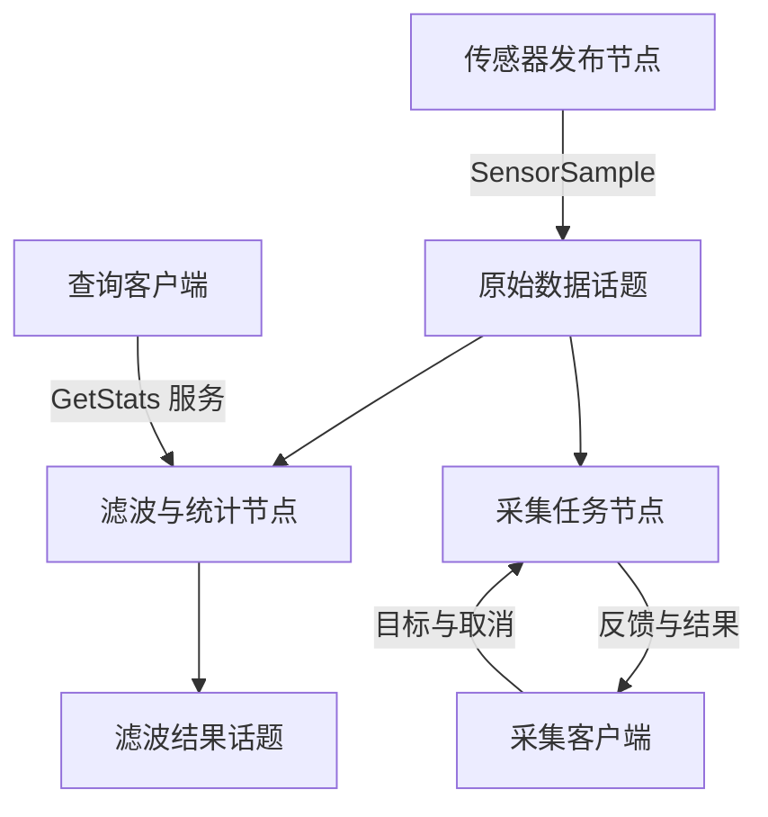
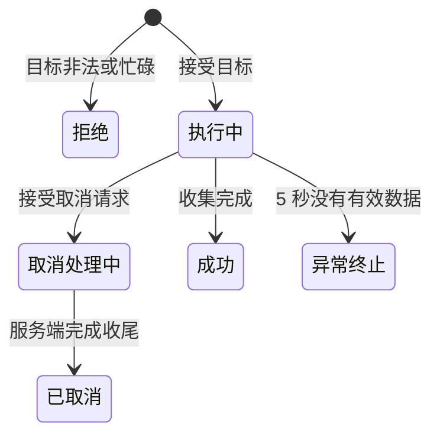

# ROS 2 第二周完整自学手册：用 C++ 写出自己的传感器系统

> 衔接：第一周已经会用命令观察 Topic、Service、Action、参数、launch 和 rosbag2。第二周把这些能力落实到自己的 C++ 程序。  
> 环境：Ubuntu 24.04、Bash、ROS 2 Jazzy；继续使用第一周的 Ubuntu 虚拟机即可。  
> 安排：7 天，共约 21～25 小时；其中第 5 天的 Action 可以分成两个半天。编译下载和意外排障另计。  
> 完成结果：一套能发布数据、滤波、查询统计、调整参数、执行可取消采集任务，并通过 launch 一次启动的 ROS 2 工程。  
> 内容核对日期：2026-09-22。

本手册给出本周需要的解释、完整文件、命令、例题、练习答案和排错顺序。末尾资料链接用于追溯，**完成课程不要求再去查资料或寻找示例代码**。下载 ROS 依赖仍需要联网 .

本周从最小例子逐步扩展同一个工程。文件发生变化时，会给出需要替换的完整版本；看到“完整替换”时，覆盖那个文件的全部内容。不要把前后两个版本的同名类拼到一起。

验证范围：示例接口已按 Jazzy 官方文档和对应源码核对；独立的 C++ 滤波测试已在编写环境运行，工程文件、配置和代码引用做了静态检查。编写环境没有 ROS 2，ROS 节点未在这里实际编译或运行。正文给出的是你在 Ubuntu 中应观察到的结果，并为每一步提供验收方法。

## 目录

- [使用方法、日程和最终工程](#start)
- [第 1 天：工作空间、功能包与第一个 C++ 节点](#day1)
- [第 2 天：发布订阅、回调与滑动平均](#day2)
- [第 3 天：自定义消息与传感器数据管线](#day3)
- [第 4 天：参数、服务与 C++ 客户端](#day4)
- [第 5 天：实现有反馈、可取消的 Action](#day5)
- [第 6 天：launch、YAML、命名空间与录制回放](#day6)
- [第 7 天：独立验收、测试与复盘](#day7)
- [自测题与参考答案](#exam)
- [常见问题与定位步骤](#troubleshooting)
- [命令速查、文件索引与第三周衔接](#finish)
- [核对来源](#sources)

<a id="start"></a>

## 使用方法、日程和最终工程

### 本周真正要学会的能力

第一周你会问：“哪个节点在发这个话题？”第二周还要能回答：“这个节点由哪个 C++ 对象创建？收到数据之后执行哪个函数？业务算法在哪里？构建系统怎样把它变成可运行的程序？”

沿用你已有 C++ 项目的思路：**先保留算法，再把输入、输出和配置接到 ROS 2。** `MovingAverage` 类不需要知道 ROS 是什么；节点负责把消息交给它，再把结果发出去。第三周封装差速运动学时也采用同一原则。

| 日期 | 核心知识 | 必须交付的成果 | 建议用时 |
|---|---|---|---|
| 第 1 天 | workspace、package、colcon、ament_cmake、Node、timer、spin | 自己编译的心跳节点 | 150～180 分钟 |
| 第 2 天 | Publisher、Subscription、消息、lambda、对象生命周期 | 数字发布者与滑动平均订阅者 | 180 分钟 |
| 第 3 天 | `.msg`、接口包、消息生成、包依赖 | 带时间戳、序号和有效标志的传感器管线 | 180～210 分钟 |
| 第 4 天 | 参数声明与校验、`.srv`、服务回调、future | 可配置的数据处理器和查询客户端 | 210～240 分钟 |
| 第 5 天 | `.action`、目标/反馈/结果、状态机、取消、超时 | 可取消的数据采集 Action 服务端与客户端 | 240～300 分钟 |
| 第 6 天 | Python launch、YAML、安装资源、命名空间、bag | 一条命令启动并复现实验 | 150～180 分钟 |
| 第 7 天 | 确定性验证、纯 C++ 测试、排障、总结 | 验收记录和可复用工程 | 150～180 分钟 |

每天建议按“20 分钟回顾 → 阅读解释 → 保存文件 → 构建运行 → 做练习 → 写 5 行总结”的顺序进行。第一次学习不要求背下 API；必须能够解释数据经过了哪些步骤。

### 阅读与终端规则

- `bash` 代码块是终端命令；没有 `$` 提示符，直接按顺序输入。
- `cpp`、`cmake`、`xml`、`yaml`、`python`、`text` 接口块是文件内容。先确认上方的**保存路径**，再写入文件。
- 日志块只是示意，时间戳、消息起始序号、运行时长可能不同。
- 行末 `\` 表示命令继续到下一行，后面不要加空格；不要把整份文档的命令一次性运行。
- `Ctrl+C` 是按键，用来结束当前持续运行的程序。
- 每天开始前，结束上一天的实验节点，避免同名节点或多个发布者影响结果。

本周工作空间固定为 `~/ros2_week2_ws`。不要把文档中助手侧的文件路径用作 Ubuntu 工作空间；`~` 始终指你在 Ubuntu 内的用户主目录。

| 终端 | 主要用途 | 应加载的环境 |
|---|---|---|
| 构建终端 BUILD | 创建包、执行 rosdep、colcon build | `setup_build.bash` |
| 运行终端 A | 发布者，或后期的 launch | `setup_run.bash` |
| 运行终端 B | 处理器、Action 服务端等 | `setup_run.bash` |
| 观察终端 C/D | echo、service、param、客户端、录包 | `setup_run.bash` |

“构建终端”是窗口角色，不是命令。一天结束可以关掉全部终端；下次按本手册重新 `source` 环境即可。

### 最终系统与名字

第 1～5 天先使用不带命名空间的 `/sensor/raw` 等名称；第 6 天的 launch 将它们放到 `/robot1` 下。



| 组件 | 第 1～5 天的名称 | 用途 |
|---|---|---|
| 发布节点 | `/sensor_publisher` | 每 200 ms 生成一份模拟温度数据 |
| 处理节点 | `/sensor_processor` | 拒绝无效值、计算滑动平均、保存统计 |
| 原始话题 | `/sensor/raw` | `robot_interfaces/msg/SensorSample` |
| 滤波话题 | `/sensor/filtered` | `std_msgs/msg/Float64`，单位仍为摄氏度 |
| 查询服务 | `/sensor/get_stats` | 读取处理器的当前统计快照 |
| 重置服务 | `/sensor/reset_stats` | 清空统计和滤波窗口 |
| 采集 Action | `/sensor/collect_samples` | 收集目标接受后处理到的 N 条有效原始消息 |

这里统计的是“本节点实际处理的消息”，不是传感器总共发送的消息。节点晚启动、网络丢失或队列溢出，都可能使不同节点看到不同集合。Action 收集的消息以接收处理顺序为准；这个练习不按 `header.stamp` 严格剔除目标接受前生成、但滞留队列中的消息。

### 本周工程的三个层次

| 层次 | 例子 | 职责 |
|---|---|---|
| 纯 C++ 算法 | `MovingAverage` | 只处理数字，可脱离 ROS 测试 |
| ROS 接入 | `SensorProcessor` | 接收消息、校验、调用算法、发布结果、提供服务 |
| 系统组织 | `sensor_system.launch.py`、`sensors.yaml` | 组织多个节点、名称和配置 |

消息定义放在独立的 `robot_interfaces` 包；节点代码放在 `robot_cpp_basics` 包。接口包被节点包依赖，方向不要反过来。

<a id="day1"></a>

## 第 1 天：工作空间、功能包与第一个 C++ 节点

### 1.1 今天结束时你应做到什么

不依赖系统自带 demo，创建自己的 C++ 包，编译出 `hello_node`，用 `ros2 run` 启动它，并解释为什么只有写完 `.cpp` 还不能运行。

### 1.2 构建流程必须理解的五个词

| 名称 | 本周实例 | 你怎样理解 |
|---|---|---|
| 工作空间 workspace | `~/ros2_week2_ws` | 管理一批包及其构建、安装结果的目录 |
| 功能包 package | `robot_cpp_basics` | 有 `package.xml` 的代码组织单位 |
| CMake | `CMakeLists.txt` | 描述源文件、依赖、编译目标和安装位置 |
| ament_cmake | CMake 中的 `ament_*` 接口 | 给普通 CMake 加上 ROS 包集成与导出能力 |
| colcon | `colcon build` | 找到包、按依赖排序、调用相应构建工具 |

以你熟悉的普通 C++ 项目对照：`g++ main.cpp -o app` 是单次编译；CMake 管理多个目标；colcon 又在包的层面调度多个项目。colcon 不替你写业务逻辑，也不代替 C++ 编译器。

构建后工作空间中会出现：

| 目录 | 内容 | 是否手动修改 |
|---|---|---|
| `src/` | 你写的源代码与配置 | 是 |
| `build/` | 编译中间产物、CMake 缓存 | 通常不修改 |
| `install/` | 安装后的程序、接口、资源、环境脚本 | 不直接改，重新构建生成 |
| `log/` | colcon 的构建日志 | 查看即可 |

`ros2 run` 通常从已加载的安装环境寻找程序。源码写对了，但没有构建、没有安装目标或者没有加载安装环境，仍然找不到它。[S1][S2]

### 1.3 准备工具与工作空间

前提：第一周已经安装 ROS 2 Jazzy。以下命令在 Ubuntu 的终端运行，不要在 Windows PowerShell 中运行。

```bash
source /opt/ros/jazzy/setup.bash
echo "$ROS_DISTRO"
sudo apt update
sudo apt install -y ros-dev-tools build-essential cmake
mkdir -p ~/ros2_week2_ws/src
mkdir -p ~/ros2_week2_ws/notes ~/ros2_week2_ws/bags
cd ~/ros2_week2_ws
```

`echo "$ROS_DISTRO"` 应输出 `jazzy`。如果 `/opt/ros/jazzy/setup.bash` 不存在，需要先完成第一周安装步骤；不要用 Humble 的文件替代 Jazzy。

保存到 **`~/ros2_week2_ws/setup_build.bash`**：

```bash
source /opt/ros/jazzy/setup.bash
export ROS_DOMAIN_ID=42
unset ROS_LOCALHOST_ONLY ROS_STATIC_PEERS
export ROS_AUTOMATIC_DISCOVERY_RANGE=LOCALHOST
```

保存到 **`~/ros2_week2_ws/setup_run.bash`**：

```bash
source "$HOME/ros2_week2_ws/setup_build.bash"
if [ ! -f "$HOME/ros2_week2_ws/install/local_setup.bash" ]; then
  echo "Build the workspace first: ~/ros2_week2_ws/install/local_setup.bash is missing"
  return 1
fi
source "$HOME/ros2_week2_ws/install/local_setup.bash"
```

以后构建终端用第一份，运行终端用第二份。脚本必须用 `source` 加载，不能只执行 `bash setup_run.bash`；后者的环境变化不会留在当前 shell。

`/opt/ros/jazzy` 是基础环境，称为 underlay；本周 `install/` 是在它之上叠加的 overlay。`local_setup.bash` 加载当前工作空间，本手册已先明确加载 underlay。每次构建增加新接口或目标后，运行终端应重新 `source setup_run.bash`。

**构建终端不要先加载本工作空间的 overlay。** 不要在 `.bashrc` 里加入本周 `install/setup.bash` 的自动加载行。若你以前已经这样做过，先注释那一行，再开新的构建终端；基础 `/opt/ros/jazzy/setup.bash` 的自动加载可以保留。

初始化 rosdep，一台机器通常只需初始化一次：

```bash
if [ -f /etc/ros/rosdep/sources.list.d/20-default.list ]; then
  echo "rosdep is already initialized"
else
  sudo rosdep init
fi
rosdep update
```

`rosdep init` 配置规则源，`rosdep update` 下载规则；实际安装依赖的 `rosdep install` 在包创建后执行。`rosdep update` 不加 `sudo`。

### 1.4 创建包与保存源文件

BUILD 终端：

```bash
source ~/ros2_week2_ws/setup_build.bash
cd ~/ros2_week2_ws/src
ros2 pkg create --build-type ament_cmake --license Apache-2.0 \
  robot_cpp_basics --dependencies rclcpp
mkdir -p ~/ros2_week2_ws/src/robot_cpp_basics/include/robot_cpp_basics
cd ~/ros2_week2_ws
```

若包已经存在，不要重复创建；从保存文件继续。用 VSCode 的“打开文件夹”打开 Ubuntu 内的 `~/ros2_week2_ws`，让源码、配置和终端处于同一个环境。

保存到 **`~/ros2_week2_ws/src/robot_cpp_basics/src/hello_node.cpp`**：

```cpp
#include <chrono>
#include <cstdint>
#include <memory>

#include "rclcpp/rclcpp.hpp"

class HelloNode : public rclcpp::Node
{
public:
  HelloNode() : Node("hello_node")
  {
    timer_ = create_wall_timer(
      std::chrono::seconds(1),
      [this]() {
        ++count_;
        RCLCPP_INFO(
          get_logger(), "heartbeat=%llu",
          static_cast<unsigned long long>(count_));
      });
  }

private:
  std::uint64_t count_{0};
  rclcpp::TimerBase::SharedPtr timer_;
};

int main(int argc, char * argv[])
{
  rclcpp::init(argc, argv);
  rclcpp::spin(std::make_shared<HelloNode>());
  rclcpp::shutdown();
  return 0;
}
```

完整替换 **`~/ros2_week2_ws/src/robot_cpp_basics/CMakeLists.txt`**：

```cmake
cmake_minimum_required(VERSION 3.8)
project(robot_cpp_basics)

set(CMAKE_CXX_STANDARD 17)
set(CMAKE_CXX_STANDARD_REQUIRED ON)
set(CMAKE_CXX_EXTENSIONS OFF)

find_package(ament_cmake REQUIRED)
find_package(rclcpp REQUIRED)

function(add_lesson_node target)
  add_executable(${target} src/${target}.cpp)
  target_include_directories(${target} PRIVATE ${CMAKE_CURRENT_SOURCE_DIR}/include)
  ament_target_dependencies(${target} rclcpp)
  if(CMAKE_CXX_COMPILER_ID MATCHES "GNU|Clang")
    target_compile_options(${target} PRIVATE -Wall -Wextra -Wpedantic)
  endif()
  install(TARGETS ${target} DESTINATION lib/${PROJECT_NAME})
endfunction()

add_lesson_node(hello_node)

ament_package()
```

完整替换 **`~/ros2_week2_ws/src/robot_cpp_basics/package.xml`**：

```xml
<?xml version="1.0"?>
<package format="3">
  <name>robot_cpp_basics</name>
  <version>0.0.1</version>
  <description>ROS 2 C++ week 2 learning nodes</description>
  <maintainer email="student@example.com">Student</maintainer>
  <license>Apache-2.0</license>
  <buildtool_depend>ament_cmake</buildtool_depend>
  <depend>rclcpp</depend>
  <export>
    <build_type>ament_cmake</build_type>
  </export>
</package>
```

`Student` 和邮箱是本地练习元数据，可以稍后改成你的署名；不会因为写入这个字段而发送邮件。

### 1.5 逐步理解代码

```cpp
class HelloNode : public rclcpp::Node
```

这表示你定义的 C++ 类拥有 ROS 节点能力。构造函数中的 `Node("hello_node")` 指定默认节点名；类名 `HelloNode`、节点名 `hello_node`、可执行文件名 `hello_node` 是不同概念，只是本例选用了相近的名字。

```cpp
timer_ = create_wall_timer(std::chrono::seconds(1), [this]() { /* 回调内容 */ });
```

定时器每隔约 1 秒变为就绪，执行器调度回调。`[this]` 让 lambda 能访问当前对象的 `count_` 和 `get_logger()`。回调中的 `++count_` 与普通 C++ 自增完全相同。

为什么把定时器存进 `timer_` 成员？因为它必须在构造函数返回后继续存活。Publisher、Subscription、Service 以及参数回调句柄也遵守同样的生命周期原则。临时创建后立即丢失所有持有者，往往意味着对象提前销毁。

`rclcpp::init(argc, argv)` 初始化 ROS 并处理 ROS 参数；`std::make_shared<HelloNode>()` 创建节点；`rclcpp::spin(...)` 持续等待并执行回调；`rclcpp::shutdown()` 清理上下文。本例 `spin` 在 `Ctrl+C` 后返回。

**创建定时器不代表代码已经在运行回调。** 如果删除 `spin`，程序会很快退出。`spin` 也不是你的数据处理算法，它是回调能够被调度的基础。

本例使用 wall timer，受实际时间推进驱动，不依赖仿真 `/clock`。它不是硬实时承诺；操作系统调度和其他回调会影响实际执行时刻。以后用于机器人控制时，不能把“设置了 10 ms”直接当成“严格每 10 ms 执行”。

### 1.6 理解构建文件

| 写法 | 作用 |
|---|---|
| `find_package(rclcpp REQUIRED)` | 找到 ROS C++ 客户端库的构建信息 |
| `add_executable(...)` | 指定生成哪个可执行程序、编译哪些源文件 |
| `target_include_directories(...)` | 让编译器找到本包自己的头文件 |
| `ament_target_dependencies(...)` | 给编译目标设置依赖所需的包含路径、链接等 |
| `install(TARGETS ... lib/${PROJECT_NAME})` | 把程序安装到 ROS 能按包名查找的位置 |
| `ament_package()` | 完成本包的 ament 导出与注册，通常放最后 |
| `package.xml` 的 `<depend>` | 声明包级依赖，供依赖安装、构建排序等使用 |

只在 CMake 中写 `find_package`，不代表包级依赖声明自动完整；只在 XML 中写依赖，也不代表 C++ 编译目标自动链接好了。两个文件职责不同。

`add_lesson_node` 是本手册定义的普通 CMake 函数，不是 ROS 自带命令。它把“创建目标、配置依赖、安装程序”的重复代码集中起来。以后新增程序，只需在完整构建文件中多调用一次。

### 1.7 构建与第一次运行

BUILD：

```bash
cd ~/ros2_week2_ws
rosdep install --from-paths src --ignore-src -r -y --rosdistro jazzy
colcon build --symlink-install --packages-select robot_cpp_basics \
  --cmake-args -DCMAKE_BUILD_TYPE=RelWithDebInfo -DCMAKE_EXPORT_COMPILE_COMMANDS=ON
```

`--ignore-src` 表示工作空间中已有源码的包不再当成系统依赖安装；`--packages-select` 只选指定包；`--symlink-install` 允许部分安装内容以符号链接组织，**不代表修改 C++ 后可以跳过编译**。

成功标准：摘要包含一个包完成，没有 `Failed`。普通编译 warning 与编译错误不同，但警告也应阅读。

新开运行终端 A：

```bash
source ~/ros2_week2_ws/setup_run.bash
ros2 pkg executables robot_cpp_basics
ros2 run robot_cpp_basics hello_node
```

应能找到 `robot_cpp_basics hello_node`，运行后大约每秒显示一次：

```text
[INFO] ... [hello_node]: heartbeat=1
[INFO] ... [hello_node]: heartbeat=2
[INFO] ... [hello_node]: heartbeat=3
```

新开 C：

```bash
source ~/ros2_week2_ws/setup_run.bash
ros2 node list
ros2 node info /hello_node
```

应找到 `/hello_node`。即使你没创建业务话题，也可能看到 `/rosout`、参数相关服务或 `/parameter_events` 等节点基础设施；这不是额外的心跳话题。本例心跳只写日志。

### 1.8 例题与动手练习

**例题：希望每秒打印两次，改哪里？**

周期公式为 `频率 Hz = 1000 / 周期 ms`，因此 2 Hz 对应 500 ms。把 `std::chrono::seconds(1)` 改成 `std::chrono::milliseconds(500)`，保存，停止旧程序，重新执行本节 `colcon build`，重新加载运行环境并启动。

**练习 A：改节点名为 `heartbeat_node`，可执行文件名保持 `hello_node`。**

答案：只把构造函数的 `Node("hello_node")` 改成 `Node("heartbeat_node")`，重新构建。启动命令仍为 `ros2 run robot_cpp_basics hello_node`，`ros2 node list` 显示 `/heartbeat_node`。完成后恢复原名，便于后文一致。

**练习 B：构建成功，却显示 `Package 'robot_cpp_basics' not found`，先做什么？**

答案：在当前运行终端执行 `source ~/ros2_week2_ws/setup_run.bash`，再执行 `ros2 pkg prefix robot_cpp_basics`；应指向本周工作空间的安装目录。先核对环境，不要立刻重装 ROS。

**今日验收：**

- [ ] 能从工作空间根目录构建自己的包。
- [ ] 能运行心跳节点，并在另一个终端查看节点信息。
- [ ] 能解释源码、可执行文件、运行中的节点三者区别。
- [ ] 能解释 timer 成员和 `spin` 各自的用途。
- [ ] 在 `notes/day1.md` 写出“修改源代码后”的正确工作流程。

<a id="day2"></a>

## 第 2 天：发布订阅、回调与滑动平均

### 2.1 今天的任务

写一个每 500 ms 发布数字的节点，再写一个订阅节点，计算最近 3 个收到的数字的平均值。程序分成两个进程运行，你无需自己写 socket 或跨进程队列。

普通函数调用把数据交给同一程序中的另一个函数；ROS 发布订阅把消息交给匹配的订阅端。节点可以在不同进程，甚至不同机器，但本周都运行在同一台 Ubuntu 中。

| C++ 对象 | 本例作用 |
|---|---|
| `std_msgs::msg::Float64` | 一份消息，其中 `data` 是双精度浮点数 |
| `rclcpp::Publisher<...>` | 向指定话题发布这种消息 |
| `rclcpp::Subscription<...>` | 订阅指定话题并保存回调 |
| `rclcpp::TimerBase` | 按周期触发发布操作 |
| `MovingAverage` | 普通 C++ 算法对象 |

主题名称相同还不够，类型和 QoS 也要兼容。`Float64` 与 `Int64` 不是同一种消息，即使都只包含一个数。[S3]

### 2.2 先手算，再写滤波类

窗口为 3 时，滑动平均只保留最近的最多 3 个值。前两次还没攒满窗口，按实际收到的数量计算，**不是补零后除以 3**。

| 收到的值 | 窗口内容 | 平均值 |
|---|---|---|
| 1 | `[1]` | 1 |
| 2 | `[1, 2]` | 1.5 |
| 3 | `[1, 2, 3]` | 2 |
| 4 | `[2, 3, 4]` | 3 |
| 5 | `[3, 4, 5]` | 4 |
| 1 | `[4, 5, 1]` | 10/3，约 3.333 |

记当前窗口为 `values`，则平均值为 `所有窗口元素之和 / 当前元素数量`。队列超过窗口长度时，先删除最旧的值。

保存到 **`~/ros2_week2_ws/src/robot_cpp_basics/include/robot_cpp_basics/moving_average.hpp`**：

```cpp
#pragma once

#include <cmath>
#include <cstddef>
#include <deque>
#include <stdexcept>

class MovingAverage
{
public:
  explicit MovingAverage(std::size_t window_size)
  : window_size_(window_size)
  {
    if (window_size_ == 0) {
      throw std::invalid_argument("window_size must be positive");
    }
  }

  double push(double value)
  {
    if (!std::isfinite(value)) {
      throw std::invalid_argument("sample must be finite");
    }
    values_.push_back(value);
    if (values_.size() > window_size_) {
      values_.pop_front();
    }
    double total = 0.0;
    for (double item : values_) {
      total += item;
    }
    return total / static_cast<double>(values_.size());
  }

  void clear()
  {
    values_.clear();
  }

  std::size_t size() const
  {
    return values_.size();
  }

private:
  std::size_t window_size_;
  std::deque<double> values_;
};
```

这里使用 `deque` 保存有限窗口。实现每次重新求和，时间复杂度为 `O(W)`，空间复杂度为 `O(W)`，W 为窗口长度。本周 W 很小，优先保证容易理解。用累计和可以做到每次 `O(1)`，但需要另外考虑减去旧值和数值误差；本周不要求优化。

`std::isfinite` 排除 NaN 和无穷大。该类只做基础数值检查，业务范围检查由节点完成。本周温度和窗口都有明确上限；不要把这份简洁示例直接理解为适合任意巨大数值的通用数值库。

### 2.3 完整发布者

保存到 **`~/ros2_week2_ws/src/robot_cpp_basics/src/number_publisher.cpp`**：

```cpp
#include <chrono>
#include <cstdint>
#include <memory>

#include "rclcpp/rclcpp.hpp"
#include "std_msgs/msg/float64.hpp"

class NumberPublisher : public rclcpp::Node
{
public:
  NumberPublisher() : Node("number_publisher")
  {
    publisher_ = create_publisher<std_msgs::msg::Float64>("numbers", 10);
    timer_ = create_wall_timer(
      std::chrono::milliseconds(500), [this]() { publish_number(); });
  }

private:
  void publish_number()
  {
    std_msgs::msg::Float64 message;
    message.data = static_cast<double>((sequence_ % 5) + 1);
    ++sequence_;
    publisher_->publish(message);
    RCLCPP_INFO(get_logger(), "published=%.1f", message.data);
  }

  std::uint64_t sequence_{0};
  rclcpp::Publisher<std_msgs::msg::Float64>::SharedPtr publisher_;
  rclcpp::TimerBase::SharedPtr timer_;
};

int main(int argc, char * argv[])
{
  rclcpp::init(argc, argv);
  rclcpp::spin(std::make_shared<NumberPublisher>());
  rclcpp::shutdown();
  return 0;
}
```

`sequence_ % 5 + 1` 产生重复序列 `1, 2, 3, 4, 5, 1, ...`。`publish(message)` 提交一条消息，不代表“所有订阅者已经处理完它”，也不是等待订阅者返回结果的函数。

### 2.4 完整订阅者

保存到 **`~/ros2_week2_ws/src/robot_cpp_basics/src/number_subscriber.cpp`**：

```cpp
#include <cmath>
#include <memory>

#include "rclcpp/rclcpp.hpp"
#include "std_msgs/msg/float64.hpp"
#include "robot_cpp_basics/moving_average.hpp"

class NumberSubscriber : public rclcpp::Node
{
public:
  NumberSubscriber() : Node("number_subscriber")
  {
    subscription_ = create_subscription<std_msgs::msg::Float64>(
      "numbers", 10,
      [this](std_msgs::msg::Float64::ConstSharedPtr message) {
        if (!std::isfinite(message->data) || std::abs(message->data) > 1000000.0) {
          RCLCPP_WARN(get_logger(), "Rejected invalid or excessive value");
          return;
        }
        const double average = filter_.push(message->data);
        RCLCPP_INFO(
          get_logger(), "raw=%.1f average=%.3f window_count=%zu",
          message->data, average, filter_.size());
      });
  }

private:
  MovingAverage filter_{3};
  rclcpp::Subscription<std_msgs::msg::Float64>::SharedPtr subscription_;
};

int main(int argc, char * argv[])
{
  rclcpp::init(argc, argv);
  rclcpp::spin(std::make_shared<NumberSubscriber>());
  rclcpp::shutdown();
  return 0;
}
```

回调接收到 `ConstSharedPtr`，表示共享拥有一份只读消息。`message->data` 读取字段；只读指针可以减少无意修改输入数据的风险。指针的意义与普通 C++ 相同，不是“ROS 特殊语法”。

`[this](... message) { ... }` 可以理解为“消息到来后调用的函数，只不过这个函数写在创建订阅的位置”。它不是一边创建订阅一边立即处理消息。

数字订阅者额外限制绝对值不超过 1,000,000，防止练习时意外注入极大数字。有效输入才进入窗口；无效输入不改变窗口。

### 2.5 更新构建文件

完整替换 **`~/ros2_week2_ws/src/robot_cpp_basics/CMakeLists.txt`**：

```cmake
cmake_minimum_required(VERSION 3.8)
project(robot_cpp_basics)

set(CMAKE_CXX_STANDARD 17)
set(CMAKE_CXX_STANDARD_REQUIRED ON)
set(CMAKE_CXX_EXTENSIONS OFF)

find_package(ament_cmake REQUIRED)
find_package(rclcpp REQUIRED)
find_package(std_msgs REQUIRED)

function(add_lesson_node target)
  add_executable(${target} src/${target}.cpp)
  target_include_directories(${target} PRIVATE ${CMAKE_CURRENT_SOURCE_DIR}/include)
  ament_target_dependencies(${target} rclcpp std_msgs)
  if(CMAKE_CXX_COMPILER_ID MATCHES "GNU|Clang")
    target_compile_options(${target} PRIVATE -Wall -Wextra -Wpedantic)
  endif()
  install(TARGETS ${target} DESTINATION lib/${PROJECT_NAME})
endfunction()

add_lesson_node(hello_node)
add_lesson_node(number_publisher)
add_lesson_node(number_subscriber)

ament_package()
```

完整替换 **`~/ros2_week2_ws/src/robot_cpp_basics/package.xml`**：

```xml
<?xml version="1.0"?>
<package format="3">
  <name>robot_cpp_basics</name>
  <version>0.0.1</version>
  <description>ROS 2 C++ week 2 learning nodes</description>
  <maintainer email="student@example.com">Student</maintainer>
  <license>Apache-2.0</license>
  <buildtool_depend>ament_cmake</buildtool_depend>
  <depend>rclcpp</depend>
  <depend>std_msgs</depend>
  <export>
    <build_type>ament_cmake</build_type>
  </export>
</package>
```

今天新增依赖 `std_msgs` 和两个可执行目标。保留第 1 天的源文件，不需要重复创建包。

BUILD：

```bash
source ~/ros2_week2_ws/setup_build.bash
cd ~/ros2_week2_ws
rosdep install --from-paths src --ignore-src -r -y --rosdistro jazzy
colcon build --symlink-install --packages-select robot_cpp_basics \
  --cmake-args -DCMAKE_BUILD_TYPE=RelWithDebInfo -DCMAKE_EXPORT_COMPILE_COMMANDS=ON
```

### 2.6 运行与观察

先启动 B，再启动 A。这样 B 更有机会从序列开头接收；不过发现和调度仍需时间，不能把“必收到第一条”当成默认保证。

B：

```bash
source ~/ros2_week2_ws/setup_run.bash
ros2 run robot_cpp_basics number_subscriber
```

A：

```bash
source ~/ros2_week2_ws/setup_run.bash
ros2 run robot_cpp_basics number_publisher
```

C：

```bash
source ~/ros2_week2_ws/setup_run.bash
ros2 topic list -t
ros2 topic info /numbers --verbose
ros2 topic echo /numbers --once
ros2 topic hz /numbers
```

`hz` 观察数秒后 `Ctrl+C` 停止，测量结果应接近 2 Hz，不要求刚好等于 2.000。`topic echo` 和 `topic hz` 也会创建订阅端，因此端点数量会随着观察工具变化。

若订阅者从 1 开始接收，应观察到平均值序列约为 `1.000, 1.500, 2.000, 3.000, 4.000, 3.333`。若它从 3 开始，第一条平均值就是 3；按实际收到的序列重新手算即可。

### 2.7 为什么本例没有线程和互斥锁

你之前的多线程数据管线可能使用“生产者线程 + 队列 + 消费者线程”。ROS 接入后，跨节点数据流由消息通信完成，节点内的任务由回调表达。

本周程序调用 `rclcpp::spin(node)`，使用单线程执行器；一个节点里的相关回调逐个执行。所以 `filter_` 不会在同一时刻被这个节点的两个回调修改，本例不需要为了“用到了 ROS”而添加互斥锁。

这不等于 ROS 程序永远没有线程，也不等于使用多线程执行器后回调一定并发；回调组还会限制执行。以后引入独立工作线程、不同回调组或真正并行访问时，才需要重新分析共享状态。

**不要在订阅回调中加入无限循环或长时间 sleep。** 单线程执行器被占住时，定时器、其他订阅、服务都可能得不到及时处理。回调应完成一次有限工作，然后返回。

### 2.8 QoS 的最小知识

`create_publisher<类型>("numbers", 10)` 中的 `10` 是历史深度的便捷写法，在这里使用默认的可靠传输等策略。它不是 10 Hz，不是消息字段个数，也不是“永远不丢消息”的保证。

| 概念 | 本例需要记住的含义 |
|---|---|
| Keep Last / depth | 中间件相关历史队列保留最近多少条样本 |
| Reliable | 在匹配与资源条件允许时进行可靠传输；不是业务处理完成确认 |
| Best Effort | 尽力交付，不要求同样的重传保障 |
| Volatile | 新订阅者默认不要求收到发布者启动以来的历史数据 |

可靠发布者可以匹配尽力订阅者；尽力发布者不能满足要求可靠传输的订阅者。实际还可能因其他 QoS 项不兼容而不通信。[S8]

### 2.9 练习与答案

**练习 A：窗口改为 5，输入 `1, 2, 3, 4, 5, 1` 时，最后一次平均值是多少？**

答案：把 `MovingAverage filter_{3};` 改成 `MovingAverage filter_{5};`，最后窗口为 `[2,3,4,5,1]`，平均值是 3。重新编译验证后恢复窗口 3。

**练习 B：不改代码，将两个节点都改为使用 `/practice/numbers`。**

先停掉旧 A/B。在 B 运行：

```bash
ros2 run robot_cpp_basics number_subscriber --ros-args \
  -r numbers:=/practice/numbers
```

在 A 运行：

```bash
ros2 run robot_cpp_basics number_publisher --ros-args \
  -r numbers:=/practice/numbers
```

答案：重映射只修改名称解析；两端都转向同一话题才会按预期连接。若只改发布者，原订阅者仍在 `/numbers` 等待。

**练习 C：只启动订阅者，没有发布者，应该看到报错吗？**

答案：通常不会。节点会继续等待消息。用 `ros2 topic info /numbers --verbose` 检查发布端数量，而不是把“暂无回调日志”直接判断成崩溃。

**今日验收：**能手算窗口结果、解释回调何时执行、找到两端的类型与 QoS、完成一次名称重映射，并在 `notes/day2.md` 写明算法与通信分别由谁负责。

<a id="day3"></a>

## 第 3 天：自定义消息与传感器数据管线

### 3.1 为什么一个 Float64 已经不够

只收到 `25.8`，你不知道它来自哪个传感器、什么时候产生、是否有效，或者有没有跳过样本。今天用一个结构化消息表达这些信息。

本例选择摄氏度作为固定单位，用字段名 `temperature_c` 明确表达。单位属于接口约定；ROS 不会看见一个 `float64` 就自动判断单位或进行转换。

| 字段 | 类型 | 约定 |
|---|---|---|
| `header.stamp` | 时间戳 | 本次消息生成时的节点时间 |
| `header.frame_id` | 字符串 | 使用 `virtual_sensor` 标识传感器参考坐标系 |
| `sequence` | `uint64` | 本次发布节点运行期间递增，从 1 开始 |
| `temperature_c` | `float64` | 摄氏温度 |
| `valid` | `bool` | 数据源对当前样本是否有效的标记 |

接收端仍需独立检查有限值和业务范围；发送端写了 `valid=true`，不意味着所有字段都可信或合理。

### 3.2 创建接口包

结束第 2 天的发布者和订阅者。BUILD：

```bash
source ~/ros2_week2_ws/setup_build.bash
cd ~/ros2_week2_ws/src
ros2 pkg create --build-type ament_cmake --license Apache-2.0 robot_interfaces
mkdir -p ~/ros2_week2_ws/src/robot_interfaces/msg
```

保存到 **`~/ros2_week2_ws/src/robot_interfaces/msg/SensorSample.msg`**：

```text
std_msgs/Header header
uint64 sequence
float64 temperature_c
bool valid
```

完整替换 **`~/ros2_week2_ws/src/robot_interfaces/CMakeLists.txt`**：

```cmake
cmake_minimum_required(VERSION 3.8)
project(robot_interfaces)

find_package(ament_cmake REQUIRED)
find_package(rosidl_default_generators REQUIRED)
find_package(std_msgs REQUIRED)

rosidl_generate_interfaces(${PROJECT_NAME}
  "msg/SensorSample.msg"
  DEPENDENCIES std_msgs
)

ament_export_dependencies(rosidl_default_runtime)
ament_package()
```

完整替换 **`~/ros2_week2_ws/src/robot_interfaces/package.xml`**：

```xml
<?xml version="1.0"?>
<package format="3">
  <name>robot_interfaces</name>
  <version>0.0.1</version>
  <description>Interfaces for the week 2 sensor system</description>
  <maintainer email="student@example.com">Student</maintainer>
  <license>Apache-2.0</license>
  <buildtool_depend>ament_cmake</buildtool_depend>
  <buildtool_depend>rosidl_default_generators</buildtool_depend>
  <depend>std_msgs</depend>
  <exec_depend>rosidl_default_runtime</exec_depend>
  <member_of_group>rosidl_interface_packages</member_of_group>
  <export>
    <build_type>ament_cmake</build_type>
  </export>
</package>
```

`.msg` 是接口描述，不是需要你自己加分号的 C++ 结构体。`rosidl_generate_interfaces` 在构建时生成 C++、Python 等语言可用的接口代码。因为消息用到了 `std_msgs/Header`，所以需要声明 `std_msgs` 依赖。[S4]

| 接口写法 | 使用位置 |
|---|---|
| `robot_interfaces/msg/SensorSample` | ROS CLI 中的消息类型 |
| `robot_interfaces::msg::SensorSample` | C++ 中的类型名 |
| `robot_interfaces/msg/sensor_sample.hpp` | C++ 中包含的生成头文件 |

文件名是 `SensorSample.msg`，生成头文件是 `sensor_sample.hpp`。不要自己在 `src/` 中创建一份“生成头文件”来消除报错；真正问题通常是接口没构建或依赖没配置。

接口包不依赖节点包。把接口单独成包，能让将来其他节点使用相同消息，而不必依赖这一套具体传感器实现。

### 3.3 完整传感器发布者

保存到 **`~/ros2_week2_ws/src/robot_cpp_basics/src/sensor_publisher.cpp`**：

```cpp
#include <chrono>
#include <cmath>
#include <cstdint>
#include <memory>

#include "rclcpp/rclcpp.hpp"
#include "robot_interfaces/msg/sensor_sample.hpp"

class SensorPublisher : public rclcpp::Node
{
public:
  SensorPublisher() : Node("sensor_publisher")
  {
    publisher_ = create_publisher<robot_interfaces::msg::SensorSample>(
      "sensor/raw", rclcpp::QoS(10).reliable());
    timer_ = create_wall_timer(
      std::chrono::milliseconds(200), [this]() { publish_sample(); });
  }

private:
  void publish_sample()
  {
    robot_interfaces::msg::SensorSample sample;
    sample.header.stamp = now().to_msg();
    sample.header.frame_id = "virtual_sensor";
    sample.sequence = ++sequence_;
    const double phase = static_cast<double>(sequence_ % 100) * 0.2;
    const double noise = (sequence_ % 2 == 0) ? -0.2 : 0.2;
    sample.temperature_c = 25.0 + 2.0 * std::sin(phase) + noise;
    sample.valid = (sequence_ % 10 != 0);
    publisher_->publish(sample);
    RCLCPP_INFO(
      get_logger(), "seq=%llu temp=%.3f valid=%s",
      static_cast<unsigned long long>(sample.sequence), sample.temperature_c,
      sample.valid ? "true" : "false");
  }

  std::uint64_t sequence_{0};
  rclcpp::Publisher<robot_interfaces::msg::SensorSample>::SharedPtr publisher_;
  rclcpp::TimerBase::SharedPtr timer_;
};

int main(int argc, char * argv[])
{
  rclcpp::init(argc, argv);
  rclcpp::spin(std::make_shared<SensorPublisher>());
  rclcpp::shutdown();
  return 0;
}
```

数据公式是“基准 25°C + 正弦变化 + 正负交替扰动”。这是一组可重复的教学数据，不是严格的真实传感器模型。每第 10 条消息设置 `valid=false`；仍然发布，便于验证下游拒绝逻辑。

`now().to_msg()` 把当前节点时钟值写入消息。默认未启用仿真时间时使用系统时间；若以后启用 `use_sim_time`，节点时间会受 `/clock` 影响。设置了 Header 不会自动做时钟同步。

`frame_id="virtual_sensor"` 只填入名称，**不会自动发布 TF**。这里的温度是标量，不涉及向量坐标变换；保留 Header 是为了建立传感器数据的组织习惯。

### 3.4 完整传感器处理器

保存到 **`~/ros2_week2_ws/src/robot_cpp_basics/src/sensor_processor.cpp`**：

```cpp
#include <cmath>
#include <memory>

#include "rclcpp/rclcpp.hpp"
#include "robot_interfaces/msg/sensor_sample.hpp"
#include "std_msgs/msg/float64.hpp"
#include "robot_cpp_basics/moving_average.hpp"

class SensorProcessor : public rclcpp::Node
{
public:
  SensorProcessor() : Node("sensor_processor")
  {
    filtered_publisher_ = create_publisher<std_msgs::msg::Float64>("sensor/filtered", 10);
    subscription_ = create_subscription<robot_interfaces::msg::SensorSample>(
      "sensor/raw", rclcpp::QoS(10).reliable(),
      [this](robot_interfaces::msg::SensorSample::ConstSharedPtr sample) {
        if (!sample->valid || !std::isfinite(sample->temperature_c) ||
          sample->temperature_c < -40.0 || sample->temperature_c > 125.0)
        {
          RCLCPP_WARN(get_logger(), "Rejected sample seq=%llu",
            static_cast<unsigned long long>(sample->sequence));
          return;
        }
        std_msgs::msg::Float64 filtered;
        filtered.data = filter_.push(sample->temperature_c);
        filtered_publisher_->publish(filtered);
        RCLCPP_INFO(get_logger(), "raw=%.3f filtered=%.3f",
          sample->temperature_c, filtered.data);
      });
  }

private:
  MovingAverage filter_{3};
  rclcpp::Publisher<std_msgs::msg::Float64>::SharedPtr filtered_publisher_;
  rclcpp::Subscription<robot_interfaces::msg::SensorSample>::SharedPtr subscription_;
};

int main(int argc, char * argv[])
{
  rclcpp::init(argc, argv);
  rclcpp::spin(std::make_shared<SensorProcessor>());
  rclcpp::shutdown();
  return 0;
}
```

数据处理顺序必须清楚：

1. 读取输入消息。
2. 若 `valid=false`、不是有限值或温度超出 `[-40, 125]`，拒绝并返回。
3. 将有效温度交给 `MovingAverage`。
4. 把结果发布到 `sensor/filtered`。

**被拒绝的样本不会占据滤波窗口，也不会发布一个替代的 0。** 0°C 是可能存在的真实值，不能用它随意代替错误数据。

输出暂用 `Float64`，适合本周观察算法。它没有保留输入的时间戳和序号，不能从输出独立重建完整时序。以后需要时间对齐或多传感器融合时，应为输出选择带时间信息的适当接口，而不是假装 Float64 自带这些字段。

### 3.5 更新节点包的构建文件

完整替换 **`~/ros2_week2_ws/src/robot_cpp_basics/CMakeLists.txt`**：

```cmake
cmake_minimum_required(VERSION 3.8)
project(robot_cpp_basics)

set(CMAKE_CXX_STANDARD 17)
set(CMAKE_CXX_STANDARD_REQUIRED ON)
set(CMAKE_CXX_EXTENSIONS OFF)

find_package(ament_cmake REQUIRED)
find_package(rclcpp REQUIRED)
find_package(std_msgs REQUIRED)
find_package(robot_interfaces REQUIRED)

function(add_lesson_node target)
  add_executable(${target} src/${target}.cpp)
  target_include_directories(${target} PRIVATE ${CMAKE_CURRENT_SOURCE_DIR}/include)
  ament_target_dependencies(${target} rclcpp std_msgs robot_interfaces)
  if(CMAKE_CXX_COMPILER_ID MATCHES "GNU|Clang")
    target_compile_options(${target} PRIVATE -Wall -Wextra -Wpedantic)
  endif()
  install(TARGETS ${target} DESTINATION lib/${PROJECT_NAME})
endfunction()

add_lesson_node(hello_node)
add_lesson_node(number_publisher)
add_lesson_node(number_subscriber)
add_lesson_node(sensor_publisher)
add_lesson_node(sensor_processor)

ament_package()
```

完整替换 **`~/ros2_week2_ws/src/robot_cpp_basics/package.xml`**：

```xml
<?xml version="1.0"?>
<package format="3">
  <name>robot_cpp_basics</name>
  <version>0.0.1</version>
  <description>ROS 2 C++ week 2 learning nodes</description>
  <maintainer email="student@example.com">Student</maintainer>
  <license>Apache-2.0</license>
  <buildtool_depend>ament_cmake</buildtool_depend>
  <depend>rclcpp</depend>
  <depend>std_msgs</depend>
  <depend>robot_interfaces</depend>
  <export>
    <build_type>ament_cmake</build_type>
  </export>
</package>
```

现在工作空间有两个包。`robot_cpp_basics` 的 XML 声明依赖 `robot_interfaces`，colcon 才能据此正确排序。

### 3.6 构建两个包

BUILD：

```bash
cd ~/ros2_week2_ws
rosdep install --from-paths src --ignore-src -r -y --rosdistro jazzy
colcon list
colcon build --symlink-install --packages-up-to robot_cpp_basics \
  --cmake-args -DCMAKE_BUILD_TYPE=RelWithDebInfo -DCMAKE_EXPORT_COMPILE_COMMANDS=ON
```

`colcon list` 应列出两个包。`--packages-up-to robot_cpp_basics` 会选中目标包及其工作空间内的递归依赖，因此先处理接口包，再处理节点包。

区别：`--packages-select robot_cpp_basics` 不会自动把尚未构建的源码依赖都选进来。之后本周统一使用 `--packages-up-to`，避免漏掉接口包。

新运行终端 C：

```bash
source ~/ros2_week2_ws/setup_run.bash
ros2 interface show robot_interfaces/msg/SensorSample
ros2 pkg executables robot_cpp_basics
```

接口显示应包含 Header、sequence、temperature_c、valid。Header 内部字段展开属于正常现象。

### 3.7 运行系统

B 先启动处理器：

```bash
source ~/ros2_week2_ws/setup_run.bash
ros2 run robot_cpp_basics sensor_processor
```

A 启动发布者：

```bash
source ~/ros2_week2_ws/setup_run.bash
ros2 run robot_cpp_basics sensor_publisher
```

C 观察：

```bash
ros2 topic echo /sensor/raw --once
ros2 topic echo /sensor/filtered --once
ros2 topic info /sensor/raw --verbose
ros2 topic hz /sensor/raw
```

停止 `hz` 后再测输出：

```bash
ros2 topic hz /sensor/filtered
```

原始数据长期频率应接近 5 Hz；每 10 条拒绝 1 条，输出长期平均频率约为 4.5 Hz。短测量窗口、消息发现和系统调度会影响读数，所以验收用“约为”和日志计数共同判断。

`reliable()` 明确了原始数据端点的可靠传输要求。本例发布者和两个下游节点将采用相容配置。depth 10 与“每第 10 条无效”是两个完全独立的概念。

### 3.8 例题与练习

**例题：窗口 3，先后收到 `20(valid)`、`22(valid)`、`99(invalid)`、`24(valid)`、`26(valid)`，输出是什么？**

答案：输出 4 条，依次是 `20, 21, 22, 24`。第三条被拒绝，不改变窗口。最后的窗口是 `[22,24,26]`。

**练习 A：若收到 `temperature_c=200.0, valid=true`，应该怎样处理？**

答案：拒绝，因为超出了处理器约定的范围。有效标记和业务范围是两层校验。

**练习 B：原始消息频率 5 Hz、窗口 3，窗口是否总是代表最近 0.6 秒？**

答案：不是。它代表最近 3 个有效样本；无效样本、丢失和调度间隔会改变覆盖的时间范围。计数窗口与时间窗口不同。

**练习 C：重启发布者之后，sequence 会怎样？**

答案：从 1 重新开始。它不是跨重启的全局唯一 ID。本例处理器按到达顺序处理，不检测重复、跳号或乱序；这些是后续可独立增加的功能。

**今日验收：**能够修改 `.msg` 后说清需要重建谁；能解释类型名和头文件名的对应；能观察到有效输出与拒绝日志；在 `notes/day3.md` 画出数据从产生到发布滤波结果的步骤。

<a id="day4"></a>

## 第 4 天：参数、服务与 C++ 客户端

### 4.1 今天给系统增加哪些能力

1. 不改源码就能设置发布周期、基准温度、窗口长度。
2. 运行时修改允许动态变化的参数，并拒绝非法值。
3. 查询处理器已经接收多少有效和无效数据。
4. 通过服务清空统计和窗口。
5. 用自己写的 C++ 客户端发起查询。

先区分：参数是节点的配置；服务是一次明确的请求与响应。持续发布温度使用 Topic；“查询此刻统计值”用 Service 更直接；持续几秒并希望查看进度的采集任务留到 Action。

### 4.2 参数的设计先于 API

| 节点 | 参数 | 类型与默认值 | 限制 | 是否允许运行时修改 |
|---|---|---|---|---|
| sensor_publisher | `period_ms` | integer，200 | 20～2000 ms | 否，启动时设置 |
| sensor_publisher | `base_temperature_c` | double，25.0 | 0.0～60.0，有限值 | 是 |
| sensor_publisher | `inject_invalid` | bool，true | true / false | 是 |
| sensor_processor | `window_size` | integer，3 | 1～50 | 否，启动时设置 |

参数改了，业务行为不一定自动变化。我们明确采取两种方式：

- 基准温度和无效标记策略：定时器每次读取当前参数，因此下一次发布就能使用新值。
- 发布周期和窗口长度：本例在构造时创建 timer 或滤波器，因此标记为只读；需要重启并传入新的启动值。

这种明确约定能避免“命令显示参数改成功，实际 timer 还按老周期运行”的错误。

`read_only=true` 约束节点运行期间的参数更改，不妨碍启动时通过参数覆盖默认值。启动值也要校验，不能只检查运行时的修改。[S6]

### 4.3 定义查询服务

Service 文件用一行 `---` 分开请求和响应。今天请求没有字段：用户问“当前统计是多少”，无需传入额外数据。

BUILD：

```bash
mkdir -p ~/ros2_week2_ws/src/robot_interfaces/srv
```

保存到 **`~/ros2_week2_ws/src/robot_interfaces/srv/GetStats.srv`**：

```text
---
uint64 accepted_count
uint64 rejected_count
bool has_data
float64 latest_temperature_c
float64 moving_average_c
```

| 返回字段 | 含义 |
|---|---|
| `accepted_count` | 自启动或上次重置以来，该处理器接受的消息数 |
| `rejected_count` | 自启动或上次重置以来，该处理器拒绝的消息数 |
| `has_data` | 当前是否至少接受过一条有效数据 |
| `latest_temperature_c` | 最新有效原始温度 |
| `moving_average_c` | 最新滑动平均 |

`has_data=false` 时两个温度字段是占位值 0.0，不能解释为已经测量到 0°C。查询返回的是服务回调执行时的快照，接下来数据仍会继续变化。

完整替换 **`~/ros2_week2_ws/src/robot_interfaces/CMakeLists.txt`**：

```cmake
cmake_minimum_required(VERSION 3.8)
project(robot_interfaces)

find_package(ament_cmake REQUIRED)
find_package(rosidl_default_generators REQUIRED)
find_package(std_msgs REQUIRED)

rosidl_generate_interfaces(${PROJECT_NAME}
  "msg/SensorSample.msg"
  "srv/GetStats.srv"
  DEPENDENCIES std_msgs
)

ament_export_dependencies(rosidl_default_runtime)
ament_package()
```

完整替换 **`~/ros2_week2_ws/src/robot_interfaces/package.xml`**：

```xml
<?xml version="1.0"?>
<package format="3">
  <name>robot_interfaces</name>
  <version>0.0.1</version>
  <description>Interfaces for the week 2 sensor system</description>
  <maintainer email="student@example.com">Student</maintainer>
  <license>Apache-2.0</license>
  <buildtool_depend>ament_cmake</buildtool_depend>
  <buildtool_depend>rosidl_default_generators</buildtool_depend>
  <depend>std_msgs</depend>
  <exec_depend>rosidl_default_runtime</exec_depend>
  <member_of_group>rosidl_interface_packages</member_of_group>
  <export>
    <build_type>ament_cmake</build_type>
  </export>
</package>
```

今天 XML 与第 3 天相同，仍给出完整内容用于核对；CMake 增加了 `.srv`。

### 4.4 发布者完整升级版

先停止第 3 天的节点。完整替换 **`~/ros2_week2_ws/src/robot_cpp_basics/src/sensor_publisher.cpp`**：

```cpp
#include <chrono>
#include <cmath>
#include <cstdint>
#include <exception>
#include <memory>
#include <stdexcept>
#include <vector>

#include "rclcpp/rclcpp.hpp"
#include "rcl_interfaces/msg/parameter_descriptor.hpp"
#include "rcl_interfaces/msg/set_parameters_result.hpp"
#include "robot_interfaces/msg/sensor_sample.hpp"

class SensorPublisher : public rclcpp::Node
{
public:
  SensorPublisher() : Node("sensor_publisher")
  {
    rcl_interfaces::msg::ParameterDescriptor period_description;
    period_description.description = "Publish period in milliseconds: 20..2000";
    period_description.read_only = true;
    const auto period_ms = declare_parameter<std::int64_t>(
      "period_ms", 200, period_description);
    const auto base = declare_parameter<double>("base_temperature_c", 25.0);
    declare_parameter<bool>("inject_invalid", true);

    if (period_ms < 20 || period_ms > 2000) {
      throw std::invalid_argument("period_ms must be in [20, 2000]");
    }
    if (!std::isfinite(base) || base < 0.0 || base > 60.0) {
      throw std::invalid_argument("base_temperature_c must be in [0.0, 60.0]");
    }

    parameter_callback_ = add_on_set_parameters_callback(
      [](const std::vector<rclcpp::Parameter> & parameters) {
        rcl_interfaces::msg::SetParametersResult result;
        result.successful = true;
        for (const auto & parameter : parameters) {
          if (parameter.get_name() == "base_temperature_c") {
            if (parameter.get_type() != rclcpp::ParameterType::PARAMETER_DOUBLE) {
              result.successful = false;
              result.reason = "base_temperature_c must be a double, e.g. 30.0";
              return result;
            }
            const double value = parameter.as_double();
            if (!std::isfinite(value) || value < 0.0 || value > 60.0) {
              result.successful = false;
              result.reason = "base_temperature_c must be in [0.0, 60.0]";
              return result;
            }
          }
        }
        return result;
      });

    publisher_ = create_publisher<robot_interfaces::msg::SensorSample>(
      "sensor/raw", rclcpp::QoS(10).reliable());
    timer_ = create_wall_timer(std::chrono::milliseconds(period_ms), [this]() {
      robot_interfaces::msg::SensorSample message;
      message.header.stamp = now().to_msg();
      message.header.frame_id = "virtual_sensor";
      message.sequence = ++sequence_;
      const double phase = static_cast<double>(sequence_ % 100) * 0.2;
      const double noise = sequence_ % 2 == 0 ? -0.2 : 0.2;
      const double current_base = get_parameter("base_temperature_c").as_double();
      const bool inject_invalid = get_parameter("inject_invalid").as_bool();
      message.temperature_c = current_base + 2.0 * std::sin(phase) + noise;
      message.valid = !inject_invalid || sequence_ % 10 != 0;
      publisher_->publish(message);
      RCLCPP_INFO(
        get_logger(), "seq=%llu temperature=%.3f valid=%s",
        static_cast<unsigned long long>(message.sequence), message.temperature_c,
        message.valid ? "true" : "false");
    });
  }

private:
  std::uint64_t sequence_{0};
  rclcpp::Publisher<robot_interfaces::msg::SensorSample>::SharedPtr publisher_;
  rclcpp::TimerBase::SharedPtr timer_;
  rclcpp::node_interfaces::OnSetParametersCallbackHandle::SharedPtr parameter_callback_;
};

int main(int argc, char * argv[])
{
  rclcpp::init(argc, argv);
  try {
    rclcpp::spin(std::make_shared<SensorPublisher>());
  } catch (const std::exception & error) {
    RCLCPP_ERROR(rclcpp::get_logger("sensor_publisher"), "%s", error.what());
    rclcpp::shutdown();
    return 1;
  }
  rclcpp::shutdown();
  return 0;
}
```

理解三个关键点：

1. `declare_parameter` 声明参数、给出默认值，并读取启动覆盖值。参数类型在这里已经确定；`30` 与 `30.0` 对 ROS 参数解析可能分别是 integer 与 double。
2. `add_on_set_parameters_callback` 在提交参数更改前做校验。返回失败时，当前配置不应被业务代码提前改掉。所以这个回调只检查，不重建 timer、不清空数据，也不更新自己的缓存。
3. 真正的定时器回调读取已生效的参数。参数改变与业务行为的衔接在此完成。

`parameter_callback_` 也必须保留，否则校验回调的注册句柄可能被销毁。`main` 捕获构造阶段的非法参数异常，显示错误并返回非零退出码，而不是让你面对难以理解的崩溃。

### 4.5 处理器完整升级版

完整替换 **`~/ros2_week2_ws/src/robot_cpp_basics/src/sensor_processor.cpp`**：

```cpp
#include <cmath>
#include <cstdint>
#include <exception>
#include <memory>
#include <stdexcept>

#include "rclcpp/rclcpp.hpp"
#include "rcl_interfaces/msg/parameter_descriptor.hpp"
#include "robot_cpp_basics/moving_average.hpp"
#include "robot_interfaces/msg/sensor_sample.hpp"
#include "robot_interfaces/srv/get_stats.hpp"
#include "std_msgs/msg/float64.hpp"
#include "std_srvs/srv/trigger.hpp"

class SensorProcessor : public rclcpp::Node
{
public:
  SensorProcessor() : Node("sensor_processor")
  {
    rcl_interfaces::msg::ParameterDescriptor description;
    description.description = "Moving-average window: 1..50";
    description.read_only = true;
    const auto window = declare_parameter<std::int64_t>("window_size", 3, description);
    if (window < 1 || window > 50) {
      throw std::invalid_argument("window_size must be in [1, 50]");
    }
    filter_ = std::make_unique<MovingAverage>(static_cast<std::size_t>(window));
    publisher_ = create_publisher<std_msgs::msg::Float64>("sensor/filtered", 10);
    subscription_ = create_subscription<robot_interfaces::msg::SensorSample>(
      "sensor/raw", rclcpp::QoS(10).reliable(),
      [this](robot_interfaces::msg::SensorSample::ConstSharedPtr message) {
        process(*message);
      });

    stats_service_ = create_service<robot_interfaces::srv::GetStats>(
      "sensor/get_stats",
      [this](const std::shared_ptr<robot_interfaces::srv::GetStats::Request> request,
      std::shared_ptr<robot_interfaces::srv::GetStats::Response> response) {
        (void)request;
        response->accepted_count = accepted_count_;
        response->rejected_count = rejected_count_;
        response->has_data = has_data_;
        response->latest_temperature_c = latest_temperature_c_;
        response->moving_average_c = moving_average_c_;
      });

    reset_service_ = create_service<std_srvs::srv::Trigger>(
      "sensor/reset_stats",
      [this](const std::shared_ptr<std_srvs::srv::Trigger::Request> request,
      std::shared_ptr<std_srvs::srv::Trigger::Response> response) {
        (void)request;
        filter_->clear();
        accepted_count_ = 0;
        rejected_count_ = 0;
        has_data_ = false;
        latest_temperature_c_ = 0.0;
        moving_average_c_ = 0.0;
        response->success = true;
        response->message = "Counters and filter window cleared";
      });
  }

private:
  void process(const robot_interfaces::msg::SensorSample & message)
  {
    const double value = message.temperature_c;
    if (!message.valid || !std::isfinite(value) || value < -40.0 || value > 125.0) {
      ++rejected_count_;
      RCLCPP_WARN(
        get_logger(), "rejected seq=%llu rejected_count=%llu",
        static_cast<unsigned long long>(message.sequence),
        static_cast<unsigned long long>(rejected_count_));
      return;
    }
    ++accepted_count_;
    has_data_ = true;
    latest_temperature_c_ = value;
    moving_average_c_ = filter_->push(value);
    std_msgs::msg::Float64 filtered;
    filtered.data = moving_average_c_;
    publisher_->publish(filtered);
    RCLCPP_INFO(
      get_logger(), "seq=%llu raw=%.3f average=%.3f accepted=%llu",
      static_cast<unsigned long long>(message.sequence), value, moving_average_c_,
      static_cast<unsigned long long>(accepted_count_));
  }

  std::unique_ptr<MovingAverage> filter_;
  std::uint64_t accepted_count_{0};
  std::uint64_t rejected_count_{0};
  bool has_data_{false};
  double latest_temperature_c_{0.0};
  double moving_average_c_{0.0};
  rclcpp::Publisher<std_msgs::msg::Float64>::SharedPtr publisher_;
  rclcpp::Subscription<robot_interfaces::msg::SensorSample>::SharedPtr subscription_;
  rclcpp::Service<robot_interfaces::srv::GetStats>::SharedPtr stats_service_;
  rclcpp::Service<std_srvs::srv::Trigger>::SharedPtr reset_service_;
};

int main(int argc, char * argv[])
{
  rclcpp::init(argc, argv);
  try {
    rclcpp::spin(std::make_shared<SensorProcessor>());
  } catch (const std::exception & error) {
    RCLCPP_ERROR(rclcpp::get_logger("sensor_processor"), "%s", error.what());
    rclcpp::shutdown();
    return 1;
  }
  rclcpp::shutdown();
  return 0;
}
```

代码中第一次出现 `std::make_unique<MovingAverage>`。窗口大小到构造函数体中声明参数后才确定，所以用独占智能指针创建滤波器；本例只有处理器对象拥有它，无需共享所有权。

服务回调拿到 `request` 和 `response`。本例请求没有字段，用 `(void)request` 明确表示未使用；把结果写入 `response`，rclcpp 负责发送响应。`Trigger` 是现成的标准服务：请求为空，响应包含 `success` 与 `message`，适合“执行一次清空操作”。

重置操作会一起清空计数、最新值和滤波窗口。只清空计数却保留旧窗口，会造成“计数从 0 开始，平均值仍受旧数据影响”的语义混乱。

服务和订阅在本例单线程执行器中串行处理，因此查询不会在某一条消息处理到一半时读取一组混合状态。数据流持续时，重置之后很快就可能收到新消息，所以不能要求稍后查询时计数仍然等于 0。

### 4.6 完整 C++ 查询客户端

保存到 **`~/ros2_week2_ws/src/robot_cpp_basics/src/stats_client.cpp`**：

```cpp
#include <chrono>
#include <memory>

#include "rclcpp/rclcpp.hpp"
#include "robot_interfaces/srv/get_stats.hpp"

int main(int argc, char * argv[])
{
  using namespace std::chrono_literals;
  rclcpp::init(argc, argv);
  auto node = std::make_shared<rclcpp::Node>("stats_client");
  auto client = node->create_client<robot_interfaces::srv::GetStats>("sensor/get_stats");

  if (!client->wait_for_service(5s)) {
    RCLCPP_ERROR(node->get_logger(), "Service unavailable after 5 seconds");
    rclcpp::shutdown();
    return 1;
  }
  auto request = std::make_shared<robot_interfaces::srv::GetStats::Request>();
  auto future = client->async_send_request(request);
  const auto status = rclcpp::spin_until_future_complete(node, future, 5s);
  if (status != rclcpp::FutureReturnCode::SUCCESS) {
    client->remove_pending_request(future);
    RCLCPP_ERROR(node->get_logger(), "No response: timeout or interrupted");
    rclcpp::shutdown();
    return 2;
  }

  const auto response = future.get();
  RCLCPP_INFO(
    node->get_logger(), "accepted=%llu rejected=%llu has_data=%s latest=%.3f average=%.3f",
    static_cast<unsigned long long>(response->accepted_count),
    static_cast<unsigned long long>(response->rejected_count),
    response->has_data ? "true" : "false",
    response->latest_temperature_c, response->moving_average_c);
  rclcpp::shutdown();
  return 0;
}
```

把流程翻译成普通语言：等服务最多 5 秒 → 创建请求 → 异步发送 → 一边调度回调一边等待响应最多 5 秒 → 读取结果或处理失败。

`future` 可以理解为“一个未来可能准备好的结果”。异步发送不会立即给出最终响应。仅调用 `future.wait()` 并不保证 ROS 相关回调正在被处理；这里使用 `spin_until_future_complete` 驱动它们。

**本例在主函数调用 `spin_until_future_complete`。不要照搬到一个已经由执行器运行的服务/订阅回调内，再对同一个节点嵌套 spin。** 那会引入执行器重复添加节点或死锁等问题。复杂节点中应使用异步回调组织后续步骤。

请求超时后，客户端使用 `remove_pending_request` 清理本地等待记录。这不等于撤销远端已经执行的业务操作；服务本身没有 Action 那样的任务取消协议。[S5]

### 4.7 完整构建配置与编译

完整替换 **`~/ros2_week2_ws/src/robot_cpp_basics/CMakeLists.txt`**：

```cmake
cmake_minimum_required(VERSION 3.8)
project(robot_cpp_basics)

set(CMAKE_CXX_STANDARD 17)
set(CMAKE_CXX_STANDARD_REQUIRED ON)
set(CMAKE_CXX_EXTENSIONS OFF)

find_package(ament_cmake REQUIRED)
find_package(rclcpp REQUIRED)
find_package(std_msgs REQUIRED)
find_package(robot_interfaces REQUIRED)
find_package(rcl_interfaces REQUIRED)
find_package(std_srvs REQUIRED)

function(add_lesson_node target)
  add_executable(${target} src/${target}.cpp)
  target_include_directories(${target} PRIVATE ${CMAKE_CURRENT_SOURCE_DIR}/include)
  ament_target_dependencies(${target} rclcpp std_msgs robot_interfaces rcl_interfaces std_srvs)
  if(CMAKE_CXX_COMPILER_ID MATCHES "GNU|Clang")
    target_compile_options(${target} PRIVATE -Wall -Wextra -Wpedantic)
  endif()
  install(TARGETS ${target} DESTINATION lib/${PROJECT_NAME})
endfunction()

add_lesson_node(hello_node)
add_lesson_node(number_publisher)
add_lesson_node(number_subscriber)
add_lesson_node(sensor_publisher)
add_lesson_node(sensor_processor)
add_lesson_node(stats_client)

ament_package()
```

完整替换 **`~/ros2_week2_ws/src/robot_cpp_basics/package.xml`**：

```xml
<?xml version="1.0"?>
<package format="3">
  <name>robot_cpp_basics</name>
  <version>0.0.1</version>
  <description>ROS 2 C++ week 2 learning nodes</description>
  <maintainer email="student@example.com">Student</maintainer>
  <license>Apache-2.0</license>
  <buildtool_depend>ament_cmake</buildtool_depend>
  <depend>rclcpp</depend>
  <depend>std_msgs</depend>
  <depend>robot_interfaces</depend>
  <depend>rcl_interfaces</depend>
  <depend>std_srvs</depend>
  <export>
    <build_type>ament_cmake</build_type>
  </export>
</package>
```

BUILD：

```bash
source ~/ros2_week2_ws/setup_build.bash
cd ~/ros2_week2_ws
rosdep install --from-paths src --ignore-src -r -y --rosdistro jazzy
colcon build --symlink-install --packages-up-to robot_cpp_basics \
  --cmake-args -DCMAKE_BUILD_TYPE=RelWithDebInfo -DCMAKE_EXPORT_COMPILE_COMMANDS=ON
```

### 4.8 实验一：运行、查询与参数修改

B：

```bash
source ~/ros2_week2_ws/setup_run.bash
ros2 run robot_cpp_basics sensor_processor
```

A：

```bash
source ~/ros2_week2_ws/setup_run.bash
ros2 run robot_cpp_basics sensor_publisher
```

C：

```bash
source ~/ros2_week2_ws/setup_run.bash
ros2 interface show robot_interfaces/srv/GetStats
ros2 service call /sensor/get_stats robot_interfaces/srv/GetStats '{}'
ros2 run robot_cpp_basics stats_client
ros2 param list /sensor_publisher
ros2 param describe /sensor_publisher period_ms
ros2 param get /sensor_publisher base_temperature_c
ros2 param set /sensor_publisher base_temperature_c 30.0
```

预期：基准温度变成 30.0，后续温度围绕 30°C 变化。滑动平均需要若干个有效样本才能完全摆脱旧窗口，不会瞬间和原始温度完全一致。

接着验证失败分支：

```bash
ros2 param set /sensor_publisher base_temperature_c 100.0
ros2 param get /sensor_publisher base_temperature_c
ros2 param set /sensor_publisher period_ms 100
ros2 param set /sensor_processor window_size 5
```

预期：100.0 被范围校验拒绝，基准温度仍为 30.0；两个只读参数的运行时修改失败。错误消息具体措辞可能不同，关键是参数值和业务行为没有悄悄改变。

关闭无效值注入：

```bash
ros2 param set /sensor_publisher inject_invalid false
ros2 service call /sensor/get_stats robot_interfaces/srv/GetStats '{}'
```

继续等几秒再查询，`rejected_count` 应不再因新生成的无效标志增加；它不会自动清零。把 `false` 写成布尔字面量，不要在 YAML 中用容易被不同解析器误解的 `off`。

### 4.9 实验二：启动参数与重置语义

先停止 A/B，然后用启动参数重启。

B：

```bash
ros2 run robot_cpp_basics sensor_processor --ros-args -p window_size:=5
```

A：

```bash
ros2 run robot_cpp_basics sensor_publisher --ros-args \
  -p period_ms:=100 -p base_temperature_c:=28.0 -p inject_invalid:=false
```

这时名义发布频率为 10 Hz，窗口为 5。启动覆盖在声明参数时生效，因此允许设置只读参数的初值。

要验证重置后精确为 0：**先停止 A，保留 B，等待日志不再有新输入**，然后 C：

```bash
ros2 service call /sensor/reset_stats std_srvs/srv/Trigger '{}'
ros2 run robot_cpp_basics stats_client
```

预期：`accepted=0 rejected=0 has_data=false latest=0.000 average=0.000`。再启动发布者，统计从新数据开始，第一次有效数据的平均值等于它自身。

### 4.10 练习与参考答案

**练习 A：把 `period_ms` 的只读标记去掉，就完成动态周期修改了吗？**

答案：没有。参数可能改成功，但现有 timer 周期不会因此自动重建。要真正支持动态周期，需要安全地更新 timer，并协调参数校验与提交后的副作用。本周保留启动配置方案。

**练习 B：为什么 `ros2 param set ... base_temperature_c 30` 可能失败？**

答案：参数声明为 double，`30` 通常解析为 integer。用 `30.0` 明确双精度类型。

**练习 C：服务调用返回前超时，是否能认为远端一定没有执行？**

答案：不能。请求或响应可能延迟，远端可能已经执行。对会产生副作用的操作，需要另行设计请求标识、幂等性或查询状态。本例查询无副作用，重置重复执行也会清空状态，但仍应理解协议的边界。

**练习 D：停止处理器，再运行 `stats_client`，观察什么？**

答案：等待约 5 秒后报告服务不可用，返回非零退出码。运行后紧接着 `echo $?` 可查看退出码；不要在这两条之间插入其他命令，否则 `$?` 对应的是后一个命令。

**今日验收：**至少完成一个成功设置、一个非法值拒绝、一个只读拒绝、一次启动覆盖、一次查询、一次重置和一次客户端超时。在 `notes/day4.md` 记录“命令 → 预期 → 实际”。

<a id="day5"></a>

## 第 5 天：实现有反馈、可取消的 Action

### 5.1 为什么采集任务适合 Action

用户要求“从现在开始收集 20 个有效样本，告诉我进度，必要时中途停止”。这项工作需要一段时间，期间还要处理新消息、取消请求与异常。

| 需求 | 用法 |
|---|---|
| 连续传输原始样本 | Topic |
| 立即查询当前统计快照 | Service |
| 执行一项持续任务，报告进度并支持取消 | Action |

Action 底层使用服务和话题组合实现，但业务代码主要通过 Goal、Feedback、Result 操作它。不要自己再写一组同名“模拟 Action”的话题。[S7]

本例 Action 独立订阅原始数据，与滤波处理器并列。结果是这次任务收到的有效原始温度的算术平均，**不是滤波输出再平均，也不是从系统启动以来的累计平均**。

### 5.2 先规定任务语义

| 项目 | 本例规则 |
|---|---|
| 输入目标 | 收集 1～100 个有效样本 |
| 并发目标 | 同时只接受一个，忙碌时拒绝新的目标 |
| 有效性 | 和处理器一致：标记有效、有限值、范围 `[-40,125]` |
| 进度 | 每收到一个有效样本，反馈已收数量与比例 |
| 成功 | 收满目标数量，返回数量和平均值 |
| 取消 | 接受取消请求后，结束任务并返回部分统计 |
| 无数据 | 连续 5 秒没有收到有效样本，终止为 ABORTED |
| 无有效样本时的平均值 | 返回 0.0 占位，必须同时检查 collected_count |

这 5 秒是“有效数据停滞超时”，不是整个任务最长 5 秒。正常 5 Hz 下收集 100 个样本需要超过 20 秒，仍然可以成功。



拒绝意味着目标未被接受执行；ABORTED 意味着已经接受，但任务无法按预期继续；CANCELED 表示取消流程到达终态。这三者不要混用。

### 5.3 自定义 Action 接口

先结束第 4 天的节点。BUILD：

```bash
mkdir -p ~/ros2_week2_ws/src/robot_interfaces/action
```

保存到 **`~/ros2_week2_ws/src/robot_interfaces/action/CollectSamples.action`**：

```text
uint32 sample_count
---
uint32 collected_count
float64 mean_temperature_c
string message
---
uint32 collected_count
uint32 target_count
float64 progress
```

`.action` 中两条 `---` 的顺序是：**Goal → Result → Feedback**。注意不是 Goal → Feedback → Result。

对应 C++ 类型为 `CollectSamples::Goal`、`CollectSamples::Result`、`CollectSamples::Feedback`；生成头文件为 `robot_interfaces/action/collect_samples.hpp`。

完整替换 **`~/ros2_week2_ws/src/robot_interfaces/CMakeLists.txt`**：

```cmake
cmake_minimum_required(VERSION 3.8)
project(robot_interfaces)

find_package(ament_cmake REQUIRED)
find_package(rosidl_default_generators REQUIRED)
find_package(std_msgs REQUIRED)
find_package(action_msgs REQUIRED)

rosidl_generate_interfaces(${PROJECT_NAME}
  "msg/SensorSample.msg"
  "srv/GetStats.srv"
  "action/CollectSamples.action"
  DEPENDENCIES std_msgs action_msgs
)

ament_export_dependencies(rosidl_default_runtime)
ament_package()
```

完整替换 **`~/ros2_week2_ws/src/robot_interfaces/package.xml`**：

```xml
<?xml version="1.0"?>
<package format="3">
  <name>robot_interfaces</name>
  <version>0.0.1</version>
  <description>Interfaces for the week 2 sensor system</description>
  <maintainer email="student@example.com">Student</maintainer>
  <license>Apache-2.0</license>
  <buildtool_depend>ament_cmake</buildtool_depend>
  <buildtool_depend>rosidl_default_generators</buildtool_depend>
  <depend>std_msgs</depend>
  <depend>action_msgs</depend>
  <exec_depend>rosidl_default_runtime</exec_depend>
  <member_of_group>rosidl_interface_packages</member_of_group>
  <export>
    <build_type>ament_cmake</build_type>
  </export>
</package>
```

保留 `.msg` 和 `.srv`，今天在此基础上增加 `.action`。不要把已有接口列表删掉。

### 5.4 完整 Action 服务端

保存到 **`~/ros2_week2_ws/src/robot_cpp_basics/src/collect_server.cpp`**：

```cpp
#include <chrono>
#include <cmath>
#include <cstdint>
#include <memory>

#include "rclcpp/rclcpp.hpp"
#include "rclcpp_action/rclcpp_action.hpp"
#include "robot_interfaces/action/collect_samples.hpp"
#include "robot_interfaces/msg/sensor_sample.hpp"

class CollectServer : public rclcpp::Node
{
public:
  using Action = robot_interfaces::action::CollectSamples;
  using GoalHandle = rclcpp_action::ServerGoalHandle<Action>;
  using Clock = std::chrono::steady_clock;

  CollectServer() : Node("collect_server")
  {
    server_ = rclcpp_action::create_server<Action>(
      this, "sensor/collect_samples",
      [this](const rclcpp_action::GoalUUID & uuid,
      std::shared_ptr<const Action::Goal> goal) {
        (void)uuid;
        if (goal->sample_count < 1 || goal->sample_count > 100 || goal_reserved_) {
          RCLCPP_WARN(get_logger(), "Goal rejected: invalid count or server busy");
          return rclcpp_action::GoalResponse::REJECT;
        }
        goal_reserved_ = true;
        return rclcpp_action::GoalResponse::ACCEPT_AND_EXECUTE;
      },
      [this](std::shared_ptr<GoalHandle> handle) {
        if (handle == active_goal_) {
          return rclcpp_action::CancelResponse::ACCEPT;
        }
        return rclcpp_action::CancelResponse::REJECT;
      },
      [this](std::shared_ptr<GoalHandle> handle) {
        active_goal_ = handle;
        collected_ = 0;
        sum_ = 0.0;
        last_valid_time_ = Clock::now();
        RCLCPP_INFO(
          get_logger(), "Goal accepted: collect %u valid samples",
          static_cast<unsigned>(handle->get_goal()->sample_count));
      });

    subscription_ = create_subscription<robot_interfaces::msg::SensorSample>(
      "sensor/raw", rclcpp::QoS(10).reliable(),
      [this](robot_interfaces::msg::SensorSample::ConstSharedPtr message) {
        if (!active_goal_ || active_goal_->is_canceling()) {
          return;
        }
        const double value = message->temperature_c;
        if (!message->valid || !std::isfinite(value) || value < -40.0 || value > 125.0) {
          return;
        }
        ++collected_;
        sum_ += value;
        last_valid_time_ = Clock::now();
        const auto target = active_goal_->get_goal()->sample_count;
        auto feedback = std::make_shared<Action::Feedback>();
        feedback->collected_count = collected_;
        feedback->target_count = target;
        feedback->progress = static_cast<double>(collected_) / target;
        active_goal_->publish_feedback(feedback);
        if (collected_ >= target) {
          finish(Finish::Succeeded, "Requested samples collected");
        }
      });

    watchdog_ = create_wall_timer(std::chrono::milliseconds(100), [this]() {
      if (!active_goal_) {
        return;
      }
      if (active_goal_->is_canceling()) {
        finish(Finish::Canceled, "Canceled by client; returning partial statistics");
        return;
      }
      if (Clock::now() - last_valid_time_ >= std::chrono::seconds(5)) {
        finish(Finish::Aborted, "No valid sample for 5 seconds");
      }
    });
  }

private:
  enum class Finish { Succeeded, Canceled, Aborted };

  void finish(Finish state, const char * message)
  {
    auto result = std::make_shared<Action::Result>();
    result->collected_count = collected_;
    result->mean_temperature_c = collected_ == 0 ? 0.0 : sum_ / collected_;
    result->message = message;
    if (state == Finish::Succeeded) {
      active_goal_->succeed(result);
    } else if (state == Finish::Canceled) {
      active_goal_->canceled(result);
    } else {
      active_goal_->abort(result);
    }
    RCLCPP_INFO(get_logger(), "%s; collected=%u", message, static_cast<unsigned>(collected_));
    active_goal_.reset();
    goal_reserved_ = false;
  }

  bool goal_reserved_{false};
  std::uint32_t collected_{0};
  double sum_{0.0};
  Clock::time_point last_valid_time_{};
  std::shared_ptr<GoalHandle> active_goal_;
  rclcpp_action::Server<Action>::SharedPtr server_;
  rclcpp::Subscription<robot_interfaces::msg::SensorSample>::SharedPtr subscription_;
  rclcpp::TimerBase::SharedPtr watchdog_;
};

int main(int argc, char * argv[])
{
  rclcpp::init(argc, argv);
  rclcpp::spin(std::make_shared<CollectServer>());
  rclcpp::shutdown();
  return 0;
}
```

这段代码较长，但由五件相互独立的事组成：

| 代码位置 | 做什么 | 何时返回 |
|---|---|---|
| 第一个 create_server 回调 | 检查目标数量和忙碌状态，接受或拒绝 | 立即返回 |
| 第二个 create_server 回调 | 判断是否同意取消这个目标 | 立即返回 |
| 第三个 create_server 回调 | 保存目标句柄，清空本次任务统计 | 初始化后返回 |
| 订阅回调 | 如果有活动任务，接收一个有效样本、反馈进度 | 处理一条后返回 |
| watchdog 定时器 | 检查取消状态和数据停滞超时 | 检查后返回 |

`GoalHandle` 是服务端操作某个已接受目标的句柄。它能读取目标、发反馈，并调用 `succeed`、`canceled` 或 `abort` 报告最终状态。一个目标只应完成一次；`finish` 结束后释放当前句柄并解除忙碌标志。

为什么设置 `goal_reserved_`？接受请求与后续正式保存句柄属于不同步骤，先保留一个名额，避免把尚未登记完成的目标误当成“仍然空闲”。本例所有用户回调串行执行，状态转移由短回调推进。

为什么用 `steady_clock` 计算停滞时间？它适合测量经过的时长，不受墙上时钟调整影响；超时逻辑也不会因为仿真时钟暂停而停止计时。消息 Header 的时间戳与这个本地超时计时器用途不同。

**服务端没有在目标回调里写 `while` 等待 N 条消息。** 如果那样阻塞单线程执行器，接收样本和处理取消的回调就可能都无法运行。这里由未来到来的事件推动任务继续。

接受取消请求也不等于已经执行完取消。框架更新目标状态后，watchdog 看到 `is_canceling()`，再调用 `canceled(result)`，客户端才能得到最终取消结果。本例检查周期为 100 ms，实际取消耗时仍受调度影响。

### 5.5 完整 Action 客户端

保存到 **`~/ros2_week2_ws/src/robot_cpp_basics/src/collect_client.cpp`**：

```cpp
#include <chrono>
#include <cstdint>
#include <exception>
#include <memory>
#include <stdexcept>

#include "rclcpp/rclcpp.hpp"
#include "rclcpp_action/rclcpp_action.hpp"
#include "robot_interfaces/action/collect_samples.hpp"

int run_client()
{
  using namespace std::chrono_literals;
  using Action = robot_interfaces::action::CollectSamples;
  using GoalHandle = rclcpp_action::ClientGoalHandle<Action>;
  auto node = std::make_shared<rclcpp::Node>("collect_client");
  const auto sample_count = node->declare_parameter<std::int64_t>("sample_count", 20);
  const auto cancel_after_ms = node->declare_parameter<std::int64_t>("cancel_after_ms", 0);
  if (sample_count < 1 || sample_count > 100) {
    throw std::invalid_argument("sample_count must be in [1, 100]");
  }
  if (cancel_after_ms < 0 || cancel_after_ms > 300000) {
    throw std::invalid_argument("cancel_after_ms must be in [0, 300000]; 0 disables it");
  }

  auto client = rclcpp_action::create_client<Action>(node, "sensor/collect_samples");
  if (!client->wait_for_action_server(5s)) {
    RCLCPP_ERROR(node->get_logger(), "Action server unavailable after 5 seconds");
    return 1;
  }
  Action::Goal goal;
  goal.sample_count = static_cast<std::uint32_t>(sample_count);
  rclcpp_action::Client<Action>::SendGoalOptions options;
  options.feedback_callback = [node](
    GoalHandle::SharedPtr handle, const std::shared_ptr<const Action::Feedback> feedback) {
      (void)handle;
      RCLCPP_INFO(
        node->get_logger(), "feedback=%u/%u progress=%.1f%%",
        static_cast<unsigned>(feedback->collected_count),
        static_cast<unsigned>(feedback->target_count), feedback->progress * 100.0);
    };

  auto goal_future = client->async_send_goal(goal, options);
  if (rclcpp::spin_until_future_complete(node, goal_future, 5s) !=
    rclcpp::FutureReturnCode::SUCCESS)
  {
    RCLCPP_ERROR(
      node->get_logger(), "No goal response; acceptance is unknown. Check the server.");
    return 2;
  }
  auto goal_handle = goal_future.get();
  if (!goal_handle) {
    RCLCPP_ERROR(node->get_logger(), "Goal rejected by server");
    return 3;
  }
  auto result_future = client->async_get_result(goal_handle);
  rclcpp::TimerBase::SharedPtr cancel_timer;
  bool cancel_requested = false;
  if (cancel_after_ms > 0) {
    cancel_timer = node->create_wall_timer(
      std::chrono::milliseconds(cancel_after_ms), [&, client, goal_handle, node]() {
        cancel_timer->cancel();
        cancel_requested = true;
        (void)client->async_cancel_goal(goal_handle);
        RCLCPP_INFO(node->get_logger(), "Cancel requested; waiting for final result");
      });
  }

  auto result_status = rclcpp::spin_until_future_complete(node, result_future, 300s);
  if (result_status == rclcpp::FutureReturnCode::TIMEOUT) {
    if (cancel_timer) {
      cancel_timer->cancel();
    }
    if (!cancel_requested) {
      (void)client->async_cancel_goal(goal_handle);
    }
    RCLCPP_WARN(node->get_logger(), "Client timeout; cancel requested, waiting 5 more seconds");
    result_status = rclcpp::spin_until_future_complete(node, result_future, 5s);
  }
  if (cancel_timer) {
    cancel_timer->cancel();
  }
  if (result_status != rclcpp::FutureReturnCode::SUCCESS) {
    RCLCPP_ERROR(node->get_logger(), "No terminal result; remote task state is unknown");
    return 4;
  }

  const auto wrapped = result_future.get();
  if (!wrapped.result) {
    RCLCPP_ERROR(node->get_logger(), "Result payload unavailable");
    return 5;
  }
  const char * state = "UNKNOWN";
  int exit_code = 5;
  switch (wrapped.code) {
    case rclcpp_action::ResultCode::SUCCEEDED:
      state = "SUCCEEDED";
      exit_code = 0;
      break;
    case rclcpp_action::ResultCode::CANCELED:
      state = "CANCELED";
      exit_code = 0;
      break;
    case rclcpp_action::ResultCode::ABORTED:
      state = "ABORTED";
      exit_code = 6;
      break;
    default:
      break;
  }
  RCLCPP_INFO(
    node->get_logger(), "%s collected=%u mean=%.3f message=%s",
    state, static_cast<unsigned>(wrapped.result->collected_count),
    wrapped.result->mean_temperature_c, wrapped.result->message.c_str());
  return exit_code;
}

int main(int argc, char * argv[])
{
  rclcpp::init(argc, argv);
  int exit_code = 0;
  try {
    exit_code = run_client();
  } catch (const std::exception & error) {
    RCLCPP_ERROR(rclcpp::get_logger("collect_client"), "%s", error.what());
    exit_code = 7;
  }
  rclcpp::shutdown();
  return exit_code;
}
```

按照以下顺序读，不必一次记住全部类型：

1. 声明客户端自己的参数 `sample_count` 和 `cancel_after_ms`。
2. 等待 Action 服务端最多 5 秒。
3. 异步发送目标；等待接受响应，最多 5 秒。
4. 若目标被拒绝，得到空句柄并退出。
5. 注册反馈回调；请求最终结果。
6. 可选地创建取消定时器；持续调度回调直到结果准备好。
7. 检查最终状态，再解释结果字段。

注意：代码中的反馈回调在发送目标的 `options` 里就已经设置；上面的第 5 步表示任务运行阶段会处理反馈，不是要求你把注册代码挪到发送之后。

取消定时器创建后会重复就绪，所以第一次触发时调用 `cancel()` 停止它，确保只发送一次定时取消请求。这里通过引用访问局部 timer 变量；变量在 `run_client` 等待结果期间持续存在，回调由同一执行线程调度，不能把这种局部引用随意复制到脱离函数生命周期的线程中。

`cancel_after_ms=0` 表示关闭自动取消。大于 0 表示目标被接受后经过这段时间发送取消请求。客户端最长等待结果 300 秒；若达到上限，会请求取消并再等 5 秒。若仍未得到终态，会明确报告远端状态未知。

发送取消请求后，目标也可能恰好已经成功。因此程序打印的是服务端返回的实际 `ResultCode`，不会仅凭“发过取消”就宣称 CANCELED。若接受响应丢失，客户端甚至可能不知道远端是否已接受目标；错误信息也保留这种不确定性。

本客户端把“成功收集”和“确认取消”都作为已正常处理的协议结果返回退出码 0；判断采集任务是否完成，应读取 SUCCEEDED/CANCELED 状态和数量，而不是只看退出码。

### 5.6 完整构建文件

完整替换 **`~/ros2_week2_ws/src/robot_cpp_basics/CMakeLists.txt`**：

```cmake
cmake_minimum_required(VERSION 3.8)
project(robot_cpp_basics)

set(CMAKE_CXX_STANDARD 17)
set(CMAKE_CXX_STANDARD_REQUIRED ON)
set(CMAKE_CXX_EXTENSIONS OFF)

find_package(ament_cmake REQUIRED)
find_package(rclcpp REQUIRED)
find_package(std_msgs REQUIRED)
find_package(robot_interfaces REQUIRED)
find_package(rcl_interfaces REQUIRED)
find_package(std_srvs REQUIRED)
find_package(rclcpp_action REQUIRED)

function(add_lesson_node target)
  add_executable(${target} src/${target}.cpp)
  target_include_directories(${target} PRIVATE ${CMAKE_CURRENT_SOURCE_DIR}/include)
  ament_target_dependencies(${target} rclcpp std_msgs robot_interfaces rcl_interfaces std_srvs rclcpp_action)
  if(CMAKE_CXX_COMPILER_ID MATCHES "GNU|Clang")
    target_compile_options(${target} PRIVATE -Wall -Wextra -Wpedantic)
  endif()
  install(TARGETS ${target} DESTINATION lib/${PROJECT_NAME})
endfunction()

add_lesson_node(hello_node)
add_lesson_node(number_publisher)
add_lesson_node(number_subscriber)
add_lesson_node(sensor_publisher)
add_lesson_node(sensor_processor)
add_lesson_node(stats_client)
add_lesson_node(collect_server)
add_lesson_node(collect_client)

ament_package()
```

完整替换 **`~/ros2_week2_ws/src/robot_cpp_basics/package.xml`**：

```xml
<?xml version="1.0"?>
<package format="3">
  <name>robot_cpp_basics</name>
  <version>0.0.1</version>
  <description>ROS 2 C++ week 2 learning nodes</description>
  <maintainer email="student@example.com">Student</maintainer>
  <license>Apache-2.0</license>
  <buildtool_depend>ament_cmake</buildtool_depend>
  <depend>rclcpp</depend>
  <depend>std_msgs</depend>
  <depend>robot_interfaces</depend>
  <depend>rcl_interfaces</depend>
  <depend>std_srvs</depend>
  <depend>rclcpp_action</depend>
  <export>
    <build_type>ament_cmake</build_type>
  </export>
</package>
```

BUILD：

```bash
source ~/ros2_week2_ws/setup_build.bash
cd ~/ros2_week2_ws
rosdep install --from-paths src --ignore-src -r -y --rosdistro jazzy
colcon build --symlink-install --packages-up-to robot_cpp_basics \
  --cmake-args -DCMAKE_BUILD_TYPE=RelWithDebInfo -DCMAKE_EXPORT_COMPILE_COMMANDS=ON
```

C：

```bash
source ~/ros2_week2_ws/setup_run.bash
ros2 interface show robot_interfaces/action/CollectSamples
```

### 5.7 实验一：成功采集

今天最小系统只需发布者和 Action 服务端；处理器可以不启动。

B：

```bash
source ~/ros2_week2_ws/setup_run.bash
ros2 run robot_cpp_basics collect_server
```

A：

```bash
source ~/ros2_week2_ws/setup_run.bash
ros2 run robot_cpp_basics sensor_publisher
```

C：

```bash
ros2 action list -t
ros2 action info /sensor/collect_samples
ros2 run robot_cpp_basics collect_client --ros-args -p sample_count:=10
```

应看到类似：

```text
feedback=1/10 progress=10.0%
feedback=2/10 progress=20.0%
...
feedback=10/10 progress=100.0%
SUCCEEDED collected=10 mean=... message=Requested samples collected
```

平均值取决于任务接受时的样本位置，不给出固定答案。默认原始频率约 5 Hz、每 10 条无效 1 条，10 个有效样本通常需要约 2～3 秒，再加发现和调度时间。

再用 CLI 验证同一个接口：

```bash
ros2 action send_goal /sensor/collect_samples \
  robot_interfaces/action/CollectSamples '{sample_count: 5}' --feedback
```

### 5.8 实验二：定时取消

保持 A/B，C：

```bash
ros2 run robot_cpp_basics collect_client --ros-args \
  -p sample_count:=80 -p cancel_after_ms:=1000
```

应看到若干条反馈，然后显示“Cancel requested”，随后通常是 `CANCELED`，数量明显小于 80。取消前通常收集约 4～6 个有效样本，不把精确数量当作验收条件。

关键判断：最终终态必须是由结果回调返回的 CANCELED。**在客户端按 Ctrl+C 只会结束客户端进程，不是本手册的远端取消实验。** 即使客户端不在了，服务端仍可能继续处理原任务。

### 5.9 实验三：非法目标与忙碌拒绝

非法目标用 CLI 发送，因为本手册 C++ 客户端已经在本地拒绝非法参数：

```bash
ros2 action send_goal /sensor/collect_samples \
  robot_interfaces/action/CollectSamples '{sample_count: 0}' --feedback
```

预期：目标被拒绝，没有正常采集结果。拒绝是服务端规则，不是 C++ 客户端替服务端做了检查就可以省略。

忙碌拒绝：C 先运行长任务：

```bash
ros2 run robot_cpp_basics collect_client --ros-args -p sample_count:=100
```

在它完成前，新开 D，加载环境并请求另一个任务：

```bash
source ~/ros2_week2_ws/setup_run.bash
ros2 action send_goal /sensor/collect_samples \
  robot_interfaces/action/CollectSamples '{sample_count: 5}' --feedback
```

预期：第二个目标被拒绝，第一个继续进行。等第一个收集完成后，再发送 5 个样本的任务，应能正常接受。

### 5.10 实验四：无数据超时

先确保旧任务已经结束，停止 A 的发布者，保留 B 的服务端。C：

```bash
ros2 run robot_cpp_basics collect_client --ros-args -p sample_count:=10
```

预期：目标会被接受，因为数量合法、服务端空闲；约 5 秒没有有效数据后返回 `ABORTED`，通常 `collected=0`。如果停止发布者时还有已排队样本，可能收集少量数据后再进入停滞，因此数量不是核心判断。

重新启动发布者后再发任务，应该恢复正常。一次任务失败不应让 `goal_reserved_` 永远保持忙碌。

### 5.11 练习与答案

**练习 A：目标为 8，目前收集 3，progress 是多少？**

答案：`3.0 / 8 = 0.375`，显示为 37.5%。若整数 `3 / 8` 直接做除法会得到 0，所以代码先转为 double。

**练习 B：为什么“5 秒没有有效数据”在每秒收到一条 invalid 数据时也会触发？**

答案：只有有效数据更新 `last_valid_time_`。有数据包到达与业务数据可用不同。

**练习 C：ResetStats 服务是否应该取消当前采集 Action？**

答案：本例不应该。它们属于两个独立节点和两个独立统计范围，没有设计成联动。若产品需要联动，必须明确添加协议，不能靠相似命名推断行为。

**练习 D：Action 服务端为什么没有工作线程？**

答案：任务主要等待未来数据，短订阅回调和定时检查足以推进状态。只有确实存在耗时计算或阻塞设备操作时，才需要考虑额外执行设计；即使使用线程，也要管理取消、状态同步与退出生命周期。

**今日验收：**成功、取消、拒绝、ABORTED 四种情况都运行一次；能指出哪一行代码决定每种终态；把结果写入 `notes/day5.md`。

<a id="day6"></a>

## 第 6 天：launch、YAML、命名空间与录制回放

### 6.1 今天把工程变成可重复启动的系统

到昨天为止，需要手动开多个终端，并记住每个启动参数。今天用 launch 保存启动关系，用 YAML 保存参数，使配置和 C++ 编译分离。

| 文件 | 回答的问题 |
|---|---|
| `sensor_system.launch.py` | 启动哪些程序、使用哪些节点名和命名空间、加载哪个参数文件 |
| `sensors.yaml` | 各节点的具体参数值是多少 |
| `CMakeLists.txt` 的安装规则 | 启动文件和配置怎样进入安装空间 |

Python launch 用于描述启动行为；本周只需理解文件中的导入、函数、列表和关键字参数，不要求先学完整 Python。[S9]

### 6.2 创建目录与 YAML

BUILD：

```bash
mkdir -p ~/ros2_week2_ws/src/robot_cpp_basics/launch
mkdir -p ~/ros2_week2_ws/src/robot_cpp_basics/config
```

保存到 **`~/ros2_week2_ws/src/robot_cpp_basics/config/sensors.yaml`**：

```yaml
/robot1/sensor_publisher:
  ros__parameters:
    period_ms: 200
    base_temperature_c: 25.0
    inject_invalid: true

/robot1/sensor_processor:
  ros__parameters:
    window_size: 3
```

一级键是完整节点名，`ros__parameters` 中间是**两个下划线**。缩进使用空格，不使用 Tab。

类型按值表达：`200` 是 integer，`25.0` 是 double，`true` 是 bool。YAML 节点名与实际运行节点不匹配时，节点可能仍以默认值正常启动，因此必须用 `ros2 param get` 验证，不能只看“程序没报错”。

### 6.3 完整 launch 文件

保存到 **`~/ros2_week2_ws/src/robot_cpp_basics/launch/sensor_system.launch.py`**：

```python
from pathlib import Path

from ament_index_python.packages import get_package_share_directory
from launch import LaunchDescription
from launch_ros.actions import Node


def generate_launch_description():
    config_path = str(
        Path(get_package_share_directory("robot_cpp_basics"))
        / "config"
        / "sensors.yaml"
    )
    return LaunchDescription([
        Node(
            package="robot_cpp_basics",
            executable="sensor_publisher",
            name="sensor_publisher",
            namespace="robot1",
            parameters=[config_path],
            output="screen",
        ),
        Node(
            package="robot_cpp_basics",
            executable="sensor_processor",
            name="sensor_processor",
            namespace="robot1",
            parameters=[config_path],
            output="screen",
        ),
        Node(
            package="robot_cpp_basics",
            executable="collect_server",
            name="collect_server",
            namespace="robot1",
            output="screen",
        ),
    ])
```

逐项解释：

- `get_package_share_directory` 从当前 ROS 环境定位本包已安装的共享资源目录，不把你的 `/home/用户名/...` 硬编码到代码里。
- `Path(...) / "config" / "sensors.yaml"` 拼接文件路径；转成字符串后交给 launch。
- `LaunchDescription` 返回一组启动动作。
- 每个 `Node` 指定一个可执行程序；`package` 与 `executable` 对应 `ros2 run` 的两个名称。
- `namespace="robot1"` 给节点和相对业务接口加上命名空间。
- `parameters=[config_path]` 加载参数文件；没有自定义参数的采集服务端不需要它。
- `output="screen"` 将日志显示在启动终端。

本例没有自动重启策略，也没有业务就绪排序。三个进程的启动并不保证发现顺序；客户端会等待服务或 Action 可用。仅仅把 Node 列在前面，不等于它已经完全准备好。

### 6.4 安装资源与完整最终构建文件

完整替换 **`~/ros2_week2_ws/src/robot_cpp_basics/CMakeLists.txt`**：

```cmake
cmake_minimum_required(VERSION 3.8)
project(robot_cpp_basics)

set(CMAKE_CXX_STANDARD 17)
set(CMAKE_CXX_STANDARD_REQUIRED ON)
set(CMAKE_CXX_EXTENSIONS OFF)

find_package(ament_cmake REQUIRED)
find_package(rclcpp REQUIRED)
find_package(std_msgs REQUIRED)
find_package(robot_interfaces REQUIRED)
find_package(rcl_interfaces REQUIRED)
find_package(std_srvs REQUIRED)
find_package(rclcpp_action REQUIRED)

function(add_lesson_node target)
  add_executable(${target} src/${target}.cpp)
  target_include_directories(${target} PRIVATE ${CMAKE_CURRENT_SOURCE_DIR}/include)
  ament_target_dependencies(${target} rclcpp std_msgs robot_interfaces rcl_interfaces std_srvs rclcpp_action)
  if(CMAKE_CXX_COMPILER_ID MATCHES "GNU|Clang")
    target_compile_options(${target} PRIVATE -Wall -Wextra -Wpedantic)
  endif()
  install(TARGETS ${target} DESTINATION lib/${PROJECT_NAME})
endfunction()

add_lesson_node(hello_node)
add_lesson_node(number_publisher)
add_lesson_node(number_subscriber)
add_lesson_node(sensor_publisher)
add_lesson_node(sensor_processor)
add_lesson_node(stats_client)
add_lesson_node(collect_server)
add_lesson_node(collect_client)

install(DIRECTORY launch config DESTINATION share/${PROJECT_NAME})

ament_package()
```

完整替换 **`~/ros2_week2_ws/src/robot_cpp_basics/package.xml`**：

```xml
<?xml version="1.0"?>
<package format="3">
  <name>robot_cpp_basics</name>
  <version>0.0.1</version>
  <description>ROS 2 C++ week 2 learning nodes</description>
  <maintainer email="student@example.com">Student</maintainer>
  <license>Apache-2.0</license>
  <buildtool_depend>ament_cmake</buildtool_depend>
  <depend>rclcpp</depend>
  <depend>std_msgs</depend>
  <depend>robot_interfaces</depend>
  <depend>rcl_interfaces</depend>
  <depend>std_srvs</depend>
  <depend>rclcpp_action</depend>
  <exec_depend>ament_index_python</exec_depend>
  <exec_depend>launch</exec_depend>
  <exec_depend>launch_ros</exec_depend>
  <export>
    <build_type>ament_cmake</build_type>
  </export>
</package>
```

接口包继续使用第 5 天的最终版本，无需修改。

`install(DIRECTORY launch config DESTINATION share/${PROJECT_NAME})` 把两个资源目录安装到包的共享目录。只把文件放进 `src/.../launch`，却没有安装规则，会造成 `ros2 launch` 找不到它。

BUILD：

```bash
source ~/ros2_week2_ws/setup_build.bash
cd ~/ros2_week2_ws
rosdep install --from-paths src --ignore-src -r -y --rosdistro jazzy
colcon build --symlink-install --packages-up-to robot_cpp_basics \
  --cmake-args -DCMAKE_BUILD_TYPE=RelWithDebInfo -DCMAKE_EXPORT_COMPILE_COMMANDS=ON
```

### 6.5 一次启动整个系统

结束所有旧的单独节点。在 A：

```bash
source ~/ros2_week2_ws/setup_run.bash
ros2 launch robot_cpp_basics sensor_system.launch.py
```

C：

```bash
source ~/ros2_week2_ws/setup_run.bash
ros2 node list
ros2 topic list -t
ros2 param get /robot1/sensor_publisher period_ms
ros2 param get /robot1/sensor_processor window_size
ros2 service call /robot1/sensor/get_stats robot_interfaces/srv/GetStats '{}'
```

至少应看到三个业务节点：

```text
/robot1/sensor_publisher
/robot1/sensor_processor
/robot1/collect_server
```

节点启动时还有参数服务等基础接口，不要求图中只出现这几个名字。

### 6.6 相对名称为什么很重要

我们的代码写的是 `"sensor/raw"`，没有开头的 `/`。在 `/robot1` 命名空间中，它解析成 `/robot1/sensor/raw`。

| 源码里的写法 | 在 `/robot1` 中的解析结果 |
|---|---|
| `sensor/raw` | `/robot1/sensor/raw` |
| `/sensor/raw` | `/sensor/raw`，仍然是绝对名称 |
| `~/status` | 当前节点私有名称，例如 `/robot1/sensor_processor/status` |

第三种写法只作名称概念说明，本周没有创建该接口。相对业务名称能让同一份代码在不同命名空间复用。

查询客户端和 Action 客户端也需要进入相同命名空间，否则会继续查找无前缀的接口。

C：

```bash
ros2 run robot_cpp_basics stats_client --ros-args -r __ns:=/robot1
ros2 run robot_cpp_basics collect_client --ros-args \
  -r __ns:=/robot1 -p sample_count:=10
```

也可直接用完整接口名称调用：

```bash
ros2 action send_goal /robot1/sensor/collect_samples \
  robot_interfaces/action/CollectSamples '{sample_count: 5}' --feedback
```

改变 launch 中的命名空间时，还要同步 YAML 的完整节点名；否则参数文件不会自动“猜到”你想配置哪个节点。

### 6.7 修改配置并验证

把 YAML 中发布周期改成 `100`、基准温度改成 `32.0`、`inject_invalid` 改成 `false`、窗口改成 `5`。保存后停止 launch。

在 BUILD 执行一次上面的构建命令，运行端重新加载环境，再启动 launch。采用统一的重新构建步骤，可以覆盖符号链接安装与复制安装之间的差异。

C：

```bash
ros2 param get /robot1/sensor_publisher period_ms
ros2 param get /robot1/sensor_publisher base_temperature_c
ros2 param get /robot1/sensor_publisher inject_invalid
ros2 param get /robot1/sensor_processor window_size
ros2 topic hz /robot1/sensor/filtered
```

预期配置值分别为 100、32.0、false、5；长期输出频率接近 10 Hz。验证后将 YAML 恢复为本节最初给出的默认值，重新构建并启动，便于第 7 天按统一条件验收。

### 6.8 录制原始与滤波数据

保持默认配置的 launch 正在运行。C：

```bash
cd ~/ros2_week2_ws
ros2 bag record -o bags/sensor_run_01 \
  /robot1/sensor/raw /robot1/sensor/filtered
```

等待约 15 秒，按 `Ctrl+C` 停止录制，等待程序正常关闭。输出目录必须尚不存在；重复实验改成 `sensor_run_02` 等编号，不要覆盖之前的记录。

```bash
ros2 bag info ~/ros2_week2_ws/bags/sensor_run_01
```

应能看到两个话题、相应类型、记录时长和消息数量。默认配置中有效输出数量通常少于原始输入；开始记录时的发现时间也会影响计数，不要求恰好是 90%。

bag 保存的是消息流。本命令没有把源码、YAML 配置、参数设置操作或完整 Action 交互一起保存；复现时需要同时保留源码版本与配置。[S10]

### 6.9 用历史原始数据重新运行算法

先停止 A 的整个 launch，保证实时发布者已经结束。然后只启动处理器，使用相同窗口参数。

B：

```bash
source ~/ros2_week2_ws/setup_run.bash
ros2 run robot_cpp_basics sensor_processor --ros-args \
  -r __ns:=/robot1 -p window_size:=3
```

D：

```bash
source ~/ros2_week2_ws/setup_run.bash
ros2 topic echo /robot1/sensor/filtered --field data
```

C：

```bash
source ~/ros2_week2_ws/setup_run.bash
ros2 bag play ~/ros2_week2_ws/bags/sensor_run_01 --topics /robot1/sensor/raw
```

这里只回放原始话题，重新计算滤波输出。若把历史 `/robot1/sensor/filtered` 也回放出来，同时处理器还发布同名输出，观察终端就会把历史结果与新结果混在一起。

重新计算的前几项可能与录制时的滤波结果不同：录制开始时，原处理器窗口可能已有更早样本；新处理器从空窗口开始。收到足够多相同有效样本后，窗口算法才进入可比较的状态，前提是实际输入集合和顺序一致。

本实验没有启动 Action 服务端；回放数据不会自动重演过去发送的目标。这里也不依赖仿真时间：算法使用温度值，忽略 Header 时间戳；以后涉及时间同步的算法才需要设计 `/clock` 和 `use_sim_time`。

### 6.10 练习与答案

**练习 A：launch 能启动，但修改 YAML 后温度仍在 25°C 附近，先查哪三个地方？**

答案：核对 YAML 完整节点名、`ros__parameters` 拼写和缩进、当前 launch 读取的安装资源是否已更新；然后用 `ros2 param get` 看实际参数。先看配置是否生效，再怀疑正弦公式。

**练习 B：为什么调用 `stats_client` 显示服务不可用，但 CLI 能调用 `/robot1/sensor/get_stats`？**

答案：客户端可能仍在根命名空间，查找 `/sensor/get_stats`。按本节给客户端加 `-r __ns:=/robot1`。

**练习 C：如果原始实时发布者和 bag 都向同一话题发送数据，输出会怎样？**

答案：处理器会处理两路到达的消息，计数、窗口和采样节奏都改变。ROS 不会自动根据 sequence 或时间戳替你去重。本实验应先停止实时源。

**今日验收：**一条 launch 命令启动三节点；确认四个配置值；在命名空间中使用两个客户端；录制一次并仅回放原始数据；在 `notes/day6.md` 写出复现条件。

<a id="day7"></a>

## 第 7 天：独立验收、测试与复盘

### 7.1 今天的目标

今天不再增加新的 ROS 通信机制。你要证明这套系统确实遵守设计，并能在出错时找到原因。验收分三层：纯算法、单节点行为、多节点任务。

先结束昨天的 launch、回放、echo 和单独节点。保留需要的终端，但不要让旧实验继续向相同话题发数据。

### 7.2 第一层：脱离 ROS 测试滑动平均

BUILD：

```bash
mkdir -p ~/ros2_week2_ws/src/robot_cpp_basics/test
```

保存到 **`~/ros2_week2_ws/src/robot_cpp_basics/test/test_moving_average.cpp`**：

```cpp
#include <cmath>
#include <iostream>
#include <limits>
#include <stdexcept>

#include "robot_cpp_basics/moving_average.hpp"

void expect_close(double actual, double expected)
{
  if (std::abs(actual - expected) > 1e-9 || !std::isfinite(actual)) {
    throw std::runtime_error("Wrong moving average");
  }
}

int main()
{
  MovingAverage filter(3);
  expect_close(filter.push(20.0), 20.0);
  expect_close(filter.push(22.0), 21.0);
  expect_close(filter.push(24.0), 22.0);
  expect_close(filter.push(26.0), 24.0);
  filter.clear();
  if (filter.size() != 0) {
    throw std::runtime_error("clear() did not reset the window");
  }
  expect_close(filter.push(10.0), 10.0);
  bool rejected_nan = false;
  try {
    filter.push(std::numeric_limits<double>::quiet_NaN());
  } catch (const std::invalid_argument &) {
    rejected_nan = true;
  }
  if (!rejected_nan || filter.size() != 1) {
    throw std::runtime_error("Invalid input changed the filter state");
  }
  bool rejected_zero_window = false;
  try {
    MovingAverage invalid_filter(0);
  } catch (const std::invalid_argument &) {
    rejected_zero_window = true;
  }
  if (!rejected_zero_window) {
    throw std::runtime_error("Zero window was accepted");
  }
  std::cout << "PASS: warm-up, sliding window, reset, NaN, zero window\n";
  return 0;
}
```

运行：

```bash
cd ~/ros2_week2_ws
g++ -std=c++17 -Wall -Wextra -Wpedantic -Werror \
  -I src/robot_cpp_basics/include \
  src/robot_cpp_basics/test/test_moving_average.cpp \
  -o /tmp/ros2_week2_moving_average_test
/tmp/ros2_week2_moving_average_test
```

预期：

```text
PASS: warm-up, sliding window, reset, NaN, zero window
```

这个测试不依赖 rclcpp，所以能把“算法错了”与“ROS 没连上”分开。它检查的是结果、边界条件和状态保持，不是仅检查程序能否启动。

本周直接用 g++ 运行该测试，没有把它接入 ament 的测试框架。因此 `colcon test` 不会自动替你执行这份文件。下一阶段再学习 `ament_cmake_gtest` 等测试集成；不要把“colcon test 没失败”当成本测试已经执行的证据。

### 7.3 第二层：固定输入，验证处理器

B 只启动处理器，窗口 3；**不要启动模拟发布者或 bag**：

```bash
source ~/ros2_week2_ws/setup_run.bash
ros2 run robot_cpp_basics sensor_processor --ros-args -p window_size:=3
```

D 先订阅滤波输出：

```bash
source ~/ros2_week2_ws/setup_run.bash
ros2 topic echo /sensor/filtered --field data
```

C 清空状态并查询：

```bash
source ~/ros2_week2_ws/setup_run.bash
ros2 service call /sensor/reset_stats std_srvs/srv/Trigger '{}'
ros2 run robot_cpp_basics stats_client
```

应为 `accepted=0 rejected=0 has_data=false`。然后在 C **按顺序逐条**执行以下命令，每条等待它结束后再执行下一条：

```bash
ros2 topic pub --once /sensor/raw robot_interfaces/msg/SensorSample \
  '{sequence: 1, temperature_c: 20.0, valid: true}'
ros2 topic pub --once /sensor/raw robot_interfaces/msg/SensorSample \
  '{sequence: 2, temperature_c: 22.0, valid: true}'
ros2 topic pub --once /sensor/raw robot_interfaces/msg/SensorSample \
  '{sequence: 3, temperature_c: 99.0, valid: false}'
ros2 topic pub --once /sensor/raw robot_interfaces/msg/SensorSample \
  '{sequence: 4, temperature_c: 24.0, valid: true}'
ros2 topic pub --once /sensor/raw robot_interfaces/msg/SensorSample \
  '{sequence: 5, temperature_c: 26.0, valid: true}'
```

CLI 没写出的 Header 字段使用默认值。本次验证只关注数值处理，不把默认的零时间戳和空 frame_id 当成真实传感器元数据。

`--once` 发布一条后退出，并默认等待相应匹配订阅；如果一直显示等待匹配，检查 B 是否运行、名称、类型和 QoS。第一周的发现范围与本周脚本应保持一致。

| 序号 | 输入 | 是否进入窗口 | 应有输出 | accepted | rejected |
|---|---|---|---|---|---|
| 1 | 20，有效 | 是 | 20 | 1 | 0 |
| 2 | 22，有效 | 是 | 21 | 2 | 0 |
| 3 | 99，无效 | 否 | 不发布新结果 | 2 | 1 |
| 4 | 24，有效 | 是 | 22 | 3 | 1 |
| 5 | 26，有效 | 是 | 24 | 4 | 1 |

发完并等 B 处理完日志后，C：

```bash
ros2 run robot_cpp_basics stats_client
```

必须得到等价于以下内容的结果：

```text
accepted=4 rejected=1 has_data=true latest=26.000 average=24.000
```

再发送一个“标记有效但越界”的样本：

```bash
ros2 topic pub --once /sensor/raw robot_interfaces/msg/SensorSample \
  '{sequence: 6, temperature_c: 200.0, valid: true}'
ros2 run robot_cpp_basics stats_client
```

此时应为 `accepted=4 rejected=2`，最新有效值和平均值仍为 26 与 24。最后清空一次：

```bash
ros2 service call /sensor/reset_stats std_srvs/srv/Trigger '{}'
ros2 run robot_cpp_basics stats_client
```

计数归零，`has_data=false`。这比观察随机变化的日志更能直接证明拒绝逻辑和重置逻辑正确。

### 7.4 解释型排错练习：QoS 不兼容

保持 B，C 开始一个尽力发布者：

```bash
ros2 topic pub --rate 2 --qos-reliability best_effort \
  --wait-matching-subscriptions 0 \
  /sensor/raw robot_interfaces/msg/SensorSample \
  '{sequence: 100, temperature_c: 30.0, valid: true}'
```

`--wait-matching-subscriptions 0` 使 CLI 不因为缺少兼容订阅者而一直等待。消息序号固定为 100 是这里手工构造的测试数据，不影响本例处理器。

在另一个观察终端运行：

```bash
source ~/ros2_week2_ws/setup_run.bash
ros2 topic info /sensor/raw --verbose
ros2 run robot_cpp_basics stats_client
```

你能发现发布者和订阅者存在，但尽力发布者不能满足处理器的可靠传输要求。通常会看到 QoS 不兼容提示，统计不会因为这一路消息而增加。

停止 C，在同一命令中把 `best_effort` 改为 `reliable` 后重启，应能接收并增加计数。

这个练习说明：**“图上看见双方”与“双方具备兼容的数据连接”不同。** 调试应观察端点的具体 QoS，而不是只重复启动程序。完成后停止该发布者和 B/D。

### 7.5 第三层：综合任务验收

确认第 6 天 YAML 已恢复默认：周期 200、基准温度 25.0、无效注入 true、窗口 3。重新构建已修改的配置，加载环境，A 启动：

```bash
ros2 launch robot_cpp_basics sensor_system.launch.py
```

C：

```bash
source ~/ros2_week2_ws/setup_run.bash
ros2 run robot_cpp_basics stats_client --ros-args -r __ns:=/robot1
ros2 run robot_cpp_basics collect_client --ros-args \
  -r __ns:=/robot1 -p sample_count:=10
ros2 run robot_cpp_basics collect_client --ros-args \
  -r __ns:=/robot1 -p sample_count:=80 -p cancel_after_ms:=1000
```

依次验证查询成功、采集成功、确认取消。第 5 天已完成的拒绝和停滞超时实验可以使用当时记录，不要求为了打卡反复运行完全相同的实验。

### 7.6 100 分验收表

| 项目 | 分值 | 合格证据 |
|---|---|---|
| 从源码构建两个包并加载环境 | 10 | 构建成功，包路径指向本工作空间 |
| 能解释节点、回调与 spin | 10 | 用自己的话说清 timer 和 subscription 何时执行 |
| 自定义消息与依赖正确 | 10 | interface show 正常，能解释生成头文件来源 |
| 纯 C++ 算法测试 | 10 | 测试输出 PASS，并知道检查了哪些边界 |
| 固定输入与无效拒绝 | 15 | 4/1 统计和平均值 24，越界后变成 4/2 |
| 参数语义 | 10 | 成功修改、非法拒绝、只读拒绝、启动覆盖 |
| 服务查询与重置 | 10 | 无输入时重置后计数 0、has_data=false |
| Action 全流程 | 15 | 成功、取消、拒绝、ABORTED 四种记录 |
| launch 与命名空间 | 5 | 一条命令启动，客户端正确连接 `/robot1` |
| 录制回放与解释 | 5 | 能说明为什么只回放 raw、为何开始几项可能不同 |

建议达到 80 分后进入第三周；**构建、固定输入、参数校验和 Action 取消**四项若没做通，先把对应问题解决。分数是自查工具，不需要为了得分掩盖问题。

### 7.7 本周报告模板

将下面模板保存到 **`~/ros2_week2_ws/notes/week2-report.md`**，填入你实际观察的结果，不要把预期结果直接当成实测记录。

```markdown
# ROS 2 第二周实验记录

## 环境
- Ubuntu / ROS 版本：
- 工作空间路径：
- 构建命令：

## 系统关系
- 原始输入的名称与类型：
- 滤波输出的名称与类型：
- 查询服务与重置服务的区别：
- Action 与处理器统计的区别：

## 验收结果
| 实验 | 预期 | 实际 | 是否通过 |
|---|---|---|---|
| 纯 C++ 滤波测试 | PASS | | |
| 固定输入 5 条 | accepted=4, rejected=1, average=24 | | |
| 越界输入 | rejected=2，平均值不变 | | |
| 重置 | 计数 0，has_data=false | | |
| 参数非法值 | 拒绝并保留旧值 | | |
| Action 成功 | SUCCEEDED | | |
| Action 取消 | CANCELED，数量小于目标 | | |
| Action 拒绝 | REJECTED | | |
| Action 停滞 | ABORTED | | |
| 命名空间启动 | 三个 /robot1 节点 | | |

## 我解决的一个问题
- 现象：
- 我先观察了什么：
- 真正原因：
- 修改内容：
- 用什么证据确认已修复：

## 我现在能解释的五件事
1. 
2. 
3. 
4. 
5. 

## 进入第三周前还需要补的内容
- 
```

### 7.8 保留一个能恢复的版本

如果此工作空间尚未由其他 Git 仓库管理，可以在本地创建仓库。先保存 **`~/ros2_week2_ws/.gitignore`**：

```gitignore
/build/
/install/
/log/
/bags/
__pycache__/
*.pyc
```

然后：

```bash
cd ~/ros2_week2_ws
git init
git add src notes setup_build.bash setup_run.bash .gitignore
git status --short
git commit -m "Complete ROS 2 week 2 sensor system"
```

如果 Git 要求作者信息，用你自己的本地 Git 配置填写后再提交；这一步无需推送远端。bag 文件保留在本机，通常不直接加入普通源码仓库。若工作空间已经处于已有仓库中，沿用原仓库提交方式，不必新建嵌套仓库。

<a id="exam"></a>

## 自测题与参考答案

先用自己的话回答，再看答案。能解释原因比记住选项更重要。

### 题目

1. 为什么创建 `.cpp` 文件后，`ros2 run` 不一定能找到它？
2. `colcon`、CMake、ament_cmake 分别负责什么？
3. 新增一个只存在于源码中的接口包时，`--packages-select` 与 `--packages-up-to` 有什么区别？
4. `package.xml` 和 `CMakeLists.txt` 的依赖声明能否只保留一处？
5. `rclcpp::spin` 的作用是什么？只调用 `create_subscription` 够吗？
6. 为什么把 Publisher、Subscription、Timer 和参数回调句柄存成成员？
7. 话题深度 10 是否代表每秒 10 条？是否保证绝不丢数据？
8. 订阅者晚启动，是否必然收到发布者之前的所有消息？
9. `SensorSample.msg` 的 C++ 类型名和生成头文件名是什么？
10. `header.frame_id` 写上坐标系名称后，是否已经建立 TF 关系？
11. 窗口为 3，输入有效值 `2,4`，当前平均值是多少？
12. 插入一条无效消息后，窗口是否应该向前移动？
13. 为什么设置参数成功，不一定意味着程序行为改变？
14. 为什么参数校验回调里不直接修改业务状态？
15. Service 请求超时是否代表服务端没有执行？
16. 能否在已经被执行器调度的回调里，对同一个节点再次 `spin_until_future_complete`？
17. Action 文件三部分的顺序是什么？拒绝、取消、异常终止如何区分？
18. 发送取消请求后，能否立即宣称任务已取消？
19. 在 `/robot1` 中运行时，`sensor/raw` 和 `/sensor/raw` 各表示什么？
20. 为什么回放原始数据计算滤波结果时，不应该同时回放录制的同名滤波输出？

### 参考答案

1. 需要在 CMake 中声明目标、成功构建并安装，运行终端还要加载对应环境。`ros2 run` 不是直接编译任意 `.cpp` 的工具。
2. colcon 在包级发现、排序和调度；CMake 描述编译与安装；ament_cmake 提供 ROS 包相关 CMake 能力和导出。
3. select 只选择列出的包；up-to 会包含目标包的工作空间内递归依赖。未构建接口包时仅选节点包可能找不到生成接口。
4. 通常不能。XML 为包依赖管理和构建排序等提供信息，CMake 为具体编译目标配置查找、包含路径和链接。
5. spin 让执行器调度回调。创建订阅只是注册了接收与处理方式，没有持续执行回调的驱动流程仍不够。
6. 保持对象生命周期，使它们在构造函数结束后继续有效。成员也明确表达这些资源属于该节点。
7. 都不是。10 是历史深度相关配置，频率由数据源决定；整体消息处理还受 QoS、资源、队列、网络和调度影响。
8. 不必然。本例使用的默认 Volatile 不提供“历史全部补发”语义；即使使用持久性策略，也受深度和匹配条件限制。
9. 类型是 `robot_interfaces::msg::SensorSample`；头文件是 `robot_interfaces/msg/sensor_sample.hpp`。
10. 没有，只填写了名称。TF 需要另外明确发布坐标变换。
11. 3，因为暖启动期间按实际 2 个样本求平均，不补零除以 3。
12. 本例不应移动；拒绝的数据不会进入有效样本窗口。
13. 程序可能只在启动时读过一次参数，或者没有重建相关资源。本例动态参数每次使用时读取，只读参数在启动时应用。
14. 它在提交前执行，后续校验仍可能失败。提前改业务状态会造成参数未生效、业务却已经改变。
15. 不能。远端可能已执行，响应尚未返回；客户端清理本地 future 也不等于远端撤销。
16. 不应照搬这种写法；可能涉及重复执行器注册、阻塞或死锁。应使用异步结果回调或经过设计的执行方式。
17. Goal、Result、Feedback。拒绝是未接受；取消是任务接受后完成取消流程；异常终止是已接受但无法按目标完成。
18. 不能，必须观察最终结果，取消请求与任务完成可能竞争。
19. 相对名变为 `/robot1/sensor/raw`；绝对名仍是 `/sensor/raw`。
20. 否则录制结果与重新计算结果成为同一话题上的两个发布来源，接收端会混合处理，难以解释数值来源。

<a id="troubleshooting"></a>

## 常见问题与定位步骤

### 一套通用排查顺序

遇到问题先定位层次，再改代码：

1. **环境层：**发行版、工作空间、Domain ID、发现范围是否一致？
2. **构建层：**源文件是否保存、目标是否声明、依赖是否齐全、是否真正编译成功？
3. **发现层：**节点与端点是否存在，名称和命名空间是否正确？
4. **通信层：**类型和 QoS 是否兼容，是否有预期发布者？
5. **业务层：**回调是否执行，是否被校验拒绝，算法输入是否符合假设？

不要在没确认问题层次前同时修改环境、话题名、QoS 和算法。一次改一个明确原因，重新运行能证伪它的最小实验。

### 问题对照表

| 现象 | 常见原因 | 具体处理 |
|---|---|---|
| `ros2: command not found` | 未加载基础环境或 ROS 未安装 | `source /opt/ros/jazzy/setup.bash`，确认路径存在 |
| `colcon: command not found` | 构建工具未安装 | 第 1 天安装 `ros-dev-tools` |
| `Package 'robot_cpp_basics' not found` | 未构建或运行端未加载 overlay | 构建成功后 `source ~/ros2_week2_ws/setup_run.bash` |
| `No executable found` | 漏目标或漏 install 规则，或程序名错误 | `ros2 pkg executables robot_cpp_basics`，核对 CMake 和运行名 |
| 找不到 `sensor_sample.hpp` / `get_stats.hpp` / `collect_samples.hpp` | 接口没生成、接口文件没加入 CMake、依赖漏写 | 核对接口包，使用 `--packages-up-to` 构建两个包 |
| `find_package(robot_interfaces)` 失败 | 接口包未先构建或依赖关系缺失 | 核对节点包 XML 的 `<depend>robot_interfaces</depend>` |
| `Cannot find source file src/xxx.cpp` | 提前使用了后一天 CMake，或文件名保存错 | 使用当天完整构建文件，确认实际文件名和目录 |
| `undefined reference` | 链接依赖或函数定义缺失 | 阅读第一个链接错误，核对 `ament_target_dependencies` |
| CMake 报 rosidl interface group 缺失 | 接口 XML 不完整 | 保留 `member_of_group` 与 runtime/generator 声明 |
| 改 `.cpp` 后结果不变 | 没重新编译、旧进程还在、加载了旧工作空间 | 停旧进程，构建，重新 source，查 `ros2 pkg prefix` |
| 节点存在，订阅没有输出 | 无输入、名称/类型/QoS 不匹配、回调阻塞 | `ros2 topic info ... --verbose`，再看发布者日志 |
| 统计数量意外偏大 | 多个发布者或同时回放 bag | 查看 Publisher count，停止多余数据源 |
| 序号跳跃 | 晚启动、队列/网络丢失或源端跳号 | 本例不保证全量接收，结合 Header 与源端日志分析 |
| 参数设置失败：类型不匹配 | `30` 与 `30.0` 不同 | double 参数用 `30.0`，bool 用 `true/false` |
| 参数设置失败：read-only | 本例参数只允许启动覆盖 | 停节点，用 `--ros-args -p name:=value` 重启 |
| YAML 已改，节点还用默认值 | 节点名不匹配、资源未安装、缩进错误 | `param get` 确认，核对完整名称，重建并重启 |
| 重置后计数马上非零 | 发布者仍在送新消息 | 停输入并等已排队消息处理完，再重置验证 |
| 服务一直等不到 | 服务端没启动或名称错 | `ros2 service list -t`，核对 `/robot1` 前缀 |
| Action 目标被拒绝 | 数量越界或已有活动任务 | 查看服务端日志，等待/取消旧任务再试 |
| Action 一直没反馈 | 没有效输入或回调被阻塞 | 看原始数据和有效性；本例应最终出现 5 秒停滞超时 |
| Action 客户端退出后服务端仍忙 | 客户端退出不自动取消目标 | 用本手册定时取消流程；必要时等任务结束再重试 |
| `Launch file ... not found` | 没安装 launch 目录或没加载新环境 | 第 6 天 install 规则、重新构建、重新 source |
| bag 输出目录已存在 | 使用了已有实验名 | 改新编号，不覆盖已有记录 |
| rosdep 下载失败 | 网络或规则源更新失败 | 阅读具体错误，恢复网络后重新 update/install；不要把缺依赖当成 C++ 语法错误 |

### 环境检查命令

在出问题的那个终端执行，不是在另一个“本来就正常”的终端执行：

```bash
echo "$ROS_DISTRO"
echo "$ROS_DOMAIN_ID"
echo "$ROS_AUTOMATIC_DISCOVERY_RANGE"
ros2 pkg prefix robot_cpp_basics
ros2 pkg prefix robot_interfaces
```

本周预期是 Jazzy、42、LOCALHOST，两个包来自本周工作空间。第 1～2 天接口包尚未创建时，最后一条找不到属于正常现象。

如果修改 Domain ID 或发现配置后，CLI 图信息仍疑似陈旧，可在重新 source 后执行：

```bash
ros2 daemon stop
ros2 daemon start
ros2 node list
```

daemon 管理 CLI 图信息，不会代替你停止正在运行的业务节点。

### 构建报错怎样阅读

先看**第一条真正的 error**，不要只看最后的 `Failed`。例如首个错误是头文件找不到，后面的类型未定义往往只是连锁结果。

需要更清晰地看到实时输出时：

```bash
cd ~/ros2_week2_ws
colcon build --symlink-install --packages-up-to robot_cpp_basics \
  --event-handlers console_direct+ \
  --cmake-args -DCMAKE_BUILD_TYPE=RelWithDebInfo -DCMAKE_EXPORT_COMPILE_COMMANDS=ON
```

不要把删除整个工作空间当成第一步。若已确认只是 CMake 缓存没有跟上配置变化，可先尝试重新配置：

```bash
colcon build --symlink-install --packages-up-to robot_cpp_basics --cmake-clean-cache
```

这不会替代缺失的文件或依赖；先修复明确报错的原因。

### VSCode 有红线，但命令行构建成功

编译器与编辑器的代码索引是两个系统。先以实际编译结果确认，再配置索引。

本手册构建命令生成：

```text
~/ros2_week2_ws/build/robot_cpp_basics/compile_commands.json
```

如果使用 VSCode 的 Microsoft C/C++ 扩展，可以创建 **`~/ros2_week2_ws/.vscode/c_cpp_properties.json`**：

```json
{
  "configurations": [
    {
      "name": "Ubuntu-ROS2-Jazzy",
      "compilerPath": "/usr/bin/g++",
      "compileCommands": [
        "${workspaceFolder}/build/robot_cpp_basics/compile_commands.json"
      ],
      "cppStandard": "c++17",
      "cStandard": "c17"
    }
  ],
  "version": 4
}
```

先在 VSCode 打开整个 `ros2_week2_ws` 文件夹，使 `${workspaceFolder}` 指向正确目录。生成接口只有构建后才存在。不要为了消除红线，手动复制生成头文件到源码目录。

运行 ROS 节点使用已经加载环境的终端和 `ros2 run`。编辑器的单文件“Run Code”常常只执行 `g++ 当前文件.cpp`，没有 ROS 依赖和安装上下文，不能代替本课程的构建方式。

<a id="finish"></a>

## 命令速查、文件索引与第三周衔接

### 最常用命令

| 目的 | 命令 |
|---|---|
| 加载构建环境 | `source ~/ros2_week2_ws/setup_build.bash` |
| 加载运行环境 | `source ~/ros2_week2_ws/setup_run.bash` |
| 查看包 | 在工作空间根目录运行 `colcon list` |
| 安装依赖 | `rosdep install --from-paths src --ignore-src -r -y --rosdistro jazzy` |
| 构建 | `colcon build --symlink-install --packages-up-to robot_cpp_basics` |
| 查看可执行文件 | `ros2 pkg executables robot_cpp_basics` |
| 启动系统 | `ros2 launch robot_cpp_basics sensor_system.launch.py` |
| 查看端点与 QoS | `ros2 topic info /robot1/sensor/raw --verbose` |
| 查看原始消息 | `ros2 topic echo /robot1/sensor/raw --once` |
| 查看参数 | `ros2 param get /robot1/sensor_publisher base_temperature_c` |
| 修改动态参数 | `ros2 param set /robot1/sensor_publisher base_temperature_c 30.0` |
| 查询统计 | `ros2 run robot_cpp_basics stats_client --ros-args -r __ns:=/robot1` |
| 重置处理器 | `ros2 service call /robot1/sensor/reset_stats std_srvs/srv/Trigger '{}'` |
| 采集 10 条 | `ros2 run robot_cpp_basics collect_client --ros-args -r __ns:=/robot1 -p sample_count:=10` |
| 1 秒后请求取消 | `ros2 run robot_cpp_basics collect_client --ros-args -r __ns:=/robot1 -p sample_count:=80 -p cancel_after_ms:=1000` |

### 最终文件索引

下表路径均相对于 `~/ros2_week2_ws`。本周只需要按顺序建立这些文件，不需要下载隐藏的配套工程。

| 文件 | 使用哪一版 |
|---|---|
| `setup_build.bash`、`setup_run.bash` | 第 1 天 |
| `src/robot_cpp_basics/package.xml` | 第 6 天最终版 |
| `src/robot_cpp_basics/CMakeLists.txt` | 第 6 天最终版 |
| `src/robot_cpp_basics/src/hello_node.cpp` | 第 1 天，练习后可恢复默认 |
| `src/robot_cpp_basics/src/number_publisher.cpp` | 第 2 天 |
| `src/robot_cpp_basics/src/number_subscriber.cpp` | 第 2 天，窗口恢复 3 |
| `src/robot_cpp_basics/include/robot_cpp_basics/moving_average.hpp` | 第 2 天 |
| `src/robot_cpp_basics/src/sensor_publisher.cpp` | 第 4 天完整升级版 |
| `src/robot_cpp_basics/src/sensor_processor.cpp` | 第 4 天完整升级版 |
| `src/robot_cpp_basics/src/stats_client.cpp` | 第 4 天 |
| `src/robot_cpp_basics/src/collect_server.cpp`、`collect_client.cpp` | 第 5 天 |
| `src/robot_cpp_basics/config/sensors.yaml` | 第 6 天默认配置 |
| `src/robot_cpp_basics/launch/sensor_system.launch.py` | 第 6 天 |
| `src/robot_cpp_basics/test/test_moving_average.cpp` | 第 7 天 |
| `src/robot_interfaces/package.xml`、`CMakeLists.txt` | 第 5 天最终版 |
| `src/robot_interfaces/msg/SensorSample.msg` | 第 3 天 |
| `src/robot_interfaces/srv/GetStats.srv` | 第 4 天 |
| `src/robot_interfaces/action/CollectSamples.action` | 第 5 天 |
| `notes/week2-report.md` | 第 7 天模板，填写实际结果 |
| `bags/sensor_run_01/` | 第 6 天实际录制生成 |

最终节点包应安装 8 个可执行程序：hello_node、number_publisher、number_subscriber、sensor_publisher、sensor_processor、stats_client、collect_server、collect_client。

### 学完这一周，你可以怎样理解已有项目

| 你已经熟悉的 C++ 内容 | 现在能接到 ROS 的方式 |
|---|---|
| 数据生成或设备读取 | 发布节点中的数据来源 |
| 消费者和处理流水线 | 订阅回调加普通 C++ 算法类 |
| 命令行配置 | ROS 参数、启动参数和 YAML |
| 查询状态 | 服务 |
| 长时间运行的可取消操作 | Action |
| 多个可执行程序的启动顺序 | launch 组织，加上运行时可用性检查 |
| CSV 等记录 | 可以保留，同时利用 rosbag2 保存消息流 |

这并不要求把旧项目所有线程原封不动搬进节点。先保留核心算法和接口语义，再根据设备 I/O、计算量和回调调度决定是否需要线程。

### 第三周从哪里接上

下一周适合把你已经完成的差速机器人仿真项目接到 ROS 2：

1. 复习米、秒、弧度与机器人坐标约定，整理纯 C++ 差速运动学接口。
2. 使用 `geometry_msgs/msg/Twist` 接收速度指令，明确消息值与控制周期的关系。
3. 发布轮速或状态信息与 `nav_msgs/msg/Odometry`，把时间戳与实际积分步长处理清楚。
4. 学习 TF2，建立 `odom → base_link` 等必要坐标关系，理解 Header 中 frame 的意义。
5. 用 RViz2 检查轨迹和坐标系；加入指令超时停止、参数校验和可重复实验。
6. 用 launch、YAML、rosbag2 和本周形成的验收方法管理完整系统。

进入这一阶段前，不需要重新学习所有 C++ 语法；需要把本周的工程构建、回调、参数、消息和排错方式用熟。更完整的机器人仿真、建图和导航应建立在运动模型、里程计与 TF 正确的基础上。

<a id="sources"></a>

## 核对来源

以下为 ROS 官方文档、ROS 官方代码仓库和 VSCode 官方文档。课程安排、示例数据和中文讲解为本手册组织；链接用于核对与扩展，**不是要求你再阅读的必修资料**。

- **S1：工作空间与 colcon。** [Creating a workspace](https://docs.ros.org/en/jazzy/Tutorials/Beginner-Client-Libraries/Creating-A-Workspace/Creating-A-Workspace.html)，[Using colcon to build packages](https://docs.ros.org/en/jazzy/Tutorials/Beginner-Client-Libraries/Colcon-Tutorial.html)，[colcon 包选择参数](https://colcon.readthedocs.io/en/released/reference/package-selection-arguments.html)，[colcon 构建参数](https://colcon.readthedocs.io/en/main/reference/verb/build.html)。
- **S2：C++ 包与 ament_cmake。** [Creating a package](https://docs.ros.org/en/jazzy/Tutorials/Beginner-Client-Libraries/Creating-Your-First-ROS2-Package.html)，[ament_cmake documentation](https://docs.ros.org/en/jazzy/How-To-Guides/Ament-CMake-Documentation.html)。
- **S3：C++ 发布订阅。** [Writing a simple publisher and subscriber](https://docs.ros.org/en/jazzy/Tutorials/Beginner-Client-Libraries/Writing-A-Simple-Cpp-Publisher-And-Subscriber.html)，[Jazzy 教程源码](https://github.com/ros2/ros2_documentation/blob/jazzy/source/Tutorials/Beginner-Client-Libraries/Writing-A-Simple-Cpp-Publisher-And-Subscriber.rst)。
- **S4：自定义接口。** [Creating custom msg and srv files](https://docs.ros.org/en/jazzy/Tutorials/Beginner-Client-Libraries/Custom-ROS2-Interfaces.html)，[rosidl_generate_interfaces 实现](https://github.com/ros2/rosidl/blob/jazzy/rosidl_cmake/cmake/rosidl_generate_interfaces.cmake)。
- **S5：服务与异步请求。** [Writing a simple service and client](https://docs.ros.org/en/jazzy/Tutorials/Beginner-Client-Libraries/Writing-A-Simple-Cpp-Service-And-Client.html)，[rclcpp Client 源码](https://github.com/ros2/rclcpp/blob/jazzy/rclcpp/include/rclcpp/client.hpp)。
- **S6：参数。** [Using parameters in a C++ class](https://docs.ros.org/en/jazzy/Tutorials/Beginner-Client-Libraries/Using-Parameters-In-A-Class-CPP.html)，[rclcpp Node API 源码](https://github.com/ros2/rclcpp/blob/jazzy/rclcpp/include/rclcpp/node.hpp)，[ParameterDescriptor 定义](https://github.com/ros2/rcl_interfaces/blob/jazzy/rcl_interfaces/msg/ParameterDescriptor.msg)。
- **S7：Action。** [Creating an action](https://docs.ros.org/en/jazzy/Tutorials/Intermediate/Creating-an-Action.html)，[Writing an action server and client in C++](https://docs.ros.org/en/jazzy/Tutorials/Intermediate/Writing-an-Action-Server-Client/Cpp.html)，[rclcpp_action Client 源码](https://github.com/ros2/rclcpp/blob/jazzy/rclcpp_action/include/rclcpp_action/client.hpp)，[ServerGoalHandle 源码](https://github.com/ros2/rclcpp/blob/jazzy/rclcpp_action/include/rclcpp_action/server_goal_handle.hpp)。
- **S8：QoS 与执行器。** [Quality of Service settings](https://docs.ros.org/en/jazzy/Concepts/Intermediate/About-Quality-of-Service-Settings.html)，[Executors](https://docs.ros.org/en/jazzy/Concepts/Intermediate/About-Executors.html)。
- **S9：launch 与参数配置。** [Using ROS 2 launch for large projects](https://docs.ros.org/en/jazzy/Tutorials/Intermediate/Launch/Using-ROS2-Launch-For-Large-Projects.html)。
- **S10：录制回放和 CLI 参数。** [Recording and playing back data](https://docs.ros.org/en/jazzy/Tutorials/Beginner-CLI-Tools/Recording-And-Playing-Back-Data/Recording-And-Playing-Back-Data.html)，[ros2 topic pub 的 Jazzy 实现](https://github.com/ros2/ros2cli/blob/jazzy/ros2topic/ros2topic/verb/pub.py)，[ros2 bag play 的 Jazzy 实现](https://github.com/ros2/rosbag2/blob/jazzy/ros2bag/ros2bag/verb/play.py)。
- **S11：VSCode C++ 配置。** [C++ extension settings reference](https://code.visualstudio.com/docs/cpp/customize-cpp-settings)。

手册中的示例程序面向教学：只接受一个采集目标，统计和滤波都保存在内存中，重启会丢失；未实现持久化、序号去重、真实设备接入或硬实时控制。你已经拥有扩展这些能力所需的基本 ROS 接入方式，后续应按具体机器人需求逐项设计和验证。
